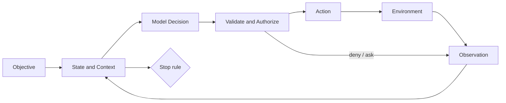

# From Chatbot to Agent

English | [简体中文](../../zh-CN/01-agent-engineering/01-from-chatbot-to-agent.md)

## What You Will Learn

After this chapter, you can:

- distinguish a text generator, chatbot, assistant, and Agent;
- explain an Agent as a feedback control loop rather than a long prompt;
- identify environment, action, observation, state, objective, and stop rules;
- recognize why autonomy increases both usefulness and failure surface;
- map these concepts to CodeHelper's Runtime without reading its implementation.

## 1. The Capability Ladder

An LLM maps an input token sequence to a probability distribution over the next
token. Product behavior emerges from the system around that model.

| System | Receives | Can affect | Maintains | Typical stop condition |
| --- | --- | --- | --- | --- |
| Text generator | one prompt | nothing | no durable state | response ends |
| Chatbot | messages | conversation only | message history | answer ends |
| Assistant | messages and context | delegated APIs | session state | task response |
| Agent | objective and observations | environment through actions | explicit task state | goal, budget, denial, failure, cancellation |

The boundary is not whether the UI looks conversational. A CLI process with no
chat bubbles may be an Agent; a polished chat UI that only returns prose is not.

## 2. A Minimal Agent Model

At step \(t\), an Agent receives an observation \(o_t\), updates state \(s_t\),
selects action \(a_t\), and receives the next observation:

```text
s(t+1) = update(s(t), o(t))
a(t)   = policy(objective, s(t), available_actions)
o(t+1) = environment(a(t))
```

For a coding Agent:

- **objective**: "fix the failing parser test";
- **environment**: repository, processes, diagnostics, remote services;
- **observations**: file contents, search hits, command output, Tool failures;
- **actions**: read, search, edit, execute, ask for input, delegate;
- **state**: working set, plan, evidence, approvals, changes, budget;
- **stop rules**: verified success, blocked, denied, canceled, or exhausted.

The model may help choose `a(t)`, but the surrounding system owns every other
part of the loop.



## 3. Why the Loop Matters

A chatbot can be wrong once. An Agent can use one wrong observation to choose
another action, modify its environment, and amplify the error over several
steps. This creates four engineering requirements:

1. **Grounding**: observations must come from inspectable sources.
2. **Control**: proposed actions must be validated and authorized.
3. **Memory**: state must distinguish current facts from old or inferred facts.
4. **Termination**: success and failure require external criteria, not model confidence.

Autonomy is therefore not a binary feature. It is delegated authority under a
budget and a stop policy.

## 4. The Coding-Agent Loop

Consider "rename a configuration field without breaking callers":

1. inspect repository structure;
2. locate definition and references;
3. infer the contract and affected tests;
4. propose or select an edit;
5. obtain authorization when required;
6. apply the edit transactionally;
7. run focused verification;
8. repair, revert, or report evidence.

A response saying "I renamed it and tests pass" is not equivalent to steps
4-7 occurring. A serious Agent separates **claims** from **receipts**.

## 5. CodeHelper Mapping

CodeHelper names the external request an `Operation` and every observable fact
an `Event`. A Turn has stable Thread/Turn/Item identities. The Application
Runtime accepts and sequences Operations; the Agent Engine performs the
model/action loop; Providers and Tools are adapters to the environment.

| Agent concept | CodeHelper owner |
| --- | --- |
| Objective and user request | `StartTurnPayload` |
| Stable task identity | `internal/runtime/protocol` |
| State transition and termination | `internal/runtime/app` |
| Decision/action loop | `internal/runtime/agent/engine` |
| Model observation/action proposal | `internal/adapter/provider` |
| Environment action | governed Tool executor |
| Authorization | Tool Guard and `internal/security` |
| Evidence | Events, receipts, journals, traces |

Hosts submit Operations and project Events. They do not become alternate Agent
loops.

## 6. Common Misconceptions

**"An Agent is an LLM with tools."** Tools add possible actions, not state,
authorization, recovery, or termination.

**"A larger model needs less engineering."** Better action selection does not
make side effects idempotent or approvals race-free.

**"More autonomy is always better."** Deterministic workflows are preferable
when the path is known; human approval is preferable when consequences are
high and intent is ambiguous.

**"Reasoning text is the Agent state."** Reasoning is model output. Runtime
state must be typed, bounded, and reconstructable.

## 7. Failure Analysis

| Failure | Root engineering question |
| --- | --- |
| Agent edits the wrong file | Was resource identity grounded and checked? |
| Agent repeats a command | Was the action idempotent or fenced? |
| Agent loops indefinitely | Were budgets and terminal rules enforced? |
| Agent trusts malicious repository text | Were data and instructions separated? |
| Agent says tests passed when none ran | Is verification represented by evidence? |
| Cancel arrives but work continues | Who owns cancellation and child processes? |

These are system failures even when the model initiated them.

## 8. Source-Grounded Exercise

Read the operation and event envelopes:

```bash
sed -n '457,478p' internal/runtime/protocol/message.go
sed -n '1706,1755p' internal/runtime/protocol/message.go
```

Then run the focused end-to-end test:

```bash
go test ./internal/runtime/app -run TestRuntimeApprovalPauseResumeE2E
```

Identify the objective, state owner, observations, terminal Event, and evidence.
The exact test name can drift; use `go test -list 'E2E|EndToEnd'
./internal/runtime/app` when necessary.

## 9. Review Questions

1. What makes an Agent different from a multi-turn chatbot?
2. Which parts of the loop must not be delegated to model output?
3. Why are autonomy, authority, and intelligence separate dimensions?
4. What would prove that a coding task completed successfully?

## Next Chapter

[LLMs, Tokens, Context Windows, and Sampling](./02-llm-token-and-context.md)
explains the probabilistic component inside the loop and the limits it imposes.

## Sources and Verification

| Item | Value |
| --- | --- |
| Catalog ID | `agent-from-chatbot-to-agent` |
| Status | `verified` |
| Last verified | 2026-08-06 |
