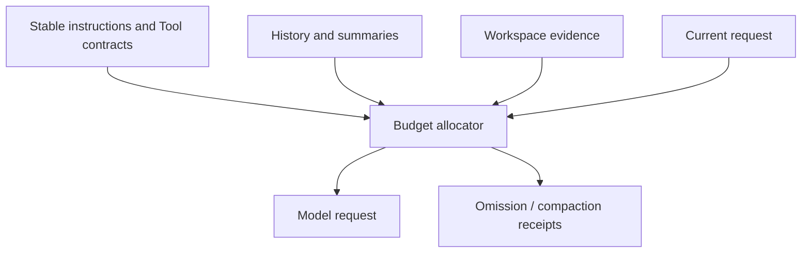

# LLMs, Tokens, Context Windows, and Sampling

English | [简体中文](../../zh-CN/01-agent-engineering/02-llm-token-and-context.md)

## What You Will Learn

You will understand the model as a probabilistic sequence component, calculate
the practical context budget of an Agent Turn, and separate model limits from
Runtime guarantees.

## 1. What the Model Computes

Given tokens \(x_1...x_n\), an autoregressive language model estimates:

```text
P(x(n+1) | x(1), ..., x(n))
```

Generation repeatedly samples or selects a next token and appends it. The model
does not inherently know files, Tools, permissions, time, cost, or whether an
action succeeded. Those facts must be represented in input or returned as
observations.

The useful abstraction is:

```text
ModelRequest(messages, tools, limits) -> Stream(text, reasoning, tool calls, usage)
```

CodeHelper's normalized form is `provider.ModelRequest` and `provider.Stream`.
Provider adapters translate this contract to OpenAI Chat/Responses, Anthropic,
or Fixture wire formats.

## 2. Tokens Are the Accounting Unit

A token is not a character or word. Tokenization varies by model and language:
identifiers, whitespace, Unicode, JSON, and source code split differently.
Therefore:

- character counts are only estimates;
- Tool schemas and repeated prefixes consume tokens;
- a long Tool result competes with source code and conversation history;
- output and reasoning reserve capacity inside the same request limit.

Usage accounting is evidence from the Provider when available. Estimated token
counts are planning data, not billing truth.

## 3. Context Window Is a Shared Budget

For a model limit \(W\):

```text
input + reserved_output + provider_overhead <= W
```

Agent input includes more than the user's prompt:

```text
system instructions
+ conversation/history
+ workspace and editor context
+ repository map and evidence
+ Tool descriptors
+ prior Tool results
+ memory and compaction summaries
```

If the Runtime merely truncates the end, it may remove the current question. If
it truncates the beginning, it may remove safety instructions. Context
engineering therefore requires priority, lifecycle, provenance, and explicit
omission.



## 4. Sampling and Determinism

Logits are converted to probabilities, commonly with temperature \(T\):

```text
P(i) = exp(logit(i) / T) / sum(exp(logit(j) / T))
```

Lower temperature sharpens the distribution; higher temperature spreads it.
Top-p limits candidates to a probability mass. Provider defaults, model
versions, parallelism, floating-point kernels, and hidden reasoning can still
change results. `temperature=0` is not a transactional guarantee.

Engineering response:

- test protocol parsing with recorded Fixtures;
- validate model output before action;
- make side effects idempotent or fenced;
- verify outcomes from the environment;
- avoid assertions that depend on exact prose.

## 5. Messages, Roles, and Tool Calls

Messages are structured input, not a security boundary. A repository file may
contain instructions, but it remains untrusted data even if included in a
message. Role precedence helps models follow intent; it does not authorize an
OS action.

A Tool Call is also generated data:

```json
{"name":"file_edit","arguments":{"path":"config.go","old":"A","new":"B"}}
```

Before execution, a Runtime must validate Tool identity, Catalog generation,
JSON Schema, resource claims, capability, policy, approval, and sandbox.

## 6. Model Capability Is Multidimensional

Do not reduce model selection to a name or context size. Relevant dimensions
include:

- text, image, reasoning, and Tool support;
- streaming protocol and Usage reporting;
- maximum input/output and Tool count;
- parallel Tool Call semantics;
- structured output guarantees;
- latency, rate limits, price, and data policy.

CodeHelper resolves a route from requested capability and catalog evidence.
Unknown capability fails rather than being invented from a model name.

## 7. Failure Modes

| Symptom | Likely cause | Runtime response |
| --- | --- | --- |
| Important file ignored | context competition | provenance and omission receipt |
| Tool JSON is incomplete | stream interruption/limit | assemble then validate |
| Same prompt differs | sampling/provider drift | Fixture tests and outcome verification |
| Request rejected | limit/capability mismatch | route validation before call |
| Cost unexpectedly rises | schema/history growth | per-sample Usage and budget |
| Malicious file changes behavior | instruction/data confusion | trust boundary plus action guard |

## 8. Code Walkthrough

Inspect the normalized request and Provider interface:

```bash
sed -n '126,190p' internal/adapter/provider/types.go
sed -n '417,435p' internal/adapter/provider/types.go
```

Then inspect and test context budgeting:

```bash
go test ./internal/runtime/agent/promptcontext
go test ./internal/adapter/provider/openai -run 'Test.*Stream'
```

Notice the division: adapters establish what the Provider emitted; Runtime
budgeting decides what may enter the request; neither authorizes Tool effects.

## 9. Practical Heuristics

1. Preserve current intent and hard constraints.
2. Prefer source evidence over repeated narrative.
3. Send the smallest Tool catalog that preserves required capability.
4. Summarize old interactions, never fabricate missing facts.
5. Reserve output and Tool-result capacity before sending.
6. Treat Usage, truncation, and compaction as observable facts.

## 10. Review Questions

1. Why is a context window not model memory?
2. Why can `temperature=0` still produce different system outcomes?
3. Which inputs compete for a coding Agent's context?
4. Why is a valid Tool Call not yet an authorized action?

## Next Chapter

[ReAct, Planning, Tool Calling, and Reflection](./03-react-planning-and-tools.md)
turns model sampling into a bounded action loop.

## Sources and Verification

| Item | Value |
| --- | --- |
| Catalog ID | `agent-llm-token-context` |
| Status | `draft` |
| Last verified | Not yet verified |
