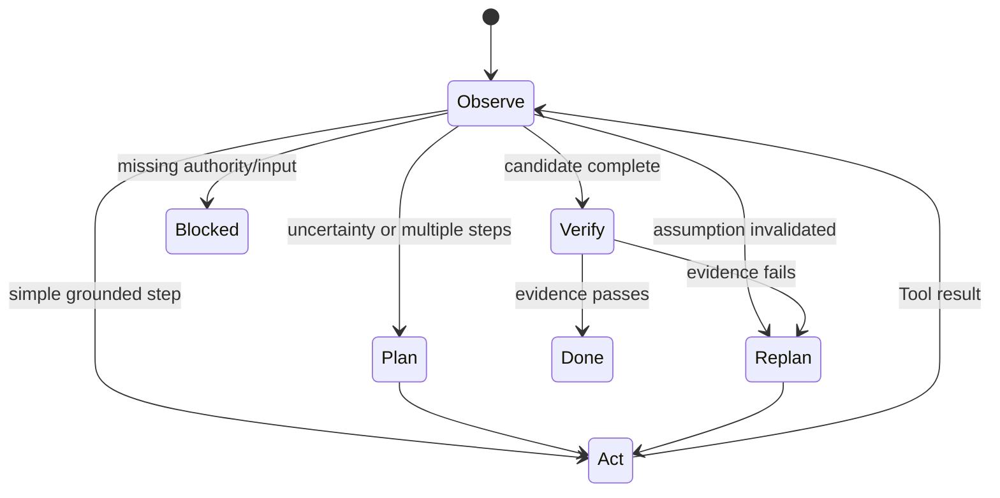

# ReAct, Planning, Tool Calling, and Reflection

English | [简体中文](../../zh-CN/01-agent-engineering/03-react-planning-and-tools.md)

## What You Will Learn

You will understand the main control patterns used by Agents, their failure
modes, and how CodeHelper turns model proposals into governed observations.

## 1. ReAct as an Observation Loop

ReAct interleaves reasoning and acting:

```text
observe -> decide -> act -> observe result -> decide again
```

The important contribution is not exposing private reasoning text. It is
feeding environment results back into the next decision. A coding example:

```text
Objective: fix parser regression
Observation: failing test names parser EOF behavior
Action: search parser implementation and tests
Observation: scanner drops final token without newline
Action: read exact function and call sites
Observation: contract permits EOF-terminated token
Action: propose edit
Observation: edit approved and applied
Action: run focused test
Observation: focused test passes
Stop: verified objective
```

Every action should reduce uncertainty or advance a verified plan.

## 2. Planning Is a Control Artifact

A useful plan is not decorative prose. It externalizes:

- decomposition and dependency order;
- current/in-progress/completed state;
- expected evidence for each step;
- points requiring approval or user input;
- replanning triggers.

Plans are most valuable for multi-file, ambiguous, or long-running work. A
trivial read does not need five planning steps. A plan also does not authorize
its own actions.



## 3. Tool Calling Has Two Contracts

The **model contract** describes what the model can request: Tool name,
description, and Input Schema. The **execution contract** additionally defines:

- capability and resource access;
- Catalog identity/generation;
- parallelism policy;
- sandbox requirement;
- availability and limits;
- result, truncation, and error semantics.

This distinction prevents prompt-visible Tool descriptions from becoming
authority.

CodeHelper's `tool.Descriptor` contains both model-facing and Runtime-facing
fields. `Guard.ExecuteBound` resolves and validates the call before Policy and
execution.

## 4. Reflection Is Evidence-Based Reassessment

Reflection is useful when it means comparing current evidence with objective:

```text
What changed?
What remains unproven?
Which assumption failed?
What is the cheapest next observation?
Should we repair, revert, ask, or stop?
```

Repeatedly asking the model "think again" without new evidence often increases
cost and confidence, not correctness. Reflection should be triggered by:

- Tool failure or contradictory evidence;
- verification failure;
- exhausted search path;
- context compaction;
- approval denial;
- unexpected side effects or diagnostics.

## 5. Tool Result Semantics

A Tool result has at least three audiences:

1. **model**: bounded content needed for the next decision;
2. **Runtime**: structured metadata, evidence, changes, diagnostics;
3. **operator**: receipts/logs sufficient for investigation.

Do not force the Runtime to parse model-facing prose to discover what changed.
Large output should be truncated with a retrievable handle, not silently cut.

## 6. Parallelism and Ordering

Parallel calls are safe only when their declared resources and Tool policies do
not conflict. Two searches may run concurrently; two edits to overlapping
paths must serialize or be rejected. Model order is not a lock.

The scheduler must preserve:

- unique Call identity;
- bounded concurrency;
- deterministic result association;
- cancellation propagation;
- conflict-aware serialization;
- one observation per completed/failed call.

## 7. Failure Modes and Corrections

| Anti-pattern | Why it fails | Correction |
| --- | --- | --- |
| Act before reading | action rests on guessed state | read-before-edit/evidence |
| Huge plan never updated | plan stops representing control state | update after each transition |
| Retry every Tool error | duplicates effects or loops | typed retry classification |
| Reflect with no new data | produces narrative, not evidence | acquire observation or stop |
| Execute Tool JSON directly | schema is mistaken for authority | Guard and Policy |
| Trust successful exit alone | semantic objective may still fail | targeted verification |
| Parallelize all calls | hidden resource conflicts | Descriptor policy and claims |

## 8. Code Walkthrough

Inspect the Tool Descriptor and Guard entry:

```bash
sed -n '138,180p' internal/adapter/tool/tool.go
sed -n '278,340p' internal/adapter/tool/guard/guard.go
```

Run focused loop tests:

```bash
go test ./internal/runtime/agent/engine \
  -run 'Test.*(ProposedPlan|ToolFailure|Scheduler)'
go test ./internal/adapter/tool/guard \
  -run 'TestAliasDeferredUnknownAvailabilityAndSandboxFailClosed'
```

Read failures as part of the protocol: a rejected or failed Tool becomes an
observation; it does not automatically justify bypass or retry.

## 9. Design Exercise

For "update a dependency and repair callers", write:

1. the first three observations required;
2. a plan with evidence-based completion criteria;
3. each Tool's resource claims;
4. which calls may run concurrently;
5. approval points;
6. verification and rollback conditions.

If the plan assumes a file or command exists before observing it, mark that
assumption and add a discovery step.

## 10. Review Questions

1. What makes a plan operational rather than decorative?
2. Why are model and execution Tool contracts different?
3. When does reflection improve reliability?
4. Why can Tool parallelism not be decided from call order alone?

## Next Chapter

[Agents, Workflows, and Automation](./04-agent-workflow-boundaries.md) explains
when this adaptive loop is appropriate and when deterministic orchestration is
the better design.

## Sources and Verification

| Item | Value |
| --- | --- |
| Catalog ID | `agent-react-planning-tools` |
| Status | `verified` |
| Last verified | 2026-08-06 |
