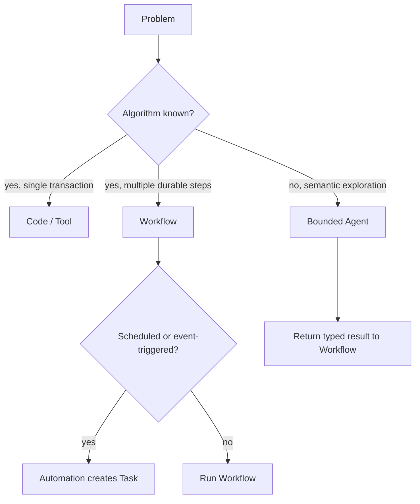

# Agents, Workflows, and Automation

English | [简体中文](../../zh-CN/01-agent-engineering/04-agent-workflow-boundaries.md)

## What You Will Learn

You will choose between adaptive Agent behavior, deterministic Workflow,
scheduled Automation, and ordinary code, then combine them without hiding
authority or recovery boundaries.

## 1. Four Different Tools

| Mechanism | Best when | Control flow | Primary risk |
| --- | --- | --- | --- |
| Function/script | inputs and algorithm are known | deterministic code | implementation defect |
| Workflow | steps and dependencies are known | explicit DAG/state machine | recovery/idempotency defect |
| Automation | trigger and repeated operation are known | schedule/event to task | duplicate or stale execution |
| Agent | path depends on semantic observations | adaptive model/action loop | incorrect action under uncertainty |

Using an Agent where a parser or state machine is sufficient adds cost,
nondeterminism, and attack surface. Using a rigid Workflow for open-ended
repository investigation produces brittle branches and poor recovery.

## 2. A Selection Test

Ask in this order:

1. Can ordinary typed code solve it completely?
2. Are the steps known but long-running or recoverable? Use a Workflow.
3. Is the operation repeated by schedule/event? Add Automation around a Task.
4. Does choosing the next step require semantic interpretation? Use an Agent
   inside a bounded step.



The strongest architecture is often hybrid: deterministic orchestration owns
progress and recovery; an Agent performs one bounded semantic step.

## 3. Determinism Has Layers

A Workflow is not deterministic merely because its graph is static. External
effects, clocks, retries, and Agent nodes can vary. Make deterministic:

- node identity and dependency resolution;
- input/output schemas;
- checkpoint and transition rules;
- retry classification and backoff;
- idempotency/fencing;
- terminal state and compensation selection.

Allow nondeterminism only inside declared nodes, and capture their input,
output, route, usage, and evidence.

## 4. Tasks, Workers, and Leases

Long-running work needs durable ownership:

- **Task** records desired work and lifecycle;
- **Worker** claims and executes;
- **Lease** expires if the Worker disappears;
- **heartbeat** proves continuing ownership;
- **generation/fencing token** rejects stale completion;
- **retry policy** classifies which failure may run again.

This is not model reasoning. It is distributed-systems control even on one
machine.

## 5. Automation Is Triggering, Not Intelligence

Automation maps an RRULE or event to a Task/Workflow. It must define:

- timezone and missed-run behavior;
- deduplication slot;
- overlap policy;
- enabled/disabled state;
- catch-up bounds;
- target Workspace and authority;
- observability and cancellation.

A schedule never grants new permission. The triggered work runs with explicit
identity and the same Guard/Policy boundary as interactive work.

## 6. Human Interaction Boundaries

Pause for a human when:

- intent is ambiguous and consequences differ;
- policy requires approval;
- credentials or external decisions are unavailable;
- a destructive recovery choice cannot be inferred safely.

Do not pause merely to ask the user to repeat facts already available in the
Workspace. Input requests are durable protocol states, not blocking terminal
prompts hidden inside a Worker.

## 7. Failure and Recovery Matrix

| Failure | Agent-only response | Workflow-owned response |
| --- | --- | --- |
| Model timeout | retry/re-route within budget | node remains retryable |
| Process crash | in-memory plan lost | reconstruct from checkpoint |
| Duplicate trigger | may duplicate action | slot/idempotency rejects |
| Stale Worker result | difficult to detect | lease generation rejects |
| Approval pending | loop may block | explicit paused state |
| Partial side effect | model may guess | journal/compensation/reconciliation |
| Changed graph | prompt may drift | compatibility check fails explicitly |

## 8. CodeHelper Boundaries

CodeHelper keeps the Agent loop in `internal/runtime/agent`. Durable Tasks,
Workers, Automation, Workflows, Lanes, Fleet, and Subagents belong to
`internal/orchestration`. Hosts submit commands and display state.

The boundary avoids two common mistakes:

- embedding an untracked Agent loop in each Worker or Host;
- asking the model to implement lease, retry, checkpoint, or DAG semantics in
  prose.

## 9. Verification Walkthrough

```bash
go test ./internal/orchestration/task ./internal/orchestration/worker
go test ./internal/orchestration/workflow/...
go test ./internal/orchestration/automation
```

Inspect:

```bash
sed -n '1,220p' internal/orchestration/workflow/spec.go
sed -n '1,220p' internal/orchestration/task/repository.go
```

Look for typed state and invariants rather than prompt conventions.

## 10. Architecture Exercise

Design "every weekday, inspect dependency alerts and prepare safe fixes":

- Automation creates one deduplicated Task per schedule slot.
- Workflow loads alerts, groups repositories, and checkpoints progress.
- An Agent investigates each bounded repository problem.
- Guard controls reads, writes, network, and approvals.
- Deterministic verification and review gates decide completion.
- A Worker crash resumes from the latest checkpoint.

State which failures retry a node, restart the Agent step, require a human, or
terminate the Workflow.

## 11. Review Questions

1. When is a Workflow better than an Agent?
2. Why is a static DAG not automatically deterministic?
3. What does a lease generation protect?
4. Can Automation grant authority?
5. Where should a bounded Agent node return its result?

## Next Chapter

[Why Agents Need a Governed Runtime](./05-why-governed-runtime.md) combines the
model, action loop, and orchestration boundaries into one local control plane.

## Sources and Verification

| Item | Value |
| --- | --- |
| Catalog ID | `agent-workflow-boundaries` |
| Status | `verified` |
| Last verified | 2026-08-06 |
