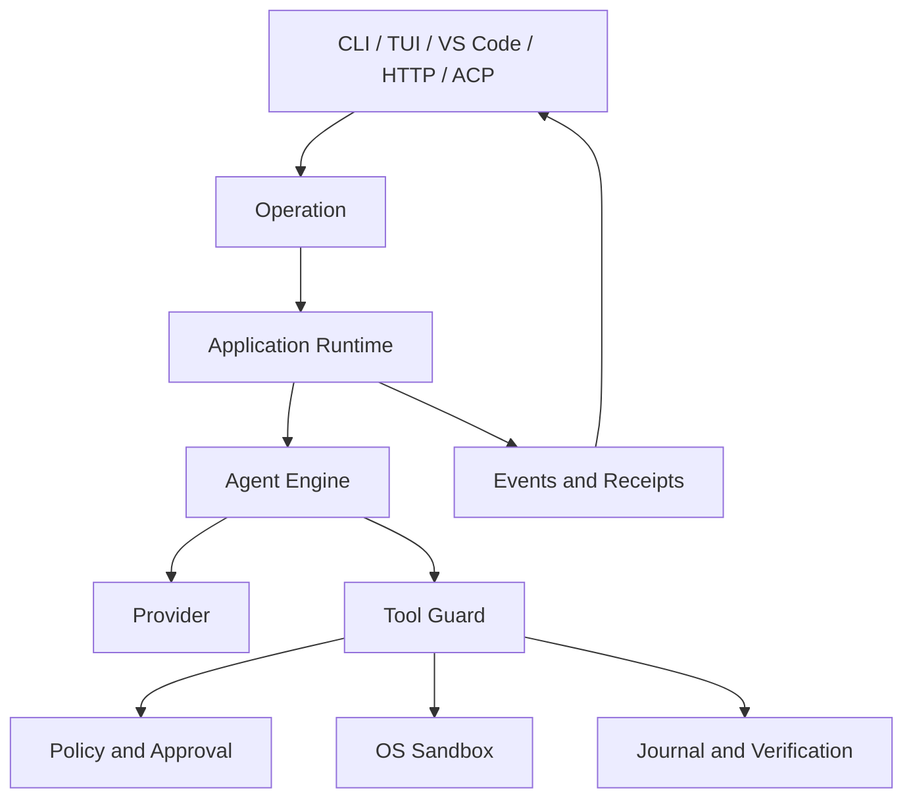

# Why Agents Need a Governed Runtime

English | [简体中文](../../zh-CN/01-agent-engineering/05-why-governed-runtime.md)

## Learning Objectives

After this chapter, you can explain why a useful coding Agent needs more than
an LLM API loop, identify the authority boundaries a runtime must own, and
distinguish model intelligence from execution reliability.

## Prerequisites

Complete the preceding four chapters. No CodeHelper source knowledge is
required; this chapter is the synthesis that maps their concepts to the
Runtime.

## Synthesis: From Probability to Controlled Work

The preceding chapters established four constraints:

| Earlier concept | Consequence for the Runtime |
| --- | --- |
| An Agent is a feedback loop | state transitions and stop rules cannot live only in prose |
| Model output is probabilistic | actions and outcomes require validation and verification |
| Tool calls are proposals | authorization must remain outside the model |
| Workflows own durable progress | retries, leases, checkpoints, and Agent steps need explicit boundaries |

These constraints imply three independent control lines:

1. **Authority**: what may happen, to which Resource, under which identity.
2. **State**: what has been accepted, observed, completed, paused, or canceled.
3. **Evidence**: what proves the claimed action and outcome.

If any line is absent, a system may be intelligent but is not operationally
trustworthy.

## Problem Background

A chatbot maps messages to messages. A coding Agent can read repositories,
start processes, change files, contact services, and continue for many steps.
That additional usefulness creates authority, state, concurrency, and recovery
problems that the model cannot solve by merely producing better text.

The smallest demo loop is often:

```text
send messages -> receive tool call -> execute tool -> append result -> repeat
```

It omits hard questions:

- Who validates the tool name, schema, and resource claims?
- Which files and network hosts may the call access?
- What happens if approval arrives after cancellation?
- Can an interrupted edit be recovered?
- How do several clients observe the same turn?
- Which event proves that verification actually ran?
- Can a retry duplicate a side effect?

A runtime exists to answer these questions deterministically outside the model.

## Core Concepts

**Intelligence** selects a possible next action. **Authority** decides whether
that action may affect the world. **Execution** performs the action.
**Evidence** records what happened. These are separate responsibilities.

A governed runtime owns:

- identity for operations, turns, items, calls, and workspaces;
- state transitions and exactly one terminal outcome;
- model routing and bounded context;
- typed tool discovery and execution;
- policy, approval, constitution, and sandbox decisions;
- durable events, journals, receipts, usage, and traces;
- cancellation, retry, recovery, and concurrency.

The model is untrusted input to this system. Repository content and remote tool
output are also untrusted because they can influence model-selected actions.

## CodeHelper Design

CodeHelper places a shared Runtime between every Host and every effectful
implementation:



This boundary yields two important properties.

First, a Host cannot gain extra authority by implementing its own tool path.
Second, the same operation has the same security and persistence semantics
whether it starts in a terminal, editor, or API client.

## Execution Flow

1. A Host creates a typed Operation.
2. `internal/runtime/app` validates, accepts, sequences, and dispatches it.
3. `internal/runtime/agent` assembles context and samples a Provider.
4. Model-requested tools resolve through a typed Registry.
5. `internal/adapter/tool/guard` evaluates resources and policy.
6. Approved work executes within its required sandbox and journal boundary.
7. The Runtime emits ordered Events and a final Receipt.
8. Hosts project those facts for their own UI.

The model never directly owns the process, filesystem, approval cache, event
cursor, or durable task lease.

## Code Map

| Concern | Source | Why it matters |
| --- | --- | --- |
| Typed operations and events | `internal/runtime/protocol` | shared contract for every Host |
| Acceptance and lifecycle | `internal/runtime/app` | sequencing, cancellation, terminal state |
| Model/tool loop | `internal/runtime/agent` | iterative reasoning and action |
| Consequential action boundary | `internal/adapter/tool/guard` | one policy and evidence path |
| Hard controls | `internal/security` | policy, constitution, permissions, sandbox |
| Durable facts | `internal/persist` | restart and audit do not depend on memory |
| Evidence | `internal/observability` | usage, traces, diagnostics, verification |

## Implementation Walkthrough

`app.Runtime` owns an operation queue, active turns, subscribers, terminal
events, pending approvals, and idempotency records. Its `Engine` interface
supports start, cancel, steer, approval, input, compact, fork, and revert
operations without importing a concrete provider or tool.

`agent/engine.Engine` owns the iterative model/tool state machine. It emits
states such as `calling_model`, `running_tools`, `awaiting_approval`,
`verifying`, and a terminal state. A Tool Call reaches `Guard.ExecuteBound`,
where validated resources are evaluated before an executor runs.

This separation is the central engineering decision: orchestration of
intelligence belongs to the Agent Engine; authorization and effects belong to
the Guard and platform layers.

## Tradeoffs and Alternatives

A single process with direct function calls is smaller. It also couples every
UI to implementation, makes restart semantics accidental, and lets new
features create alternate authority paths.

A remote control plane can centralize policy, but moves local source and
execution authority across a network boundary. CodeHelper instead keeps one
local runtime and exposes protocol adapters.

Governance adds latency and code: schema validation, approval, journaling, and
verification are real work. The benefit is that a successful demo can become a
system whose failures are observable and bounded.

## Failure Modes and Security Boundaries

- Unknown or malformed operations are rejected explicitly.
- A full operation queue returns a retryable resource-exhausted problem.
- Missing grants, unknown capabilities, or unavailable policy deny execution.
- An unanswered approval expires rather than becoming implicit permission.
- A required strong sandbox that is unavailable fails closed.
- Cancellation produces a terminal event and releases owned work.
- A repeated idempotency key with different content is a conflict.
- A slow subscriber can be dropped without blocking runtime progress.

No layer proves that arbitrary generated code is safe. The runtime limits
authority and records evidence; repository review, tests, and backups remain
necessary.

## Tests and Verification

```bash
go test ./internal/runtime/app \
  -run 'TestRuntime(ConcurrentSubmitHasStrictSequenceAndUniqueTerminal|CancelActuallyCancelsActiveTurn|UnsupportedOperationIsExplicitlyRejected)'

go test ./internal/adapter/tool/guard \
  -run 'Test(PendingApprovalExpiresFailClosed|AliasDeferredUnknownAvailabilityAndSandboxFailClosed)'
```

These tests demonstrate lifecycle ordering, cancellation, explicit rejection,
approval expiry, and sandbox fail-closed behavior.

## Hands-On Lab

Run a deterministic turn without network access:

```bash
make build
./bin/codehelper exec \
  --provider-fixture ./testdata/providers/openai \
  --provider openai \
  --model gpt-fixture \
  --workspace . \
  --output-format stream-json \
  "say hello"
```

Observe that output is an event stream with operation and turn identity, not a
raw provider response. The Fixture contract intentionally expects `say hello`;
then rerun with an invalid model and compare the explicit error boundary.

Record one example of each control line:

- Authority: a Tool Descriptor, Policy decision, or Approval Event;
- State: an Operation, ordered Event, or terminal outcome;
- Evidence: Usage, verification Event, Receipt, or Journal entry.

## Review Questions

1. Why is a model-generated Tool Call not authorization?
2. Which responsibilities would be duplicated if Hosts executed tools?
3. What evidence distinguishes “the model said it tested” from verification?

## Further Reading

- [Architecture manual](../../../en/architecture.md)
- [Security manual](../../../en/security.md)
- [System architecture](../../en/02-codehelper-overview/02-system-architecture.md)
- [Build and trace the first Agent Turn](../13-hands-on-labs/01-first-agent-turn.md)

## Sources and Verification

| Item | Value |
| --- | --- |
| Catalog ID | `agent-why-governed-runtime` |
| Status | `verified` |
| Last verified | 2026-08-06 |
