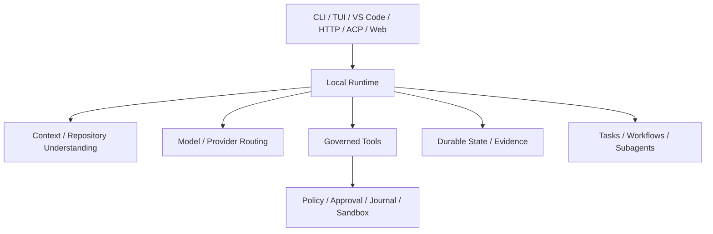

# Positioning, Value, and Non-Goals

English | [简体中文](../../zh-CN/02-codehelper-overview/01-positioning-and-non-goals.md)

## What You Will Learn

You will be able to state what CodeHelper is, who it serves, which engineering
problems it owns, and which attractive claims it deliberately does not make.

## 1. One Project, Two Deliverables

CodeHelper is:

1. a **local, governed coding-Agent Runtime** shared by terminal, editor, API,
   worker, and orchestration surfaces;
2. an **executable Agent engineering book** whose claims point to the same
   source, tests, fixtures, and failure modes.

The Runtime is the product under study; the book is the maintained learning
interface to that product. Neither is a demo wrapper around the other.

## 2. The Problem It Owns

The project starts where a raw model call stops:

```text
engineering objective
  -> repository evidence and bounded context
  -> model route and streaming
  -> governed Tool proposals
  -> approval / policy / sandbox
  -> durable state and recoverable effects
  -> verification, receipts, usage, and traces
```

CodeHelper owns the consistency of this path across all Hosts. It does not own
the correctness of arbitrary model output or every external service.

## 3. Primary Users

| User | Value | Required boundary |
| --- | --- | --- |
| Individual developer | local analysis, edits, verification, resumable sessions | repository and credentials stay user-controlled |
| Team/platform engineer | protocol, policy, observability, repeatable integrations | one authority path across Hosts |
| Extension author | Provider, Tool, MCP, Skill, Plugin, Hook, Host integration | extensions cannot create a second control plane |
| Agent learner | concepts tied to production-shaped source and labs | documentation distinguishes fact, tradeoff, and roadmap |
| Coding Agent | machine-readable rules, ownership, tests, evidence | instructions do not become authority |

## 4. Product Principles

### Local authority

Source and execution remain in the local Workspace. Network access is explicit,
and listening services default to local boundaries.

### One Runtime, many Hosts

CLI, TUI, VS Code, HTTP/SSE, ACP, Web, Workers, and child Agents share
Operation/Event semantics. A feature implemented only as Host-side execution is
architecturally incomplete.

### Evidence over claims

Reads, searches, Tool Calls, approvals, changes, verification, Usage, and
traces become inspectable data. Model prose is not substituted for evidence.

### Fail closed

Unknown capability, unavailable strong Sandbox, stale Catalog identity, or
missing authority causes an explicit failure. Security does not silently
degrade to make a task appear successful.

### Extensible through governed boundaries

New capabilities enter through adapters and construction, not by bypassing the
Runtime.

## 5. Capability Surface



The breadth matters less than the shared semantics. A smaller set of Tools on
one guarded path is more trustworthy than many Host-specific shortcuts.

## 6. Explicit Non-Goals

CodeHelper is not:

- a hosted source-code SaaS or remote repository owner;
- an unrestricted shell with a chat front end;
- proof that generated code is correct or safe;
- a replacement for CI, review, backup, or incident response;
- a promise of identical Sandbox strength on every OS;
- a compatibility commitment for unpublished pre-release formats;
- a benchmark claiming one model or Provider is universally best;
- a fully autonomous organization that removes human accountability;
- a framework where every problem should be solved by an Agent.

These boundaries prevent marketing language from weakening engineering
contracts.

## 7. Trust and Responsibility

| CodeHelper provides | User/operator still owns |
| --- | --- |
| bounded context and explicit provenance | deciding whether the selected evidence is sufficient |
| Tool validation and authorization | granting appropriate Workspace/credential access |
| journals and revert support | repository backup and review of consequential changes |
| verification execution and receipts | choosing meaningful project checks |
| durable state and replay | retention policy and sensitive-data handling |
| extension integrity controls | deciding which publishers/services to trust |

Governance reduces and exposes risk; it does not eliminate responsibility.

## 8. Maturity and Compatibility

The repository is an initial development baseline. Public contracts are
explicitly versioned, but internal APIs and unpublished persisted formats may
still change before a stable release. Current priorities are correctness,
documentation, cross-platform evidence, and repeatable release artifacts.

Roadmap items must not be described as shipped behavior. Catalog chapter status
and executable tests are stronger evidence than aspirational prose.

## 9. How to Evaluate a Feature Request

Ask:

1. Does it strengthen the one local Runtime or create a second path?
2. Who owns its state and authority?
3. Can it be represented through stable Operations, Events, and read models?
4. Does a consequential effect pass Guard and platform enforcement?
5. Can failure, cancellation, replay, and recovery be tested?
6. What evidence lets a user distinguish success from a model claim?
7. Does it belong in the Runtime, an Adapter, Orchestration, a Host, or only
   presentation?

If ownership is ambiguous, implementation should not begin.

## 10. Source-Grounded Exercise

Run the product identity and one deterministic Turn:

```bash
make build
./bin/codehelper version
./bin/codehelper doctor
tmp="$(mktemp -d)"
./bin/codehelper exec \
  --provider-fixture ./testdata/providers/openai \
  --provider openai --model gpt-fixture \
  --workspace . --data-dir "$tmp/state" \
  --output-format stream-json "say hello"
rm -rf "$tmp"
```

Classify each output as capability, environment fact, Runtime Event, evidence,
or terminal result. None of these outputs prove that every generated program
is correct.

## 11. Review Questions

1. Why is CodeHelper a Runtime rather than a chat application?
2. What is gained by serving many Hosts from one authority path?
3. Which responsibilities remain with the user?
4. Why are non-goals part of architecture?
5. How does the book avoid becoming disconnected documentation?

## Next Chapter

[CodeHelper System Architecture](./02-system-architecture.md) maps this
positioning to layers and dependency direction.

## Sources and Verification

| Item | Value |
| --- | --- |
| Catalog ID | `overview-positioning` |
| Status | `verified` |
| Last verified | 2026-08-06 |
