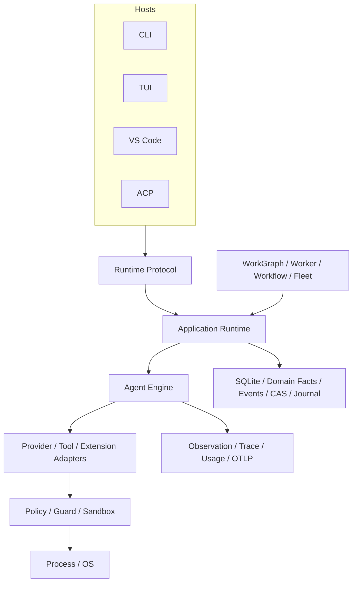

# CodeHelper System Architecture

English | [简体中文](../../zh-CN/02-codehelper-overview/02-system-architecture.md)

## Learning Objectives

You will learn the major layers, dependency direction, Runtime protocol, and
the reason CodeHelper uses one execution core behind many Hosts.

## Prerequisites

Read [Why Agents Need a Governed Runtime](../01-agent-engineering/05-why-governed-runtime.md).

## Problem Background

A coding Agent quickly accumulates interfaces: CLI for scripts, TUI for
interactive work, editor UI, HTTP clients, background workers, and child
Agents. If each interface constructs providers, runs tools, or stores state
independently, behavior diverges precisely where consistency matters most:
security, cancellation, recovery, and evidence.

Architecture must therefore describe authority and dependency direction, not
only a directory tree.

## Three Views of the Same System

Do not try to understand CodeHelper from one package diagram alone:

| View | Question | Follow this path |
| --- | --- | --- |
| Control | Who may request and authorize an effect? | Host → Operation → Runtime → Guard → Platform |
| Data | Where do facts flow and persist? | Provider/Tool → Event/Receipt → Event Log/SQLite → Projection |
| Construction | Who selects concrete implementations? | config → `runtime/app/wire` → interfaces/adapters |

A correct change must fit all three views. For example, a new Tool needs a
construction path, a control path through Guard, and an evidence path through
Events/receipts. Implementing only the executor is incomplete.

## Core Concepts

- A **Host** translates user/client I/O into Operations and Events.
- The **Runtime** owns lifecycle, Agent execution, and shared contracts.
- An **Adapter** connects external models, tools, and extension ecosystems.
- **Security** decides and enforces authority.
- **Persistence** and **observability** preserve facts and evidence.
- **Orchestration** schedules durable or multi-step execution.
- **Platform** implements OS-specific process and sandbox behavior.

## CodeHelper Design



The important constraint is that arrows do not mean “anything can call
anything below.” For example, a Host may import protocol and application
facades, but not concrete tool, provider, Agent Engine, or sandbox
implementations.

The supported product Hosts are CLI, TUI, VS Code, and ACP. Provider HTTP,
MCP HTTP/SSE, and local fixture listeners are integration transports, not
product Hosts. Root `web`/`serve`, embedded UI, pairing/QR, and REST/SSE are
not supported product surfaces.

## Package Layers

| Layer | Path | Owns |
| --- | --- | --- |
| Entry | `cmd/codehelper` | process startup and CLI root |
| Hosts | `internal/host` | presentation and transport adapters |
| Runtime | `internal/runtime` | protocol, app lifecycle, Agent loop, wiring |
| Adapters | `internal/adapter` | providers, tools, MCP, skills, plugins, hooks |
| Security | `internal/security` | policy, permissions, constitution, sandbox |
| Orchestration | `internal/orchestration` | WorkGraph, worker, automation, workflow, lane, fleet, subagent |
| Persistence | `internal/persist` | SQLite, event log, CAS, sessions, journal |
| Observability | `internal/observability` | versioned observations, traces, usage, diagnostics, verification, OTLP |
| Platform | `internal/platform` | process and OS integration |
| VS Code | `extensions/vscode` | editor presentation and ACP client |

VS Code is a local UI Extension with a physical boundary between Webview and
Extension Host. Webview receives immutable projections and emits finite
intents. Extension Host owns VS Code APIs, local Workspace identity,
SecretStorage, native controls, and ACP transport. Runtime remains the only
owner of Session, Profile, Tool policy, lifecycle, artifacts, and execution.
Only local `file:` single-root and multi-root workspaces are supported; Remote
SSH, Dev Containers, and Codespaces are outside this product surface.

## Hard Dependency Rules

1. `runtime/protocol` is independent of implementation packages.
2. Hosts submit Operations; they do not execute providers or tools.
3. Business turn loops remain in `runtime/agent`.
4. Construction remains in `runtime/app/wire`.
5. Consequential tools pass through `adapter/tool/guard`.
6. UI state is a projection, not runtime truth.
7. Persistent effects are transactional or journaled at the owner boundary.

`internal/host/cli/architecture_test.go` parses imports and fails when the CLI
depends directly on execution implementations. Architecture is therefore a
tested property.

`testdata/contracts/hotspot-baseline.json` freezes responsibility and file-size boundaries
for TUI, Engine, Config, and Protocol. Characterization, Golden, Schema drift,
and Race tests protect behavior while those responsibilities evolve.

## Runtime Protocol

The transport-neutral vocabulary is:

```text
Operation -> ordered Events -> Projection
                     \-> Receipt
```

`internal/runtime/protocol` defines tagged unions for Operations and Events.
The generated schema in `docs/protocol/runtime-protocol.schema.json` is shared
with ACP and VS Code generation. ACP wraps the same model rather than defining
a separate runtime.

An Event carries sequence, Operation, Thread, Turn, and Item identity. This
allows a Host to reconnect, replay from a cursor, and distinguish output,
tools, approvals, verification, and terminal outcomes.

## Construction Boundary

`runtime/app/wire` is allowed to know concrete implementations. `NewExec` is
the composition root: it creates a construction-only `buildState` and runs a
closed module sequence:

```text
config -> provider -> persistence -> platform -> builtin tools
       -> extension contributors -> security -> extension plan
       -> orchestration -> observability -> agent -> runtime
       -> background services
```

Each module owns one construction boundary and publishes only what later
modules need. `buildState` is never retained by Runtime, Engine, or Session
services. Persistence owns Content, Job Log, and the SQLite foundation;
Platform owns Process, Sandbox, and Repository Index; Orchestration owns
Task/Automation repositories, Workflow executors, Scheduler construction,
Subagents, and child worktrees/toolsets. Provider publishes the selected
Provider/Model catalogs, while Security publishes its Permission Store and
Guard Factory.

Builtin and extension tools share one Registry. Plugin, Skill, Memory, Dynamic
Tool, Hook, and MCP contributors register typed contracts, receive only
explicit construction capabilities, and return bounded receipts. Source
resolution then produces a digested Extension Plan; Runtime lifecycle owns
generations and every process, connection, subscription, lease, timer, and Tool
registration. Task/Automation registration belongs to Orchestration rather
than the extension contributor chain.

Runtime construction has a prepared state: `RuntimeModule` constructs the
facade and restores static durable state without accepting operations;
`BackgroundModule` performs the initial MCP refresh, starts Runtime terminal
outbox and pending-Turn recovery, starts MCP prewarm, reconciles Automations,
then starts the Worker Scheduler. A failed step aborts construction and the
resource stack rolls back; no background worker starts before Runtime
recovery has succeeded.

Construction and shutdown share `assembly.ResourceStack`, so a partial build
rolls back in reverse registration order without leaking resources.

Keeping construction separate prevents dependency injection logic from
becoming a second business loop.

### Runtime Ownership Table

| Owner | Source | Boundary |
| --- | --- | --- |
| Composition | `runtime/app/wire` | constructs concrete modules; owns no business loop |
| Durable assembly | `runtime/app/persistence` | composes repositories and recovery |
| Chat merge | `runtime/app/chatmerge` | previews and journal-applies isolated worktree changes |
| Operations | `runtime/app` | dispatch, reservation, Event Hub, terminal commit |
| Turns | `runtime/agent` | Coordinator, Scope, effects, controls, verification |
| Work lifecycle | `orchestration/kernel`, `orchestration/store` | Run/Node/Attempt/Lease/Effect transitions and atomic facts |
| Extension lifecycle | `runtime/extension`, `runtime/app/extension` | Plan, generation, Effect ownership, control receipts |
| Observation plane | `observability/observation`, `observability/router` | privacy admission, evidence routing, exporter isolation |
| Go projection | `runtime/eventview` | typed Event interpretation shared by Go Hosts |
| VS Code projection | `extensions/vscode/src/chat/projector` | exhaustive generated Event Class dispatch |

The ownership split removes two accidental control paths. Persistent ACP is the
only `host --adapter acp` implementation; the pre-release one-shot envelope
adapter no longer delegates into `exec`. Chat merge and durable repository
behavior are independently testable services rather than construction logic
inside `wire`.

## Persistence and Orchestration

SQLite stores relational projections and WorkGraph/Turn facts; the Runtime
Event Log stores Host-facing lifecycle evidence; CAS stores immutable payloads;
snapshots speed restoration; the Workspace Journal records edit before-images.
The separate Observation Journal stores privacy-admitted causal evidence for
semantic replay and OTLP projection without becoming execution authority.

Tasks, Workflows, Automation, background commands, verification, and Agent work
compile to one durable WorkGraph. Worker is the only Claim authority; Fleet is
a read/audit projection and Lane is placement. All execution returns to the
same Runtime, Guard, and Sandbox boundaries.

## Tradeoffs and Alternatives

A monolithic package reduces initial ceremony but hides ownership and makes
cycles likely. Independent runtimes per Host simplify local UI code but create
semantic drift. CodeHelper accepts more interfaces and adapters in exchange
for one authority path and testable boundaries.

The protocol also adds versioning work. That cost is deliberate: a visible
contract is safer than undocumented coupling between a terminal, extension,
and execution engine.

## Failure Modes and Security Boundaries

- Host-specific execution would bypass common Guard semantics.
- Provider imports in a Host would make model behavior depend on presentation.
- Business logic in `wire` would be hard to test without constructing the world.
- Treating projection state as truth would lose replay and recovery guarantees.
- Writing directly around persistence owners could separate relational state
  from events or journals.
- An extension adapter that executes directly would become an ungoverned
  control plane.
- Treating Webview state as Session truth would break Revision, replay, and
  recovery contracts.

## Tests and Verification

```bash
go test ./internal/host/cli -run TestCLIDoesNotDependOnExecutionImplementations
go test ./internal/runtime/protocol -run TestTheCommittedSchemaMatchesThisBuild
go test ./internal/runtime/app -run TestRuntimeUnsupportedOperationIsExplicitlyRejected
```

These tests cover import boundaries, generated protocol drift, and explicit
Runtime rejection.

## Hands-On Lab

Trace one path without reading implementation bodies:

1. Find `OperationStartTurn` in `internal/runtime/protocol`.
2. Find `Runtime.Submit` in `internal/runtime/app`.
3. Find `EngineAdapter.StartTurn` in `internal/runtime/app/application.go`.
4. Find `Engine.RunForTurn` in `internal/runtime/agent/engine` and follow
   `prepareTurnSpec`/`SnapshotTurnSpec` to the frozen `TurnSpec` executed
   inside a `turnexec.Scope` (`internal/runtime/agent/turnexec`).
5. Find `Guard.ExecuteBound` in `internal/adapter/tool/guard`.
6. Find `NewExec` and the module sequence in `internal/runtime/app/wire`.

Then run the architecture test. The exercise demonstrates that the source tree
encodes the same route described by the diagram.

## Review Questions

1. Why is `wire` allowed to import concrete implementations while Hosts are not?
2. Why are Provider/MCP HTTP transports not CodeHelper product Hosts?
3. Which durable component should own recovery from a half-applied edit?
4. For a new capability, what are its control, data, and construction paths?

## Further Reading

- [Architecture manual](../../../en/architecture.md)
- [Turn lifecycle](./05-turn-lifecycle.md)
- [Guard, Approval, Constitution, and Sandbox](../07-security-governance/03-approval-constitution-sandbox.md)

## Sources and Verification

| Item | Value |
| --- | --- |
| Catalog ID | `overview-system-architecture` |
| Status | `draft` |
| Last verified | Not yet verified |
