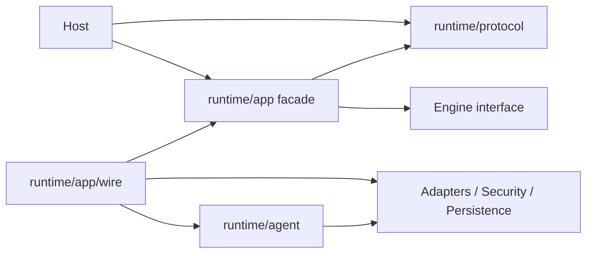

# Package Ownership and Dependency Direction

English | [简体中文](../../zh-CN/02-codehelper-overview/03-package-ownership.md)

## What You Will Learn

You will locate the owner of a change, distinguish contracts from construction
and execution, and reject dependency shortcuts that create alternate authority.

## 1. Ownership Is a Correctness Tool

A package owns:

- the invariants it enforces;
- the state it may mutate;
- the vocabulary it exports;
- the failures it classifies;
- the tests that pin its behavior.

Ownership is not just directory organization. Putting logic in the wrong layer
can bypass policy, duplicate lifecycle state, or make restart behavior depend
on a UI process.

## 2. Top-Level Ownership Map

| Concern | Owner | Must not become |
| --- | --- | --- |
| Process entry | `cmd/codehelper` | business logic container |
| CLI/TUI/API presentation | `internal/host` | Provider/Tool executor |
| Protocol and lifecycle | `internal/runtime` | vendor-specific transport |
| Provider/Tool/ecosystem integration | `internal/adapter` | policy authority |
| Policy and OS isolation | `internal/security` | UI preference |
| Task/Workflow/Subagent scheduling | `internal/orchestration` | second Agent Engine |
| Durable data and recovery | `internal/persist` | arbitrary global store |
| Usage/Trace/Verify | `internal/observability` | source of execution authority |
| OS process/filesystem behavior | `internal/platform` | product policy |
| Editor integration | `extensions/vscode` | local Runtime reimplementation |

## 3. Runtime Sub-ownership

`internal/runtime` contains distinct layers:

| Package | Owns |
| --- | --- |
| `protocol` | transport-neutral Operation/Event contracts |
| `app` | acceptance, sequence, active Turns, subscriptions, control operations |
| `agent` | context and iterative Model/Tool business loop |
| `app/wire` | concrete dependency construction and capability composition |

Direction matters:



`wire` may import concrete implementations because construction is its job.
That permission does not allow it to own Turn business decisions.

## 4. Adapter Sub-ownership

Adapters isolate external or effectful contracts:

- `model`: Catalog, capability, limits, pricing, routes;
- `provider`: normalized request/stream and vendor wire formats;
- `tool`: Descriptor, Registry, executor families, Guard;
- `mcp`: external protocol connection and discovery;
- `skill`: instruction/resource manifests and resolution;
- `plugin`: signed executable distribution and lifecycle;
- `hooks`: bounded lifecycle callbacks;
- `lsp`, `memory`: specialized integrations.

An Adapter translates and executes within declared contracts. It does not
decide product-level authority. Consequential Tools enter Guard even when they
originated from MCP or a Plugin.

## 5. Security, Platform, and Guard

These layers answer different questions:

| Layer | Question |
| --- | --- |
| Tool Descriptor/Registry | What capability and Resources does this Call claim? |
| Policy/permissions/constitution | Is it allowed under current identity and posture? |
| Guard | Were identity, schema, resources, approval, claims, journal, and execution composed correctly? |
| Platform/Sandbox | What can the process actually access at the OS boundary? |

Moving policy into a Tool or Host makes it optional. Moving product policy into
Platform makes OS code own user intent. Guard is the composition boundary.

## 6. Persistence and Observability

Persistence owns durable facts and reconstruction:

- SQLite relational projections;
- ordered Event Log;
- CAS payloads;
- Session/Snapshot state;
- Workspace Journal and recovery.

Observability derives inspectable evidence:

- Usage and cost;
- Trace and latency;
- Diagnostics and verification;
- Telemetry and reports.

Observability may report a failure but should not secretly change authority.
Persistence may restore state but should not invent business transitions.

## 7. Orchestration Ownership

Orchestration owns work above a single Turn:

- Tasks and lifecycle;
- Worker leases and retry;
- Automation schedules;
- Workflow DAG/checkpoint;
- Lanes and Fleet read models;
- Subagent topology and budgets.

It can start Runtime Operations through explicit adapters. It does not call
Providers or Tool executors directly.

## 8. Change Placement Examples

| Requested change | Primary owner | Related contracts |
| --- | --- | --- |
| Add Event field | `runtime/protocol` | schema, transports, projections |
| Change Turn cancellation | `runtime/app` | Engine interface, persistence |
| Add context source | `runtime/agent` | Receipt and budget |
| Add OpenAI frame type | `adapter/provider/openai` | normalized Stream |
| Add file mutation Tool | `adapter/tool/file` | Descriptor, Guard, journal |
| Add approval rule | `security/policy` | Guard and protocol Events |
| Add Worker retry state | `orchestration/task` | persistence and executor |
| Add SQLite table | `persist/state/sqlite` | repository owner and schema checks |
| Add VS Code command | `extensions/vscode` | ACP Operation and trust |

Cross-cutting does not mean ownerless. Choose one primary invariant owner and
adapt other layers around its contract.

## 9. Forbidden Dependency Smells

- Host imports `adapter/provider`, `adapter/tool`, or `security/sandbox`.
- Tool executor evaluates its own broad permission.
- `wire` contains retry/Turn state machine logic.
- Engine writes SQLite tables directly.
- Projection/UI state is used to authorize an action.
- Orchestration calls a Provider instead of starting a Runtime Turn.
- VS Code trusts Webview data as Workspace identity.
- Protocol imports a concrete Host or Adapter.

These may appear convenient locally while violating system-wide guarantees.

## 10. How to Trace a Change

1. Start from the stable contract or user-visible Event.
2. Find the package that validates its invariant.
3. Find construction in `runtime/app/wire`.
4. Find Host projection/read-model use.
5. Read nearest tests before editing.
6. Search for direct imports that would cross the boundary.
7. Update protocol/generated files only through repository commands.

Useful commands:

```bash
rg 'type Engine interface|type Operation struct|type Descriptor struct' internal
rg 'internal/adapter/(provider|tool)|internal/security/sandbox' internal/host
go test ./internal/host/cli -run TestCLIDoesNotDependOnExecutionImplementations
go test ./internal/runtime/app/wire -run TestOnlyWireConstructsPlatformBackend
```

## 11. Review Questions

1. Why is `wire` an owner of construction but not behavior?
2. Which package owns a new Tool's authorization?
3. Why should projections never authorize execution?
4. Where should Workflow retry behavior live?
5. How do architecture tests convert design rules into evidence?

## Next Chapter

[Operation, Event, Receipt, and Projection](./04-runtime-vocabulary.md) defines
the contracts passed across these ownership boundaries.

## Sources and Verification

| Item | Value |
| --- | --- |
| Catalog ID | `overview-package-ownership` |
| Status | `verified` |
| Last verified | 2026-08-06 |
