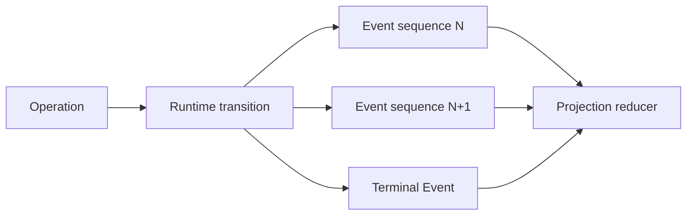

# Operation, Event, Receipt, and Projection

English | [简体中文](../../zh-CN/02-codehelper-overview/04-runtime-vocabulary.md)

## What You Will Learn

You will use CodeHelper's protocol terms precisely, understand their identity
and durability rules, and avoid treating commands, facts, evidence, and query
state as interchangeable.

## 1. The Four Roles

```text
Operation:  request that the Runtime attempt a transition
Event:      immutable fact emitted by Runtime processing
Receipt:    structured evidence about how work was performed
Projection: query-oriented state derived from durable facts
```

Example:

```text
Operation  turn.start
Events     turn.started -> output.delta* -> usage -> turn.receipt -> turn.completed
Receipt    route, context, tools, changes, verification, latency, cost
Projection thread title, latest Turn, pending approvals, task status
```

An Operation is intent, not success. An Event is a fact, not a command. A
Receipt is evidence, not authority. A Projection is a view, not the source of
truth.

## 2. Operation

`protocol.Operation` carries:

- protocol version;
- unique Operation ID;
- tagged `Kind`;
- UTC creation time;
- typed `Payload`.

Operations include starting/canceling/steering a Turn, deciding Approval,
replying to Input, compacting/forking a Thread, and reverting a Turn.

Validation answers whether the request is structurally meaningful. Runtime
acceptance additionally applies queue, identity, lifecycle, and idempotency
rules. An accepted Operation can still lead to failed or canceled work.

## 3. Event

`protocol.Event` carries:

- global/stream `Sequence` cursor;
- Event and originating Operation IDs;
- Thread, Turn, and Item IDs;
- tagged `Kind`;
- timestamp and typed `Data`.

Events describe output, reasoning, Tool state, Usage, approvals, diagnostics,
compaction, Agent status, receipts, and terminal outcomes.

Every Event Kind also carries Protocol Traits — Class, Item Owner, Durability,
Correlation, and Terminal. Classification is Protocol data, not Host policy:
Hosts consume the generated manifest instead of re-classifying Events per Host.



Sequence establishes replay order. Timestamps are useful evidence but are not a
replacement for cursor ordering.

## 4. Identity Hierarchy

| Identity | Scope | Example use |
| --- | --- | --- |
| Workspace | repository authority boundary | bind paths, sessions, permissions |
| Session | user-facing collection | organize Threads |
| Thread | conversation/history lineage | compact, fork, replay |
| Turn | one Agent interaction | terminal state, Usage, verification |
| Item | one visible/interactive unit | Tool, Approval, output card |
| Operation | one requested transition | idempotency and correlation |
| Call/Request | one Tool/Approval interaction | bind decisions and Results |
| Event | one immutable fact | deduplication and replay |

Identity is not decoration. Approval for one Request cannot authorize another;
an Event for one Workspace cannot be projected as another Workspace's truth.

## 5. Terminal Semantics

A Turn ends in exactly one:

- `turn.completed`;
- `turn.failed`;
- `turn.canceled`.

No output is not a terminal state. Process exit is not necessarily a terminal
Event. The Runtime accounts for accepted Operations across cancellation and
close races.

Hosts should render unknown future Events generically while preserving their
envelope, but must understand terminal kinds used for lifecycle control.
Terminal detection derives from `Traits(kind).Terminal`, so Hosts never
hardcode terminal Kind lists.

## 6. Receipt

`turn.receipt` is an Event whose `ExecutionReceiptData` joins evidence such as:

- Context sections, truncation, and budget;
- route, model, Provider, Usage, and cost;
- Tool catalog and Tool attempts;
- reads, changes, line statistics, and rollback conflicts;
- approvals and sandbox posture;
- diagnostics and verification;
- latency phases;
- resolved Skills and evidence facts/risks.

Receipts answer "what happened and under which constraints?" They do not grant
future permission and do not replace detailed Event/Journal records.

## 7. Projection

A Projection reduces durable Events and relational records into query-friendly
state:

```text
projection(next) = reduce(projection(current), event)
```

Examples include Thread lists, latest Turn status, pending approvals, Usage
rollups, and VS Code tree/chat state.

Properties:

- rebuildable from authoritative facts where specified;
- idempotent under duplicate delivery;
- ordered by cursor/version;
- scoped by Workspace/Thread identity;
- optimized for reads, not execution authority.

Go Hosts (TUI, CLI, Bench) share one projection entry point:
`eventview.Project` returns Traits, Data, and a normalized Terminal update
(`completed`, `failed`, `canceled`, or `rejected`) while machine NDJSON keeps
original Event Envelope. Presentation may differ per Host; classification
must not.

If a Projection and durable Event disagree, repair/rebuild the Projection; do
not use the convenient view to overwrite the fact.

## 8. Persistence and Replay

CodeHelper combines an ordered durable Event Log with SQLite projections.
Commit boundaries prevent a projection from claiming an Event that was not
durably recorded. Replay pages from a cursor; a gap is explicit rather than
silently returning a misleading suffix.

On restart, reconstruction determines completed, failed, reverted, and
interrupted state. Reconstruction is not re-execution: replaying `tool.start`
must not rerun the Tool.

## 9. Idempotency and Concurrency

`SubmitWithKey` binds an idempotency key to canonical Operation content:

- same key and same content: duplicate/no-op semantics;
- same key and different content: conflict;
- no key: distinct Operation.

Idempotent submission does not automatically make every side effect
idempotent. Tool, Task, Workflow, and external API boundaries still need their
own fencing or reconciliation.

## 10. Failure Examples

| Mistake | Consequence |
| --- | --- |
| Treat submitted Operation as success | UI reports completion too early |
| Order by timestamp | concurrent Events can reorder |
| Approve by Tool name only | decision can bind wrong Call |
| Re-execute during replay | duplicate side effects |
| Use Projection as authority | stale UI state authorizes work |
| Drop unknown Events | forward compatibility loses evidence |
| Emit two terminal Events | lifecycle and Usage become ambiguous |

## 11. Code Walkthrough

```bash
sed -n '457,478p' internal/runtime/protocol/message.go
sed -n '1361,1450p' internal/runtime/protocol/message.go
sed -n '1706,1765p' internal/runtime/protocol/message.go

go test ./internal/runtime/protocol
go test ./internal/runtime/app \
  -run 'TestRuntime(ConcurrentSubmitHasStrictSequenceAndUniqueTerminal|ReplayEventsPagesWithoutSubscribing|ReplayEventsSurfacesCursorGap)'
go test ./internal/persist/state \
  -run 'TestStore(RecoversProjectionAndPreservesSequenceGaps|RejectsCommittedProjectionWithoutDurableEvent)'
```

## 12. Review Questions

1. Why does Operation acceptance not imply successful completion?
2. Why is Event Sequence stronger than timestamp for replay?
3. What does a Receipt prove, and what does it not authorize?
4. Why must Projection be rebuildable and non-authoritative?
5. Why must replay never re-execute a Tool?
6. Why is Event classification Protocol data rather than Host policy?

## Next Chapter

[The Complete Lifecycle of an Agent Turn](./05-turn-lifecycle.md) applies this
vocabulary to one end-to-end interaction.

## Sources and Verification

| Item | Value |
| --- | --- |
| Catalog ID | `overview-runtime-vocabulary` |
| Status | `draft` |
| Last verified | Not yet verified |
