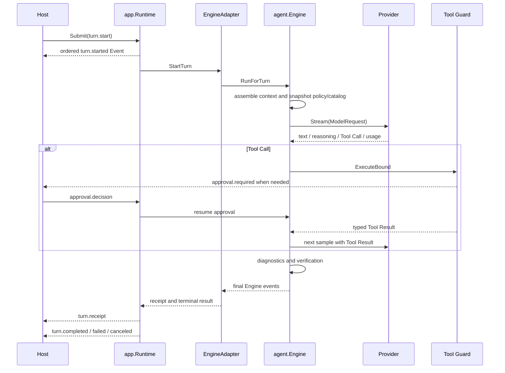

# The Complete Lifecycle of an Agent Turn

English | [简体中文](../../zh-CN/02-codehelper-overview/05-turn-lifecycle.md)

## Learning Objectives

You will be able to trace a Turn from Operation creation through context,
model streaming, tools, verification, receipt, and exactly one terminal Event.

## Prerequisites

Read [CodeHelper System Architecture](./02-system-architecture.md).

## Problem Background

“Send a prompt and print text” is not a lifecycle. A real Turn may stream
reasoning, request several tools, wait for approval, receive steering input,
compact history, run verification, fail, cancel, or survive client
reconnection. These transitions need identity and ordering independent of a
particular UI.

## Core Concepts

- An **Operation** requests a transition.
- A **Turn** is the scoped Agent interaction started by `turn.start`.
- An **Item** gives output, Tool Calls, approvals, and inputs stable UI identity.
- An **Event** records an immutable observation with a monotonic cursor.
- A **Receipt** summarizes evidence, changes, budget, route, latency, and checks.
- A **terminal Event** is exactly one of completed, failed, or canceled.

Operation acceptance and Turn completion are different moments. A Host must not
interpret “submitted” as “succeeded.”

## Phase and Waiting Invariants

| Phase | Runtime may emit | What it must not imply |
| --- | --- | --- |
| accepted/queued | rejection or start later | successful model call |
| calling model | deltas, Usage, Tool proposal | Tool authorization |
| running tools | Tool state/result | semantic task completion |
| awaiting approval/input | durable request identity | implicit permission |
| verifying | verification events/receipts | success before verdict |
| terminal | exactly one completed/failed/canceled | further Turn output |

Waiting is an explicit state, not a blocked anonymous goroutine. Approval and
Input replies bind request, call, Turn, and Workspace identity. A late or
duplicate decision is rejected rather than applied to whatever currently waits.

## Lifecycle



## Step 1: Create and Validate the Operation

`protocol.NewOperation` mints an Operation ID, assigns the tagged-union kind,
sets UTC creation time, and validates the payload. `StartTurnPayload` carries
Thread, Turn, Item, prompt, context, idle state, and optional workspace
identity.

Strict tagged unions reject unknown kinds and fields. Hosts may fill missing
references, but client-provided identity is preserved and validated.

## Step 2: Accept and Sequence

`app.Runtime.SubmitWithKey` validates the Operation, canonicalizes it for
idempotency, and queues accepted work. Reuse with identical content is a no-op;
conflicting reuse is rejected.

The Runtime loop dispatches operations, assigns Event sequence numbers, records
durable lifecycle state, and publishes to subscribers. A bounded queue and
subscriber buffers prevent one caller from consuming unbounded memory.

## Step 3: Bind Workspace and Context

`EngineAdapter.StartTurn` verifies workspace identity and resolves editor
context against runtime paths. It separates the display prompt from
model-visible expanded context and begins a Receipt recorder.

The Agent Engine snapshots Turn-scoped policy, route, and catalog state.
Dynamic context such as repository map, working set, and evidence is rendered
at sampling time so it can evolve after Tool Results.

## Step 4: Sample and Stream

The Engine builds a `provider.ModelRequest` with route, messages, limits,
reasoning options, native search, and the Tool Definitions visible in the
catalog snapshot. Provider-specific adapters normalize responses into common
Stream Events.

Text, reasoning, citations, usage, and Tool Calls become Engine Events and then
Runtime protocol Events. The Host receives incremental facts without owning
the model stream.

## Step 5: Execute Tools and Continue

A sampled Tool Call is bound to catalog identity before execution. The Engine
does not trust a name that was not advertised in its snapshot.

The Guard validates arguments and resources, evaluates policy, waits for
approval when required, acquires resource claims, journals writes, executes
under the sandbox requirement, and returns a typed Result. The Result is
appended as a Tool message for the next sample.

The loop continues until the model produces a terminal answer, the step/budget
gate stops it, verification fails, or the context is canceled.

## Step 6: Verify and Finish

Changed paths can trigger diagnostics and configured Verify checks. A hard
failure can fail the Turn and roll back journaled edits. The Receipt captures
what was read, changed, approved, verified, spent, and timed.

The Runtime enforces one terminal Event per Turn. Cancellation is represented
as a terminal fact, not as missing output.

## Control Operations

- `turn.cancel` cancels the active context.
- `turn.steer` contributes input to the current or next Turn.
- `approval.decision` resolves a specific pending request.
- `input.reply` resumes a typed interaction request.
- `thread.compact` summarizes history under budget.
- `thread.fork` creates independent history.
- `turn.revert` reverts eligible workspace effects.

Each is an Operation with explicit rejection and Event semantics.

## Code Map

| Stage | Source |
| --- | --- |
| Operation/Event types | `internal/runtime/protocol/message.go` |
| Queue, cursor, terminal state | `internal/runtime/app/runtime.go` |
| Protocol-to-Engine adaptation | `internal/runtime/app/application.go` |
| Model/tool loop | `internal/runtime/agent/engine/engine.go` |
| Receipt projection | `internal/runtime/app/receipt.go` |
| Durable restart | `internal/runtime/app/wire/persistent.go` |

## Tradeoffs and Alternatives

Emitting only text is easier but cannot represent approval, tools, usage, or
recovery. Keeping mutable Turn state only in a UI is responsive but loses
authority when another Host connects. CodeHelper accepts a richer event model
to make lifecycle facts replayable across Hosts.

## Failure Modes and Security Boundaries

- Cursor gaps are explicit and include a recovery cursor.
- A slow subscriber is dropped deterministically.
- Unsupported Operations emit rejection rather than disappearing.
- Workspace identity drift fails before model-visible editor context is used.
- Tool catalog mutation between sampling and execution is rejected.
- Approval decisions with wrong request/call identity are rejected.
- A Verify hard failure can roll back and fail the Turn.
- Cancel/close races account for every accepted Operation.

## Tests and Verification

```bash
go test ./internal/runtime/protocol \
  -run 'Test(OperationTaggedUnionRoundTrip|EditorContextValidationFailsClosed)'

go test ./internal/runtime/app \
  -run 'TestRuntime(ConcurrentSubmitHasStrictSequenceAndUniqueTerminal|CancelActuallyCancelsActiveTurn|ToolAndApprovalGetOwnedItemIDs)'

go test ./internal/runtime/agent/engine \
  -run 'Test(EngineExecutesToolAndFeedsResultOnce|VerifyGateHardFailureFailsTurnAndRollsBack)'
```

## Hands-On Lab

Run the fixture with events preserved:

```bash
make build
./bin/codehelper exec \
  --provider-fixture ./testdata/providers/openai \
  --provider openai \
  --model gpt-fixture \
  --workspace . \
  --output-format stream-json \
  "say hello"
```

Identify Operation/Turn identity, `turn.started`, output deltas, Receipt, and
the terminal Event. Then run
`TestEngineExecutesToolAndFeedsResultOnce` to inspect the Tool branch without
requiring a platform-dependent file write. Fixture behavior depends on its
recorded scenario; inspect `testdata/providers/openai/fixture.json` before
changing the prompt.

## Review Questions

1. Why can an Operation be accepted before the Turn succeeds?
2. Why does a Tool Call need catalog identity in addition to its name?
3. Which Event tells a reconnecting Host that no more output will arrive?
4. Why must approval waiting be represented as protocol state?

## Further Reading

- [Model, Context, and Tool](./06-model-context-and-tool.md)
- [Runtime protocol schema](../../../protocol/runtime-protocol.schema.json)

## Sources and Verification

| Item | Value |
| --- | --- |
| Catalog ID | `overview-turn-lifecycle` |
| Status | `verified` |
| Last verified | 2026-08-06 |
