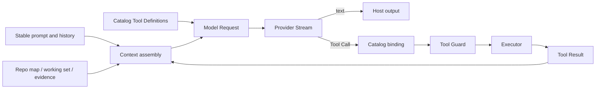

# How Models, Context, and Tools Cooperate

English | [简体中文](../../zh-CN/02-codehelper-overview/06-model-context-and-tool.md)

## Learning Objectives

You will understand the boundary between Model and Provider, how stable and
volatile context are assembled, how Tool Definitions become guarded execution,
and how non-terminal Tool Results can trigger another model sample.

## Prerequisites

Read [The Complete Lifecycle of an Agent Turn](./05-turn-lifecycle.md).

## Problem Background

A model has no direct repository access. It sees only the messages and Tool
Definitions included in one request. A Tool has no intent of its own. Context
without tools can explain a repository but cannot act; tools without context
act blindly; a model without governance can request unsafe effects.

An Agent Runtime must connect all three while keeping their responsibilities
separate.

## Core Concepts

- **Model** describes inference capabilities and limits.
- **Provider** transports a normalized Model Request to a remote or fixture
  implementation and returns a normalized Stream.
- **Context** is the bounded information included in a sample.
- **Tool Definition** is model-visible name, description, and input schema.
- **Tool Call** is untrusted sampled data.
- **Tool Registry** resolves a Call to current catalog identity and an executor.
- **Tool Result** is structured evidence appended to the conversation.

## Collaboration Loop



The loop can sample multiple times in one Turn. Context and catalog state are
re-evaluated at defined boundaries, while identity prevents a sampled Call from
silently targeting a replaced executor.

## Three Kinds of Snapshot

The collaboration loop needs different stability rules:

| Snapshot | Stable for | Why |
| --- | --- | --- |
| Turn policy and route | the Turn | mid-Turn config reload must not change authority/model unexpectedly |
| Tool Catalog binding | the sampled Call | name reuse must not retarget an old proposal |
| Volatile context tail | one sample | Tool Results, evidence, and risks must evolve |

Freezing everything would hide new observations; rebuilding everything would
break authority consistency and prompt-cache stability. CodeHelper freezes
identity/authority at the narrowest correct scope and rebuilds observational
context where change is expected.

## Model and Provider

`internal/adapter/model` owns catalog descriptors, capabilities, limits,
pricing, routes, and credential references. A resolved `ReadyRoute` identifies
the Provider, Model, protocol, endpoint, and supported behavior.

`internal/adapter/provider` owns normalized messages, content blocks, Tool
Calls, Tool Definitions, Model Requests, usage, citations, Stream Events, and
the small `Provider.Stream` interface.

Provider adapters translate OpenAI Chat, Responses, Anthropic, or fixture wire
formats into the shared Stream. The Agent Engine therefore does not parse each
vendor protocol.

Capability checks are executable contracts. For example, a request carrying
tools is rejected when the selected model does not advertise Tool Calls.

## Context Architecture

Context has different stability classes:

1. base system constraints and coding policy;
2. mode and security posture;
3. repository/file context and skills;
4. durable conversation history;
5. volatile repository map, working-set ledger, evidence, and reminders.

`promptcontext.Assemble` creates stable partitions with explicit byte/token
budgets and receipts. `AssembleTurn` renders volatile partitions at the tail of
each request. Keeping the volatile tail last preserves a byte-identical prefix
for Provider prompt caching.

Receipts record original and retained sizes plus truncation reason. Missing,
empty, and truncated context therefore have different observable meanings.

## Working Set and Evidence

The Working Set records paths and provenance, not repeated file contents.
Contents already appeared in Tool Results/history and can be read again.

Evidence records:

- facts established by search/read operations;
- changed paths that remain unverified;
- blind changes made without a prior read;
- open diagnostics;
- reminders about repeated or wasted work.

Risks appear before facts in the rendered partition because prefix-preserving
budget cuts should retain actionable uncertainty.

## Tool Discovery and Binding

The Registry exposes an eager subset of Tool Definitions and can defer a large
catalog behind Tool Search. Each snapshot has catalog ID, generation, revision,
and authority. The Provider sees only public schema; execution identity remains
local.

When the model samples a Tool Call, the Engine binds it to the snapshot that
advertised it. Replacement or revocation before execution fails closed rather
than running a different implementation under the same name.

## Tool Execution and Feedback

The Engine schedules Tool Calls according to concurrency/resource rules and
passes each Call through Guard. Results can include content, metadata, file
changes, error categories, and retrievable handles for oversized output.

Successful and recoverable failed Results are appended as Tool messages. A
non-terminal Result can trigger another model sample that uses the evidence to
continue or correct arguments. An accepted `turn_complete` Result instead
publishes its `summary` as the final response without another sample.
Unauthorized or structurally invalid execution terminates according to the
error classification rather than being disguised as ordinary text.

## Code Map

| Concern | Source |
| --- | --- |
| Model catalog and routes | `internal/adapter/model` |
| Normalized request/stream | `internal/adapter/provider/types.go` |
| HTTP Provider behavior | `internal/adapter/provider/httpclient` |
| Tool Registry and claims | `internal/adapter/tool/tool.go` |
| Stable/volatile context | `internal/runtime/agent/promptcontext` |
| Working Set and evidence | `internal/runtime/agent/workingset`, `evidence` |
| Collaboration loop | `internal/runtime/agent/engine/engine.go` |
| Default context budgets | `internal/runtime/app/wire/route.go` |

## Tradeoffs and Alternatives

Sending the whole repository appears simple but exceeds context limits,
increases cost, and reduces relevance. Sending only user-selected files misses
cross-cutting structure. CodeHelper combines bounded repository structure,
observed working state, explicit evidence, and on-demand tools.

Freezing the full prompt at Turn start improves repeatability but ignores Tool
Results and new risks. Rebuilding everything each sample defeats prompt cache.
The stable-prefix/volatile-tail design balances both.

## Failure Modes and Security Boundaries

- Route resolution fails when credentials, protocol, limits, or capabilities
  are inconsistent.
- Unknown Tool Calls are returned as controlled failures.
- Unadvertised or revoked tools do not execute.
- Context truncation is reported in receipts.
- Tool schema/count budgets prevent unbounded catalogs from consuming context.
- A Tool Result is untrusted model input even after execution.
- Credential values are resolved in Provider clients and do not enter prompt
  context.

## Tests and Verification

```bash
go test ./internal/runtime/agent/promptcontext \
  -run 'TestAssembleTurn(RendersBothSectionsAsSystemMessages|ReportsBudgetTruncation)'

go test ./internal/runtime/agent/engine \
  -run 'Test(EngineExecutesToolAndFeedsResultOnce|SamplingFailsClosedUntilToolCatalogSyncRecovers|TurnContextRebuildsWithinTheSameTurn)'
```

## Hands-On Lab

Inspect context receipts in a deterministic run:

```bash
make build
./bin/codehelper exec \
  --provider-fixture ./testdata/providers/openai \
  --provider openai \
  --model gpt-fixture \
  --workspace . \
  --output-format stream-json \
  "say hello"
```

Search the stream for `turn.receipt`, context sections, route, and usage. Then
compare the Tool Definitions in `internal/runtime/agent/engine` with the
Registry descriptors in `internal/adapter/tool`. The fixed prompt is part of
the deterministic Fixture contract, not a general model limitation.

## Review Questions

1. Why is Provider not a synonym for Model?
2. Why does volatile context appear after durable history?
3. What prevents a sampled Tool Call from targeting a replaced executor?
4. Which data is Turn-stable, Call-bound, or rebuilt per sample?

## Further Reading

- [Context Engineering part in navigation](../NAVIGATION.md)
- [Guard, Approval, Constitution, and Sandbox](../07-security-governance/03-approval-constitution-sandbox.md)

## Sources and Verification

| Item | Value |
| --- | --- |
| Catalog ID | `overview-model-context-tool` |
| Status | `draft` |
| Last verified | Not yet verified |
