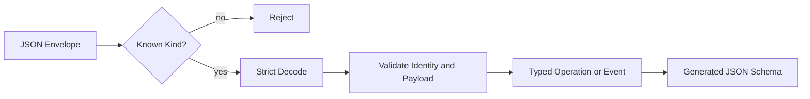

# Protocol and Stable Data Contracts

English | [简体中文](../../zh-CN/03-runtime-kernel/01-protocol.md)

## Learning Objectives

Understand why Runtime protocol types are independent, how tagged unions and
identity prevent ambiguous messages, and how generated schema detects drift.

## Prerequisites

Read [The Complete Lifecycle of an Agent Turn](../02-codehelper-overview/05-turn-lifecycle.md).

## Problem Background

CLI, ACP, VS Code, persistence, and tests all need to describe the same
work. Sharing Go structs is insufficient when messages cross process and
language boundaries. A stable contract must reject unknown shapes, preserve
identity, and evolve deliberately.

## Core Concepts

- Operation requests a transition; Event records an observation.
- Kind plus typed Payload/Data forms a tagged union.
- Thread, Turn, Operation, Event, and Item IDs answer different ownership
  questions.
- Cursor orders Events for replay.
- Problem carries machine code, retryability, and sanitized details.
- Receipt is evidence, not a terminal status.
- Readiness carries `ready`, `degraded`, or `blocked` plus reason, impact, and
  repair action.
- Session/Profile, Provider/Model, Tool Catalog, lifecycle/search, Checkpoint,
  Plan, and Turn recovery contracts are shared Host data, not VS Code-local
  state.

## CodeHelper Design

`internal/runtime/protocol` imports no Runtime implementations. Registries map
every Operation/Event Kind to a constructor. Custom JSON encoding writes the
Kind and concrete payload; decoding uses strict unknown-field rejection and
then validates semantic invariants.



## Identity and Ordering

An Event includes Sequence, Operation ID, Thread ID, Turn ID, and Item ID.
Sequence supports cursor replay; the other IDs preserve causality and UI
ownership. Tool, Approval, and Input Items are distinct from the initial
prompt Item so projection does not collapse unrelated activity.

`FillOperationReferences` only fills empty values. It cannot silently replace
client identity. Workspace identity has its own versioned structure and
canonical paths.

## Envelope and Semantic Invariants

Validation happens at two levels:

| Level | Examples | Why both are needed |
| --- | --- | --- |
| Envelope | version, ID, Kind, timestamp, Payload/Data present | prevents ambiguous framing |
| Semantic payload | required references, finite enum, bounded context, matching identities | prevents valid JSON from requesting impossible work |

Decoding may construct a typed payload before semantic validation so callers
can report precise problems, but no Runtime transition may accept it before
`Validate`.

An Event must preserve causal references from its Operation. The Runtime may
assign missing internal Item identity, but it cannot rewrite a client's
non-empty Thread/Turn reference to make an invalid message fit.

## Schema Generation

`schema.go` reflects the registered payload/data types into
`docs/protocol/runtime-protocol.schema.json`. The drift test regenerates in
memory and compares the committed artifact. Protocol changes therefore require
code, tests, generated schema, and client types to move together.

## Compatibility and Evolution

Protocol versioning is not equivalent to accepting arbitrary extra JSON.

- Adding an optional field still requires regenerated schema and client review.
- Adding a Kind requires every decoder/projection to preserve or understand it.
- Changing required fields, enum meaning, identity scope, or terminal behavior
  is a compatibility change even when the JSON type is unchanged.
- Unknown Events may be displayed generically by Hosts, but unknown Operations
  are rejected because the Runtime cannot safely infer intent.
- Generated compatibility artifacts must be updated through repository
  commands, not hand-edited.

Before a stable release, compatibility policy may evolve; the committed
version and schema remain authoritative for each build.

## Code Map

| Concern | Source |
| --- | --- |
| Shared envelope | `message.go` |
| Operations and payloads | `operation.go` |
| Events and data | `event.go` |
| Execution evidence | `receipt.go` |
| Identity | `identity.go` |
| Codec and strict validation | `codec.go`, `validate.go` |
| Readiness | `readiness.go` |
| Machine errors | `problem.go` |
| Dynamic Tool protocol | `dynamic.go` |
| Workspace identity | `workspace_identity.go` |
| Session Profile/lifecycle | `session_profile.go`, `session_lifecycle.go` |
| Provider/Model and Tool catalogs | `model_catalog.go`, `tool_catalog.go` |
| Checkpoint and Plan intent | `checkpoint.go`, `workflow_intent.go` |
| Schema reflection | `schema.go`, `schemagen` |

## Implementation Walkthrough

`NewOperation` and `NewEvent` mint IDs and validate before returning.
`Operation.Validate` checks version, ID, timestamp, Kind/Payload agreement, and
payload semantics. Event validation additionally requires complete ownership
identity and monotonic Sequence.

The Kind registries are copied when exposed, preventing callers from mutating
global protocol state. Fuzz tests exercise JSON decoding so malformed input
fails without panic.

Protocol files are separated by contract role without changing the wire
schema. The committed JSON Schema and generated VS Code types are the
behavioral boundary; file layout is an implementation detail protected by
the hotspot baseline.

Session-facing contracts deliberately separate durable summary from transient
search matches, immutable Checkpoint/Plan artifacts from mutable lifecycle
state, and accepted Turn identity from terminal receipts. Recovery requests
carry explicit source Turn, action, guidance, and idempotency identity; they do
not carry reconstructed display text or historical effects.

## Tradeoffs and Alternatives

Generic maps are flexible but defer mistakes until deep execution. Generated
Protobuf would provide another strong contract but add tooling and migration
cost. CodeHelper uses explicit Go tagged unions plus JSON Schema because Hosts
already communicate in JSON while still requiring closed shapes.

## Failure Modes and Security Boundaries

- Unknown Kind, field, version, or missing payload is rejected.
- Kind/Payload mismatch is rejected.
- Empty identity or invalid editor context fails closed.
- Error details are structured to avoid leaking raw remote/path errors.
- A newer schema cannot be assumed compatible merely because JSON parses.

## Tests and Verification

```bash
go test ./internal/runtime/protocol
make protocol-schema
git diff --exit-code -- docs/protocol/runtime-protocol.schema.json
```

The generation command should produce no diff when the committed schema is
current.

## Hands-On Lab

Open `message_test.go`, add an unknown field to a valid Operation fixture, and
run the strict-decode test. Revert the local experiment afterward. Then inspect
the schema entry for `turn.start` and map each required field to the Go type.

## Review Questions

1. Why are Cursor and Turn ID not interchangeable?
2. Why must Kind registries be closed and immutable to callers?
3. What artifacts must change with a new public Event?
4. Why can an optional JSON field still require compatibility review?
5. Why may a Host preserve an unknown Event but not submit an unknown Operation?
6. Why are durable Session summaries and search matches different shapes?
7. Why must recovery name a source Turn instead of resubmitting rendered text?

## Further Reading

- [Application Runtime](./02-application-runtime.md)
- [Runtime protocol schema](../../../protocol/runtime-protocol.schema.json)

## Sources and Verification

| Item | Value |
| --- | --- |
| Catalog ID | `runtime-protocol` |
| Status | `verified` |
| Last verified | 2026-08-07 |
