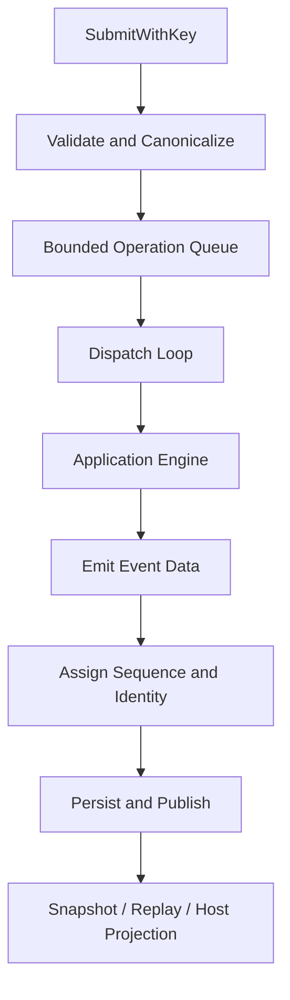

# Application Runtime and State Projection

English | [简体中文](../../zh-CN/03-runtime-kernel/02-application-runtime.md)

## Learning Objectives

Understand operation acceptance, dispatch, event sequencing, subscriber
projection, active Turn ownership, and the boundary between app Runtime and
Agent Engine.

## Prerequisites

Read [Protocol and Stable Data Contracts](./01-protocol.md).

## Problem Background

The Agent Engine knows how to run a Turn, but multiple callers need queueing,
idempotency, cancellation, replay, pending Approval/Input state, and consistent
terminal outcomes. Putting those concerns into a Host would make each Host a
different runtime.

## Core Concepts

- Acceptance validates and owns an Operation before execution.
- Dispatch maps each Operation Kind to an explicit Handler and structured
  Outcome.
- Projection derives current query state from ordered Events.
- `ActiveTurnRegistry` atomically reserves a Turn and Thread with a lease.
- `eventhub.Hub` exclusively owns Event sequence, append, replay, and
  subscriber fanout.
- Pending work represents resumable Approval, Input, and Operation state.

## Runtime Flow



## Acceptance and Idempotency

`SubmitWithKey` rejects closed Runtime, malformed Operation, queue exhaustion,
and conflicting reuse. Reusing the same Operation ID or caller key with the
same canonical payload is a no-op. This protects a reconnecting transport from
duplicating effects.

Accepted and committed records are separate so a restart can distinguish work
that entered the Runtime from work whose lifecycle completed.

## Linearization Points and Backpressure

Concurrency becomes understandable only when each promise has a linearization
point:

| Promise | Linearization point |
| --- | --- |
| Operation accepted | durable/in-memory acceptance record is installed before queue send |
| Duplicate suppressed | canonical content is compared under Runtime state lock |
| Event ordered | Sequence is assigned in the single publish path |
| Event durable | Event Store append succeeds before subscriber publication |
| Turn active | Registry lease and control are bound before Engine goroutine runs |
| Turn terminal | terminal map accepts the first terminal Kind |
| Runtime closed | acceptance is disabled before active work/subscribers are drained |

The bounded Operation channel is admission backpressure, not a work-completion
queue. `Submit` returning `nil` means accepted, not completed. Event replay or a
read model communicates completion.

## Lock and Goroutine Boundaries

The Runtime separates general state from active-Turn cancellation state. It
never holds its main mutex while executing the Engine, calling a subscriber,
or waiting on external I/O. The dispatch loop owns Operation order; Turn work
may run asynchronously but all Events re-enter the central publish path.

This design avoids global serialization of model latency while retaining one
Event order. Tests exercise submit/close races because shutdown is part of the
state machine, not a process afterthought.

## Dispatch and Active Turns

`operationDispatcher` explicitly dispatches start, cancel, steer, Approval,
Input, compact, fork, and revert. Every Handler returns an Outcome carrying
optional Events, an optional Async Turn identity, a typed `*protocol.Problem`,
and an explicit Commit Mode (`CommitNow` or `CommitDeferred`). Only the
Dispatcher applies the synchronous commit/rejection template, and
`validateOperationOutcome` enforces the exact Kind/Commit Mode combination;
plain errors are converted to Problems with `CodeInternal` mapped to
`CodeConflict`. Start remains async until terminal publication.

`ActiveTurnRegistry` reserves Thread and Turn in one critical section; the
lease carries the durable Start Operation ID. Release requires the matching
lease token, so a stale goroutine cannot release a newer Turn. The same handle
binds control and cancellation provenance and applied Profile revision, but
pending-work phase is no longer stored there: `EngineAdapter.TurnPhase` reads
the authoritative Turn Kernel snapshot.

## Terminal and Service Ownership

`TerminalPublisher` is the sole owner of atomic terminal commit, deterministic
outbox projection, and restart recovery. A terminal commit durably binds the
frozen kernel state, Session Delta, Receipt, terminal Event, and real Operation
receipt before projection.

`SessionService` owns lifecycle, Profile, and Tool Catalog behavior.
`ArtifactService` owns Checkpoint, Plan, Turn recovery, and artifact
persistence. Their Host-facing contracts live in the independent
`app/service` package (`Session` and `Artifact[Recovery, Plan]` interfaces);
implementations are adapters over Runtime-owned ports, not host logic. Runtime
embeds both services so Hosts retain the existing Facade API without duplicate
forwarding methods.

## Chat Merge and Durable Assembly

`chatmerge.Service` (`internal/runtime/app/chatmerge`) owns the isolated Chat
workspace pipeline as an independently testable service rather than
construction logic inside `wire`:

- `Plan` returns a compact `tool.EditPlan` whose ID digests every planned
  batch, so a stale preview cannot be applied.
- `Apply` re-plans under the Turn Gate, verifies the plan ID, snapshots
  expected file fingerprints, and journal-applies batches with CAS conflict
  detection, then refreshes the worktree and commits a new baseline.
- `Snapshot` copies parent workspace changes into a new worktree and commits
  its baseline; `Verify` rejects a restored worktree without a baseline.
- Text conflicts resolve with a three-way `git merge-file` against the
  committed baseline; binary or non-UTF-8 paths and overlarge diffs are
  rejected (512 files, 64 per batch, 3 MiB diff cap).
- `allowApply` derives from the Runtime permission, so a read-only workspace
  never reaches the journal.

`internal/runtime/app/persistence` is the durable assembly boundary: it
composes Session, Thread, Task, Snapshot, Usage, and Trace repositories over
`persist/state.Store`, restores interrupted Tasks, and prepares or starts a
persistent `app.Runtime` (`PreparePersistentRuntime`, `NewPersistentRuntime`)
before accepting Operations. `EnsureThread` seeds workspace/session/thread
rows so CLI and TUI hosts can start Turns against the persistent Runtime.

## Event Projection

`eventhub.Hub` owns the single ordering path: sequence assignment, append,
replay, and subscriber fanout. The Runtime delegates `Events`,
`EventsLimited`, `ReplayEvents`, `Snapshot`, and `Close` to the Hub. `Publish`
appends an Event and fans it out to subscribers; `PublishStable` additionally
deduplicates by a deterministic Event ID against an identity store, which
makes `TerminalPublisher`'s committed outbox projection idempotent across
restarts. `Restore` reconciles the in-memory sequence after recovery.

Replay uses Cursor ranges without creating a live subscription. A bounded
in-memory history can produce an explicit Cursor Gap. Slow subscribers are
closed and dropped rather than blocking the single ordering path.

## Thread and Engine Management

`ThreadManager` creates or restores an `EngineAdapter` per Thread and supports
forked history. `EngineAdapter` resolves workspace/editor context and converts
internal Engine Events into protocol Events while recording a Receipt.

The app layer does not parse Provider streams or authorize Tool Calls.

## Code Map

| Concern | Source |
| --- | --- |
| Queue, acceptance, dispatch | `runtime.go` |
| Operation outcomes and handlers | `operation_dispatch.go` |
| Active Turn leases and control | `active_turn_registry.go` |
| Event sequence, replay, subscribers | `eventhub/hub.go` |
| Host-facing service contracts | `service/contracts.go` |
| Atomic terminal/outbox recovery | `terminal_publisher.go` |
| Session and artifact services | `service_facade.go`, `session_artifacts.go` |
| Engine adaptation | `application.go` |
| Pending state | `pendingwork.go` |
| Thread ownership | `thread_manager.go` |
| Receipt projection | `receipt.go` |
| Durable lifecycle interface | `lifecycle.go` |
| Chat merge preview and journaled apply | `chatmerge/service.go` |
| Durable Runtime assembly and recovery | `persistence/runtime.go` |

## Tradeoffs and Alternatives

A goroutine per request with direct callbacks is simple but gives no total
Event order. One central acceptance/sequence path improves determinism while
bounded queues expose backpressure instead of hiding overload.

Dropping a slow subscriber can lose live UI updates, but replayable Events make
recovery explicit and prevent one UI from stopping execution.

## Failure Modes and Security Boundaries

- Queue full is retryable; closed Runtime is not.
- Conflicting idempotency reuse is rejected before Engine work.
- Cursor ahead/gap/replay limit have distinct machine errors.
- Idle automatic Turn is rejected in Plan mode.
- Control Operation for an unknown Turn is explicitly rejected.
- Runtime close cancels active work and accounts for accepted Operations.

## Tests and Verification

```bash
go test ./internal/runtime/app \
  -run 'TestRuntime|TestRuntimeTurnPhaseClassification|TestThreadManager|TestActiveTurnRegistry|TestOperationOutcome'
```

Run the complete package when changing queue, event, or recovery semantics:

```bash
go test ./internal/runtime/app
```

## Hands-On Lab

Read `TestRuntimeConcurrentSubmitHasStrictSequenceAndUniqueTerminal`. Draw the
invariants it checks: unique Sequence, exactly one terminal Event, and complete
operation accounting. Then inspect `ReplayEvents` and explain how a dropped
subscriber catches up.

## Review Questions

1. Why are accepted and committed Operations tracked separately?
2. Why does the Runtime, rather than the Engine, assign Event Sequence?
3. What allows subscriber drop to be recoverable?
4. What does `Submit` linearize, and what does it not promise?
5. Why must subscriber sends and Engine execution happen outside the main lock?

## Further Reading

- [Agent Loop](./03-agent-loop.md)
- [Resume and Recovery](./06-resume-and-recovery.md)

## Sources and Verification

| Item | Value |
| --- | --- |
| Catalog ID | `runtime-app` |
| Status | `draft` |
| Last verified | Not yet verified |
