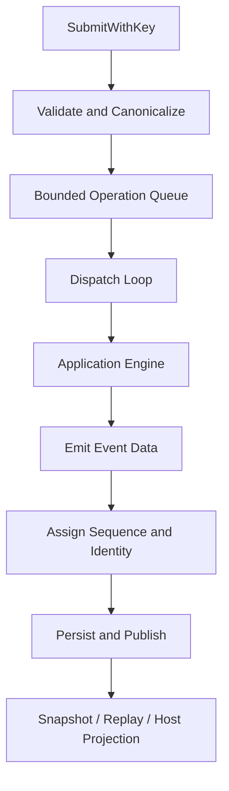

# Application Runtime and State Projection

English | [简体中文](../../zh-CN/03-runtime-kernel/02-application-runtime.md)

## Learning Objectives

Understand operation acceptance, dispatch, event sequencing, subscriber
projection, active Turn ownership, and the boundary between app Runtime and
Agent Engine.

## Prerequisites

Read [Protocol and Stable Data Contracts](./01-protocol.md).

## Problem Background

The Agent Engine knows how to run a Turn, but multiple callers need queueing,
idempotency, cancellation, replay, pending Approval/Input state, and consistent
terminal outcomes. Putting those concerns into a Host would make each Host a
different runtime.

## Core Concepts

- Acceptance validates and owns an Operation before execution.
- Dispatch maps Operation Kind to the application Engine interface.
- Projection derives current query state from ordered Events.
- Active maps bind one Turn to a cancellation function and one Thread to its
  active Turn.
- Pending work represents resumable Approval, Input, and Operation state.

## Runtime Flow



## Acceptance and Idempotency

`SubmitWithKey` rejects closed Runtime, malformed Operation, queue exhaustion,
and conflicting reuse. Reusing the same Operation ID or caller key with the
same canonical payload is a no-op. This protects a reconnecting transport from
duplicating effects.

Accepted and committed records are separate so a restart can distinguish work
that entered the Runtime from work whose lifecycle completed.

## Linearization Points and Backpressure

Concurrency becomes understandable only when each promise has a linearization
point:

| Promise | Linearization point |
| --- | --- |
| Operation accepted | durable/in-memory acceptance record is installed before queue send |
| Duplicate suppressed | canonical content is compared under Runtime state lock |
| Event ordered | Sequence is assigned in the single publish path |
| Event durable | Event Store append succeeds before subscriber publication |
| Turn active | Turn/Thread cancellation maps are installed before Engine goroutine runs |
| Turn terminal | terminal map accepts the first terminal Kind |
| Runtime closed | acceptance is disabled before active work/subscribers are drained |

The bounded Operation channel is admission backpressure, not a work-completion
queue. `Submit` returning `nil` means accepted, not completed. Event replay or a
read model communicates completion.

## Lock and Goroutine Boundaries

The Runtime separates general state from active-Turn cancellation state. It
never holds its main mutex while executing the Engine, calling a subscriber,
or waiting on external I/O. The dispatch loop owns Operation order; Turn work
may run asynchronously but all Events re-enter the central publish path.

This design avoids global serialization of model latency while retaining one
Event order. Tests exercise submit/close races because shutdown is part of the
state machine, not a process afterthought.

## Dispatch and Active Turns

The Runtime dispatches start, cancel, steer, Approval, Input, compact, fork,
and revert through the `app.Engine` interface. It registers active Turn
cancellation before asynchronous execution and enforces one active Turn per
Thread.

Terminal tracking rejects duplicate completed/failed/canceled outcomes.
Cancellation provenance records reason and owning Item/Operation for the final
Event.

## Event Projection

Event sequence is assigned centrally. Events are appended to the Event Store,
used to update pending/terminal maps, and published to subscribers. Replay uses
Cursor ranges without creating a live subscription.

A bounded in-memory history can produce an explicit Cursor Gap. Slow
subscribers are dropped rather than blocking the single ordering path.

## Thread and Engine Management

`ThreadManager` creates or restores an `EngineAdapter` per Thread and supports
forked history. `EngineAdapter` resolves workspace/editor context and converts
internal Engine Events into protocol Events while recording a Receipt.

The app layer does not parse Provider streams or authorize Tool Calls.

## Code Map

| Concern | Source |
| --- | --- |
| Queue, sequence, subscribers | `runtime.go` |
| Engine adaptation | `application.go` |
| Pending state | `pendingwork.go` |
| Thread ownership | `thread_manager.go` |
| Receipt projection | `receipt.go` |
| Durable lifecycle interface | `lifecycle.go` |

## Tradeoffs and Alternatives

A goroutine per request with direct callbacks is simple but gives no total
Event order. One central acceptance/sequence path improves determinism while
bounded queues expose backpressure instead of hiding overload.

Dropping a slow subscriber can lose live UI updates, but replayable Events make
recovery explicit and prevent one UI from stopping execution.

## Failure Modes and Security Boundaries

- Queue full is retryable; closed Runtime is not.
- Conflicting idempotency reuse is rejected before Engine work.
- Cursor ahead/gap/replay limit have distinct machine errors.
- Idle automatic Turn is rejected in Plan mode.
- Control Operation for an unknown Turn is explicitly rejected.
- Runtime close cancels active work and accounts for accepted Operations.

## Tests and Verification

```bash
go test ./internal/runtime/app \
  -run 'TestRuntime|TestRuntimeTurnPhaseClassification|TestThreadManager'
```

Run the complete package when changing queue, event, or recovery semantics:

```bash
go test ./internal/runtime/app
```

## Hands-On Lab

Read `TestRuntimeConcurrentSubmitHasStrictSequenceAndUniqueTerminal`. Draw the
invariants it checks: unique Sequence, exactly one terminal Event, and complete
operation accounting. Then inspect `ReplayEvents` and explain how a dropped
subscriber catches up.

## Review Questions

1. Why are accepted and committed Operations tracked separately?
2. Why does the Runtime, rather than the Engine, assign Event Sequence?
3. What allows subscriber drop to be recoverable?
4. What does `Submit` linearize, and what does it not promise?
5. Why must subscriber sends and Engine execution happen outside the main lock?

## Further Reading

- [Agent Loop](./03-agent-loop.md)
- [Resume and Recovery](./06-resume-and-recovery.md)

## Sources and Verification

| Item | Value |
| --- | --- |
| Catalog ID | `runtime-app` |
| Status | `verified` |
| Last verified | 2026-08-06 |
