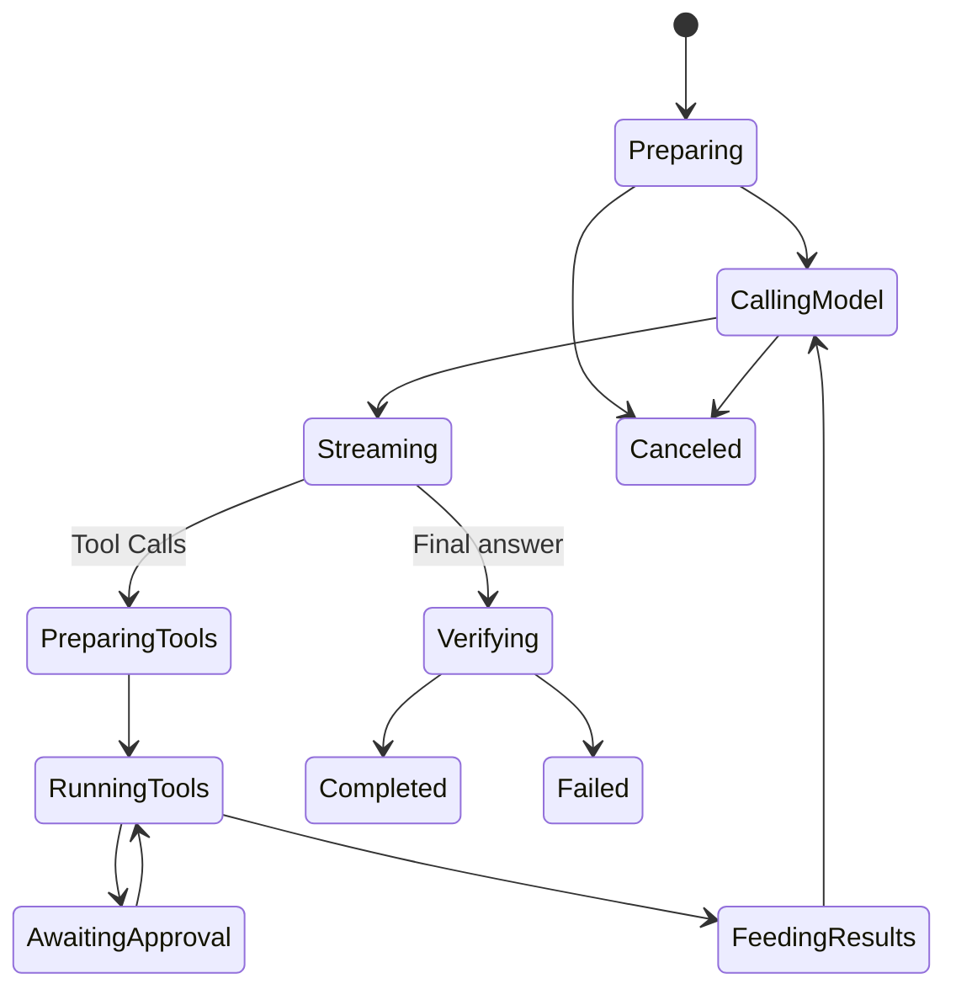

# The Model and Tool Execution Loop

English | [简体中文](../../zh-CN/03-runtime-kernel/03-agent-loop.md)

## Learning Objectives

Trace one Engine step, understand sampling snapshots and Tool scheduling, and
identify the gates that stop an iterative Turn.

## Prerequisites

Read [Application Runtime](./02-application-runtime.md).

## Problem Background

An Agent Turn is not one model call. The model may request Tools, consume their
Results, revise a plan, ask for input, and sample again. An unbounded loop can
spend indefinitely or execute stale capabilities.

## Core State Machine



Actual Events also cover compaction, input waiting, catalog changes, usage,
diagnostics, and extension health.

## Sampling Boundary

At Turn start the Engine snapshots security policy and route intent. Before a
sample it assembles stable history plus volatile Turn context and captures a
Tool Catalog snapshot. `ModelRequest` includes route, messages, limits,
reasoning options, and only the Tool Definitions admitted by the catalog
budget.

Meaningful Stream data prevents unsafe automatic retry: once output or a Tool
Call may have influenced state, replaying the Provider request could duplicate
effects.

## Tool Round Trip

Stream fragments are normalized into complete Tool Calls. Catalog identity is
attached locally, calls are admitted by a scheduler, and execution goes through
Guard. Parallel-safe calls may run concurrently; exclusive resources serialize.

The Engine does not publish partial batch results as complete Tool messages.
After the batch settles, Results are appended with matching Call IDs and the
next sample sees the complete causal history.

Recoverable Tool failures are classified and fed back to the model. Security,
budget, cancellation, and invariant failures terminate instead of inviting the
model to work around them.

## One Iteration as a Transaction

Each model/Tool iteration has a provisional and committed side:

```text
snapshot route/policy/catalog
  -> assemble request
  -> stream provisional output and complete Tool Calls
  -> validate/bind/schedule/execute calls
  -> append paired Assistant Call + Tool Result
  -> next sample or final verification
  -> commit coherent Turn history only at successful boundary
```

Live Events may be observable before history commits. Users need progress, but
future model context must never contain an Assistant Tool Call without its
matching Result. Failed/canceled Turns discard incoherent provisional history;
durable protocol Events remain as audit facts.

This is not a database transaction across every external effect. File writes
use Guard/Journal semantics, and remote effects require their own idempotency or
reconciliation.

## State Scope

| Scope | Examples |
| --- | --- |
| Turn | security snapshot, route intent, Workspace gate, budgets, trace |
| Sample | volatile context, Tool definitions, Provider request, Usage ordinal |
| Call | Catalog binding, arguments, resource claims, approval, Result |
| Thread | committed history, working set, evidence, compaction windows |

A mid-Turn Policy reload must not silently widen authority, while Tool Results
must become visible to the next sample. Scope is part of correctness.

## Gates and Completion

- Max Steps bounds loop iterations.
- Token and cost Budget bounds spend.
- Context limit triggers compaction or failure.
- Pre-sampling Gate can require a plan or other condition.
- Workspace Turn Gate serializes writers sharing a root.
- Verify Gate checks changed work before completion.
- Cancellation propagates through Provider and Tool contexts.

History is committed only for a successful coherent Turn. Failed history can
roll back so a future Turn does not treat an incomplete Tool exchange as fact.

## Code Map

| Concern | Source |
| --- | --- |
| Loop and sampling | `engine.go` |
| Tool scheduler | `scheduler.go` |
| Tool failure classes | `toolfailure.go` |
| Verification | `verify.go` |
| Compaction | `compaction.go` |
| Tracing and latency | `tracing.go` |
| Dynamic context | `workingset.go` |

## Tradeoffs and Alternatives

Letting the Provider run a server-side Agent loop reduces local code but moves
Tool authority and observability outside the Runtime. Running every Tool
serially is deterministic but wastes safe parallelism. CodeHelper keeps the
loop local and uses descriptor/resource scheduling.

## Failure Modes and Security Boundaries

- Unknown or unadvertised Tool Calls never execute.
- Catalog replacement between sample and execution fails closed.
- Tool Call fragments must form valid JSON arguments.
- Usage emit failure can fail the Turn rather than undercount.
- Hard Verification failure rolls back journaled changes.
- Cancellation while waiting for scheduler/approval releases resources.
- Step or Budget exhaustion produces explicit terminal failure.

## Tests and Verification

```bash
go test ./internal/runtime/agent/engine \
  -run 'Test(EngineExecutesToolAndFeedsResultOnce|ToolSchedulerSerialExcludesConcurrent|EngineBudgetAndFailedHistoryRollback|VerifyGateHardFailureFailsTurnAndRollsBack)'
```

## Hands-On Lab

Follow `TestEngineExecutesToolAndFeedsResultOnce`: write down the first
ModelRequest, sampled Tool Call, Guard Result, second ModelRequest, and final
text. Confirm that Tool Call ID pairs the Assistant and Tool messages.

## Review Questions

1. Why does meaningful Stream data restrict Provider retry?
2. Why are batch Tool Results appended only after the batch settles?
3. Which failures may be returned to the model, and which must terminate?
4. Why can live Events exist before model-visible history commits?
5. Which state is Turn-, sample-, Call-, or Thread-scoped?

## Further Reading

- [Streaming, Cancellation, and Errors](./05-streaming-cancellation-errors.md)
- [Tool Guard execution pipeline](../06-tools-and-execution/03-tool-guard-pipeline.md)

## Sources and Verification

| Item | Value |
| --- | --- |
| Catalog ID | `runtime-agent-loop` |
| Status | `verified` |
| Last verified | 2026-08-06 |
