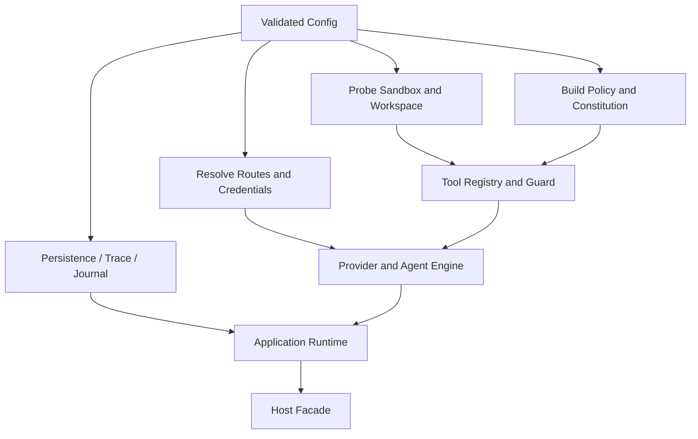

# Dependency Construction and Capability Wiring

English | [简体中文](../../zh-CN/03-runtime-kernel/04-dependency-wiring.md)

## Learning Objectives

Understand why construction is isolated, how configuration becomes a Runtime,
and which invariants Wiring must establish before a Turn starts.

## Prerequisites

Read [System Architecture](../02-codehelper-overview/02-system-architecture.md)
and [Agent Loop](./03-agent-loop.md).

## Problem Background

Providers, credentials, routes, sandboxes, tools, journals, traces, MCP,
plugins, persistence, and context budgets must be connected consistently.
Constructing them in every Host duplicates policy. Constructing them inside the
Agent loop mixes configuration with behavior.

## Construction Flow



## What Wiring Owns

`internal/runtime/app/wire` is the composition root. It may import concrete
implementations to:

- resolve Model Catalog routes and Credential References;
- create Provider HTTP clients or Fixtures;
- build Tool Registry, Guard, Policy, Constitution, and Sandbox Backend;
- assemble stable Prompt Context and partition budgets;
- connect Journal, Diagnostics, Verify, Trace, Usage, and stores;
- initialize MCP, Skill, Plugin, Hook, and Dynamic Tool managers;
- build child runtimes, Worktrees, and background executors;
- choose persistent or in-memory application Runtime.

## Composition Root Structure

`wire.NewExec` is an orchestration entry, not a service locator or business
workflow. It creates a construction-only `buildState` and executes a closed
module sequence:

```text
config -> provider -> platform -> persistence -> builtin tools
       -> extension contributors -> security -> orchestration
       -> agent -> runtime -> background services
```

Each module implements the `buildModule` contract (`Name()` and `Build`),
owns one construction boundary, and publishes only the values later modules
need through `buildState`. Runtime, Engine, and Session services never retain
that state. A failed module aborts with a `moduleBuildError` that names the
module, and already-opened resources are closed through the shared resource
stack.

Builtin and extension tools receive the same `Registry` instance. Plugin,
Skill, Memory, Task/Automation, Hook, and MCP integrations implement the
`extensionContributor` contract (`ID()` and `Contribute`) and run in the
`extension-tools` module in fixed order with unique IDs, so no extension
modifies the Agent module.

Construction and shutdown share `assembly.ResourceStack`. `NewExec` registers
resource closers once; both partial-build rollback and normal shutdown close
the stack in reverse registration order. A resource closes at most once, one
close failure does not skip later resources, and callers receive the joined
errors with resource identities. Late failures, including Runtime or Scheduler
construction failures, cannot leak resources.

## Invariants Before Start

Construction fails rather than producing a partially trusted Runtime when:

- route/capability/config is invalid;
- workspace identity cannot be canonicalized;
- required Sandbox cannot be injected;
- persistence recovery fails;
- duplicate executors or Tool identities conflict;
- an extension cannot satisfy its activation contract.

Default Prompt budgets and security defaults live near construction because
they define the Runtime assembled from user configuration.

## Startup Ordering and Ownership Transfer

Construction follows a dependency order, not merely a list of constructors.
The module sequence above enforces it; each numbered step maps to one module
or one group of modules:

1. validate configuration and canonicalize Workspace identity;
2. open durable stores and perform recovery before acceptance;
3. resolve model metadata, routes, limits, and credential references;
4. probe platform/Sandbox capability;
5. build Policy, permissions, Constitution, Registry, and Guard;
6. initialize extensions and reconcile their catalog contributions;
7. connect context, evidence, diagnostics, verification, usage, and trace;
8. create Thread/Engine factories;
9. create Application Runtime and only then expose a Host facade.

Ownership transfers at each successful step. If a later step fails, already
opened stores, transports, extension processes, and background managers are
closed in reverse registration order by the shared `ResourceStack`. A
constructor that leaks a process on failure violates the Runtime contract even
if no Turn started.

## Capability Provenance

Every enabled capability should answer where the fact came from:

| Fact | Preferred source |
| --- | --- |
| Model supports Tools/Vision | Catalog plus probe observation |
| Credential available | reference resolution at execution boundary |
| Strong Sandbox available | platform Backend probe |
| Tool executable | Registry Descriptor plus dependency health |
| Extension trusted | manifest/signature/authority receipt |
| Persistent state ready | successful open, schema check, and recovery |

Configuration expresses intent; it cannot manufacture environmental capability.

## Code Map

| Concern | Source |
| --- | --- |
| Composition root and module sequence | `runtime.go` |
| Construction-only state and module contract | `build_state.go` |
| config/provider/platform/persistence/builtin tools | `modules_core.go` |
| Extension contributors | `modules_extensions.go` |
| Security policy/constitution/guard | `modules_security.go` |
| Orchestration tools and subagents | `modules_orchestration.go` |
| Agent engine, runtime, background services | `modules_runtime.go` |
| Resource lifecycle | `assembly/resources.go` |
| Route/budget defaults | `route.go`, `routeset.go` |
| Provider construction | `model.go`, `model_catalog.go`, `model_probe.go` |
| Persistent Runtime | `persistent.go` |
| Sandbox facts | `sandbox_info.go` |
| MCP/extensions | `mcp.go`, `extensions.go` |
| Child/background work | `childruntime.go`, `background_executors.go` |
| Task/automation contributor | `internal/adapter/extension/orchestration/contributor.go` |

## Implementation Walkthrough

`NewExec` runs the closed module sequence: canonicalize Workspace, build
stores and observability, load Constitution, merge Policy rules, create
Registry and Guard, assemble Prompt Context, then construct Agent Engines
through a Thread Manager. Each step publishes into `buildState`; ownership
moves forward module by module.

The application Runtime receives only its `Engine` interface and durable
facilities. Hosts receive the resulting session/facade, not the concrete
Provider or Guard, and never the `buildState`.

## Tradeoffs and Alternatives

A dependency-injection framework could automate graphs but hide ordering and
security decisions. CodeHelper uses explicit Go construction so reviewers can
trace exactly which Backend and Policy enter a Guard.

Large composition roots are harder to read. The response is a closed module
sequence with per-module ownership (`modules_*.go`), a construction-only
`buildState`, and an explicit `ResourceStack` — not moving business loops into
Wiring.

## Failure Modes and Security Boundaries

- No Host-specific shortcut may construct an unguarded Tool Registry.
- Fixture and live Provider routes must remain explicit.
- Sandbox capability claims come from Backend probing, not configuration text.
- Secret values are resolved at Provider execution boundary, not Prompt setup.
- Child Runtime budgets/depth/workspace must be narrower than parent authority.

## Tests and Verification

```bash
go test ./internal/runtime/app/wire
go test ./internal/host/cli -run TestCLIDoesNotDependOnExecutionImplementations
```

## Hands-On Lab

Start at the CLI `exec` command and trace only constructor calls until
`wire.NewExec`. Identify the module sequence in `defaultBuildModules`, and
record where Route, Guard, Sandbox, Journal, and Prompt Context are attached.
No business Turn step should occur during this trace.

## Review Questions

1. Why may Wiring import concrete implementations while Hosts may not?
2. Which construction failures must prevent Runtime startup?
3. Why should capability probing override configuration claims?
4. Why must the Host facade be exposed last?
5. What resources must be closed when construction fails midway?

## Further Reading

- [Application Runtime](./02-application-runtime.md)
- [Provider adapters and Model Catalog](../04-model-and-provider/02-provider-and-catalog.md)

## Sources and Verification

| Item | Value |
| --- | --- |
| Catalog ID | `runtime-wiring` |
| Status | `draft` |
| Last verified | Not yet verified |
