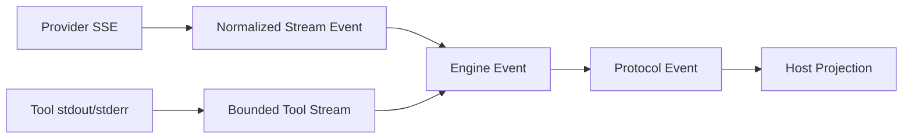

# Streaming, Cancellation, and Error Taxonomy

English | [简体中文](../../zh-CN/03-runtime-kernel/05-streaming-cancellation-errors.md)

## Learning Objectives

Understand how partial output remains observable, how cancellation propagates,
and how machine error categories drive retry and terminal behavior.

## Prerequisites

Read [The Model and Tool Execution Loop](./03-agent-loop.md).

## Problem Background

Long model and Tool calls must stream progress, but partial output complicates
retry. Cancellation must stop Provider, scheduler, approval wait, process
groups, and Runtime ownership. Free-form errors make Hosts guess whether to
retry or display a security denial.

## Streaming Layers



Provider adapters normalize vendor fragments. Engine accumulates Tool Call
arguments while forwarding text, reasoning, citation, usage, and bounded Tool
output. Protocol Events add durable identity and ordering.

Tool output uses a byte Cursor and truncation marker. Live commentary can stop
at a budget while the final Tool Result still carries complete or retrievable
content.

## Delivery Guarantees by Layer

| Layer | Guarantee | Recovery |
| --- | --- | --- |
| Provider fragments | ordered within one Stream, vendor-specific termination | adapter classifies incomplete stream |
| Engine Events | normalized, Call-correlated, bounded | Turn fails/cancels or continues |
| Protocol Events | Runtime sequence and stable identity | replay from Cursor |
| Host projection | may miss live data after disconnect/slow consumer | rebuild/replay; never rerun work |

Streaming is not exactly-once transport delivery. Event IDs and reducer
idempotency handle duplicate observation; Runtime Sequence handles order.
Exactly one terminal Event defines lifecycle completion.

## Cancellation Propagation

`app.Runtime` stores a CancelFunc per active Turn. `turn.cancel` records
provenance and invokes it. The Context flows through Engine, Provider Stream,
Tool scheduler, Guard, Approval/Input waits, and process execution.

Every blocking boundary must select on `ctx.Done()`. Process execution also
terminates the process group so child processes do not outlive the canceled
Tool.

Cancellation produces `turn.canceled`; it is not reported as an arbitrary
failure or absence of a terminal Event.

Cancellation ownership is layered:

- Host requests cancellation through an Operation.
- Runtime owns active Turn lookup, provenance, and terminal Event.
- Engine stops sampling/scheduling and rolls back provisional history.
- Guard releases approval waits and resource claims.
- Provider closes the Stream/request.
- Platform terminates process groups and PTY sessions.

A lower-layer `context.Canceled` is a cause, not permission to emit a second
terminal outcome.

## Error Taxonomy

`protocol.Problem` carries:

- stable machine `Code`;
- safe message;
- retryable flag;
- optional structured details.

Representative codes distinguish invalid argument, conflict, unavailable,
resource exhausted, denied, and internal failure. Lower layers classify Tool
failures such as bad arguments, unavailable dependency, catalog revocation,
egress denial, and sandbox denial.

Retry is permitted only where semantics are safe. Provider retry stops after
meaningful Stream data. A recoverable Tool failure may be fed to the model;
security denial and invariant failure are not invitations to bypass controls.

## Retry Decision Table

| Failure point | Automatic retry? | Reason |
| --- | --- | --- |
| Provider connect before data | bounded, if classified transient | no meaningful output observed |
| Provider after text/Tool fragment | no blind retry | request may have influenced state |
| Tool precondition before effect | possibly model correction/retry | no side effect occurred |
| Tool partial/unknown effect | no automatic retry | duplicate effect risk |
| Policy/Sandbox denial | no | authority boundary |
| Queue resource exhaustion | caller may retry with backoff | Operation not accepted |
| Verification failure | repair/revert policy, not transport retry | semantic outcome failed |
| Cancellation | no | explicit user/Runtime intent |

## Code Map

| Concern | Source |
| --- | --- |
| Machine Problems | `runtime/protocol/problem.go` |
| Provider Stream | `adapter/provider` |
| Engine stream handling | `agent/engine/engine.go` |
| Bounded Tool output | `agent/engine/toolstream.go` |
| Tool failure category | `agent/engine/toolfailure.go` |
| Runtime cancellation | `runtime/app/runtime.go` |
| Process cleanup | `platform/process` |

## Tradeoffs and Alternatives

Buffering all output until completion simplifies replay but leaves users blind
during long work. Unlimited streaming improves visibility but can exhaust
memory and logs. Bounded streaming plus final Results separates live UX from
complete evidence.

Treating all errors as retryable increases apparent resilience while risking
duplicate effects. Explicit taxonomy makes conservative retry possible.

## Failure Modes and Security Boundaries

- Partial Provider data prevents blind request retry.
- Tool stream overflow marks truncation instead of unbounded buffering.
- Subscriber backpressure cannot block Runtime ordering.
- Cancel during scheduler admission or Approval releases claims/waits.
- Late Approval after cancellation is rejected.
- Raw Provider/filesystem errors are sanitized before public machine output.

## Tests and Verification

```bash
go test ./internal/runtime/protocol -run TestCodeOfContextErrors
go test ./internal/runtime/app -run 'TestRuntime(CancelActuallyCancelsActiveTurn|DropsSlowSubscriberDeterministically)'
go test ./internal/runtime/agent/engine \
  -run 'Test(ToolOutputReachesTheHostWhileTheCallIsStillOpen|ToolSchedulerCancelDuringAdmit|EngineRetriesOnlyBeforeMeaningfulStreamData)'
```

## Hands-On Lab

Run `TestToolOutputReachesTheHostWhileTheCallIsStillOpen` with `-v`. Identify
the point where a Tool has not completed but the Host already has a chunk.
Then compare `context.Canceled` mapping in `problem.go` with the terminal Event
created by the Runtime.

## Review Questions

1. Why does partial output change retry safety?
2. Why are Tool stream budget and final Result separate?
3. What must cancellation release besides the Provider request?
4. Why is protocol replay different from execution retry?
5. Which component owns the authoritative canceled terminal Event?

## Further Reading

- [Provider failures and retry](../04-model-and-provider/06-provider-failures.md)
- [Resume and Recovery](./06-resume-and-recovery.md)

## Sources and Verification

| Item | Value |
| --- | --- |
| Catalog ID | `runtime-stream-cancel-errors` |
| Status | `verified` |
| Last verified | 2026-08-06 |
