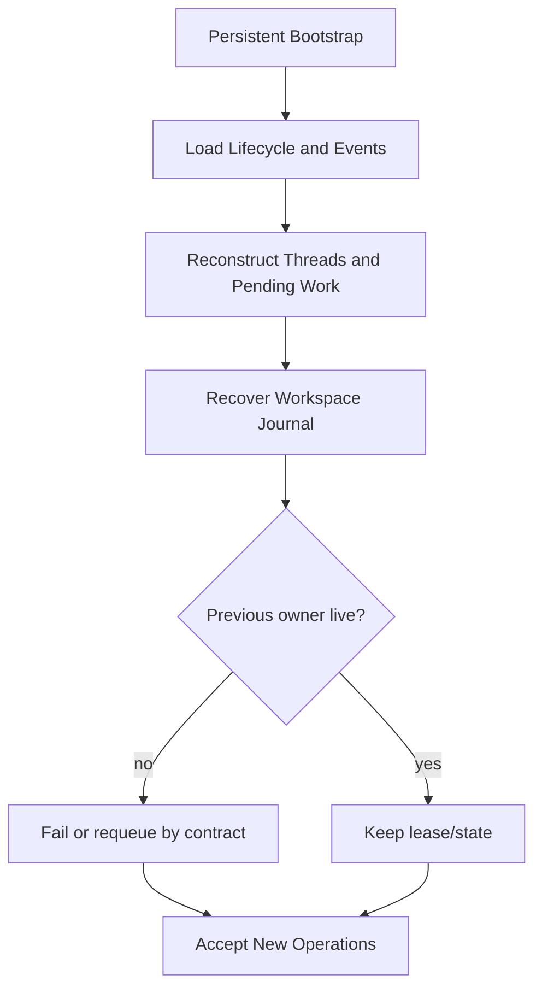

# Resume, Recovery, and Idempotency

English | [简体中文](../../zh-CN/03-runtime-kernel/06-resume-and-recovery.md)

## Learning Objectives

Distinguish resume from recovery, understand durable lifecycle reconstruction,
and identify the idempotency boundaries that prevent duplicate effects.

## Prerequisites

Read [Application Runtime](./02-application-runtime.md) and
[Streaming, Cancellation, and Errors](./05-streaming-cancellation-errors.md).

## Problem Background

A client disconnect is not a Turn failure, and a process crash is not a normal
pause. Resume reconnects to valid durable state; recovery reconciles state
whose owner disappeared or stopped mid-effect. Confusing them can replay model
or Tool work and duplicate side effects.

## Recovery Model



Persistent bootstraps use `NewRuntimeWithRecovery`, which calls the durable
Lifecycle before opening acceptance. `TerminalPublisher` replays pending
terminal outbox projections during startup activation (`runtime_start.go`)
before the Runtime opens acceptance. Outbox entries are published through the
Event Hub with deterministic Event IDs (`PublishStable`), so restart replay is
idempotent even when a projection was partially applied before the crash.

## Resume

Resume selects an existing Session/Thread, reconstructs coherent history, and
submits new input or reconnects Event observation. It does not rerun already
committed Engine work.

History reconstruction keeps completed, correctly paired Tool exchanges.
Failed/incomplete Turn fragments are dropped so the next model request does not
consume a Tool Call without its Result. Revert removes only the targeted Turn.

## Recovery

Recovery restores:

- accepted and committed Operation records;
- active/pending Turn, Approval, and Input ownership;
- pending terminal outbox projections and Item identity;
- last Event cursor;
- thread history and snapshots;
- workspace Journal state;
- the latest durable `SessionDelta` per Thread (History, Usage, Cost, Working
  Set, Evidence, Failures, Compaction, with revision and digest), committed
  with each Turn's Terminal Envelope.

Turn state is committed as a `SessionDelta` bundled with the Terminal
Envelope. The Engine stages the delta during execution and applies it exactly
once, only after the envelope is durably committed; a commit failure leaves
Session memory unchanged. On restart, `ThreadManager` restores the latest
durable delta for each Thread from `persist/state/turnstate`, so Usage, Cost,
Working Set, Evidence, Failures, and Compaction counters survive a crash
alongside committed History.

Interrupted executable background work may be requeued; records without an
executor fail because no honest implementation can run them. Live leases owned
by another worker are not stolen.

## The Four Different "Re" Operations

| Operation | Repeats execution? | Purpose |
| --- | --- | --- |
| Replay | no | deliver already recorded Events again |
| Resume | no completed work | continue from coherent durable state |
| Retry | yes, under explicit contract | repeat a transient/precondition-safe attempt |
| Reconcile | inspect then repair | resolve uncertain external or partial state |

Using "resume" for all four hides duplicate-effect risk. The owner chooses
based on what was durably recorded and which effects can be proven.

Turn-level Retry and Continue are explicit recovery operations, not automatic
Provider retry. Runtime reconstructs the source Turn's model-visible request
from durable history and starts a new Turn. Retry preserves the request;
Continue may append bounded guidance. Both require a terminal source Turn, an
idle target Session, active-thread ownership, and a new idempotency key. They
do not copy or replay historical Tool, Command, Network, or file effects.

## Session Checkpoints and State-only Restore

A Session Checkpoint is an immutable artifact backed by Snapshot metadata and
CAS. It binds Session, Thread, Turn, Profile Revision, model-visible history,
and integrity data. It is different from a Workflow node checkpoint.

Restore is state-only. Runtime selects the verified history/Profile baseline
and emits durable restore facts; it never re-executes historical Events or
effects. Fork also restores state only, then creates a new active Thread with
explicit parent Session/Thread/Checkpoint lineage. That lineage is relational
state and survives process restart.

Structured Plan Artifacts use the same ownership discipline. Implementing a
Plan in the current Session, a new Session, or a Checkpoint Fork creates a new
Turn after Runtime validates Plan identity, source Profile Revision, target
Profile equivalence, and lineage.

## Crash Window Matrix

| Crash window | Durable evidence | Safe startup action |
| --- | --- | --- |
| before acceptance | none | caller may submit normally |
| accepted, before dispatch | acceptance record | restore pending; do not blindly sample |
| Turn started, before effect | Events/active record | mark interrupted unless explicit resume contract |
| Tool proposed, no Result | incomplete pair | exclude from model history |
| file write journaled, not committed | before-image/owner | restore when owner is dead |
| committed file Turn | commit/settlement | keep write |
| remote effect outcome unknown | insufficient proof | reconcile; never claim revert |
| terminal Event durable, projection missing | authoritative Event | rebuild projection |

Recovery is conservative because explicit interrupted state is safer than
silently repeating an effect.

## Workspace Journal

Before a write, the Journal stores before-images and process ownership. On
startup it distinguishes:

- committed Turn: keep writes and settle records;
- abandoned in-progress Turn: restore before-images;
- still-live owner: do not undo its work.

Recovery is scoped to file effects the Journal can prove. It does not claim to
revert arbitrary network or external side effects.

## Idempotency Boundaries

- Operation ID and caller idempotency key protect submission.
- Event IDs and Sequence protect replay/projection.
- Tool Call ID pairs requests and Results.
- Task attempt/lease protect background claims.
- Edit Plan/Journal fingerprint protects file effects.

Idempotency is local to a boundary; one key does not magically make an
arbitrary shell command idempotent.

## Code Map

| Concern | Source |
| --- | --- |
| Durable lifecycle contract | `runtime/app/lifecycle.go` |
| Runtime restore | `runtime/app/runtime.go` |
| History reconstruction | `runtime/app/reconstruct.go` |
| Persistent construction | `runtime/app/wire/persistent.go` |
| Session snapshots | `persist/session`, `persist/snapshot` |
| Checkpoint/Plan/Turn recovery | `runtime/app/session_artifacts.go` |
| Thread session state restore | `runtime/app/thread_manager.go` |
| Terminal turn state store | `persist/state/turnstate` |
| Workspace recovery | `persist/workspacejournal` |

## Tradeoffs and Alternatives

Replaying every accepted Operation after restart appears complete but can
repeat Provider charges and effects. CodeHelper restores pending facts without
replaying Engine work unless an explicit durable executor contract permits it.

Event sourcing alone can reconstruct logical state but not restore a
half-written file. The Journal complements Events with effect-specific
before-images.

## Failure Modes and Security Boundaries

- Recovery failure prevents persistent Runtime startup.
- Incomplete Tool history is excluded from model context.
- Another worker's live lease is preserved.
- Unknown/non-executable interrupted work fails rather than pretending retry.
- Journal restore checks ownership and fingerprints.
- External side effects are never falsely reported as reverted.
- Checkpoint Restore/Fork never execute historical side effects.
- Retry/Continue reject non-terminal, cross-thread, busy, or stale sources.

## Tests and Verification

```bash
go test ./internal/runtime/app -run TestReconstructThread
go test ./internal/runtime/app -run 'Test(SessionCheckpoint|Restore|Fork|RecoverTurn|Plan)'
go test ./internal/runtime/app/wire -run TestPersistentRuntime
go test ./internal/persist/workspacejournal -run 'Test(TheNextProcessUndoesATurnAKilledProcessLeftHalfApplied|RecoveryKeepsTheWritesOfATurnThatAlreadyCommitted)'
```

## Hands-On Lab

Run the persistent CLI checkpoint test:

```bash
go test ./internal/host/cli -run TestExecPersistentResumeListTurns
```

Then read `persistent_test.go` and classify each test as resume, logical
recovery, lease recovery, or effect recovery.

## Review Questions

1. Why must restart not automatically replay accepted Engine work?
2. What can Event history reconstruct that a Workspace Journal cannot, and vice
   versa?
3. Why is idempotency always boundary-specific?
4. How do replay, resume, retry, and reconcile differ?
5. What should happen when a remote effect has an unknown outcome?
6. Why can a Checkpoint restore history but not replay its Events?
7. How does Continue differ from resuming an interrupted process?

## Further Reading

- [Why durable state is required](../08-state-observability/01-why-durable-state.md)
- [Checkpoints and recovery](../09-task-orchestration/04-checkpoint-and-recovery.md)

## Sources and Verification

| Item | Value |
| --- | --- |
| Catalog ID | `runtime-resume-recovery` |
| Status | `draft` |
| Last verified | Not yet verified |
