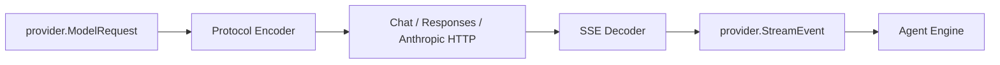

# Chat Completion and Responses Protocols

English | [简体中文](../../zh-CN/04-model-and-provider/01-wire-protocols.md)

## Learning Objectives

Distinguish CodeHelper's normalized Provider contract from vendor wire
protocols and trace how Chat, Responses, and Anthropic streams become common
events.

## Prerequisites

Read [Protocol and Stable Data Contracts](../03-runtime-kernel/01-protocol.md).

## Problem Background

Providers represent messages, reasoning, Tool Calls, search, usage, and stream
termination differently. Letting the Agent Engine understand every wire format
would spread vendor branches through the Runtime.

## Normalization Boundary



`provider.ModelRequest` contains a resolved Route, normalized Messages, output
limit, reasoning/search options, Tool Definitions, and cache hints.
`Provider.Stream` returns normalized text, reasoning, Tool Call fragments,
search results, citations, usage, and terminal information.

## Wire Differences

Chat Completion represents output under choices/delta and Tool Calls as indexed
function fragments. Responses uses typed output items and deltas. Anthropic
uses content-block lifecycle Events. CodeHelper encoders preserve each
protocol's required history shape while decoders emit one common StreamEvent.

Tool history is especially strict: Assistant Tool Calls and Tool Results must
remain paired with Call IDs. Reasoning signatures are replayed only where the
route supports them.

## Semantic Mapping Matrix

| Concept | OpenAI Chat | OpenAI Responses | Anthropic | Normalized |
| --- | --- | --- | --- | --- |
| visible text | choice delta | output text item/delta | content block delta | text delta |
| reasoning | provider detail | reasoning item | thinking block | reasoning/signature |
| Tool proposal | indexed function fragments | function-call item | tool-use block | Tool fragment |
| Tool Result | tool message | call-output item | tool-result block | Tool Result block |
| search/citation | provider-specific | search/citation item | server-tool result | search/citation |
| Usage | final stream chunk | completed response | start/delta Usage | normalized Usage |
| terminal | finish reason + EOF | response completed | message stop | message stop |

EOF alone is not always success. Each decoder tracks the protocol terminal
marker and rejects abrupt streams that might otherwise look complete.

## Lossless Core and Opaque Extensions

Common semantics are normalized, while `ContentProvider`/`ProviderData` retain
opaque replay artifacts such as encrypted reasoning state. Opaque data may be
returned unchanged only on a compatible Route; it is never interpreted as
Runtime authority.

Attachments carry bytes and media type, not local paths. Encoders receive
content, never permission to fetch arbitrary Workspace files.

## Code Map

| Concern | Source |
| --- | --- |
| Normalized types | `provider/types.go` |
| HTTP encoding/retry | `provider/httpclient/client.go` |
| OpenAI decode | `provider/openai/stream.go` |
| Anthropic decode | `provider/anthropic/stream.go` |
| SSE framing | `provider/sse.go` |

## Implementation Walkthrough

The HTTP client validates the Route and ModelRequest before encoding. It selects
the encoder from Route Protocol, applies governed headers and credentials, and
parses SSE with bounded line/event handling. Protocol-specific decoders validate
fragments before returning normalized Events to the Engine.

## Tradeoffs and Alternatives

A lowest-common-denominator API is simple but loses reasoning, native search,
and protocol-specific cache controls. Exposing raw vendor payloads preserves
features but couples the Engine. CodeHelper keeps a rich normalized model and
uses explicit capability checks for optional features.

## Failure Modes and Security Boundaries

- Protocol/endpoint mismatch fails before request.
- Unknown stream Event or malformed Tool fragment fails decoding.
- Tool history that violates the selected protocol is rejected.
- SSE size and HTTP limits prevent unbounded input.
- Redirects and debug dumps must not leak credentials.

## Tests and Verification

```bash
go test ./internal/adapter/provider/...
```

Key tests normalize text, reasoning, Tool Calls, usage, search, and citations
across Chat, Responses, and Anthropic fixtures.

## Hands-On Lab

Compare `TestChatStreamNormalizesTextReasoningToolAndUsage` with
`TestResponsesStreamNormalizesSearchCitationAndRegularTool`. List the different
wire fields that produce the same normalized Event types.

## Review Questions

1. Why should the Agent Engine not parse vendor SSE?
2. Which features would a lowest-common-denominator API lose?
3. Why must Tool history encoding depend on protocol?
4. Why is EOF insufficient to prove every protocol completed?
5. When should provider-specific data remain opaque?

## Further Reading

- [Provider and Catalog](./02-provider-and-catalog.md)
- [Streaming, Reasoning, and Usage](./04-streaming-reasoning-and-usage.md)

## Sources and Verification

| Item | Value |
| --- | --- |
| Catalog ID | `model-wire-protocols` |
| Status | `draft` |
| Last verified | Not yet verified |
