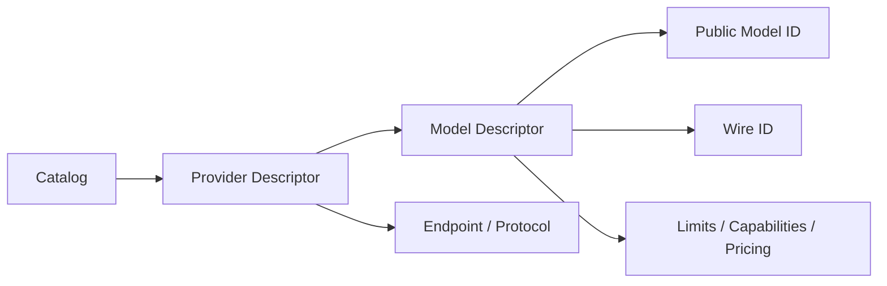

# Provider Adapters, Model Catalog, and Wire IDs

English | [简体中文](../../zh-CN/04-model-and-provider/02-provider-and-catalog.md)

## Learning Objectives

Understand Provider/Model separation, Catalog validation, and why a public
Model ID may differ from the identifier sent on the wire.

## Prerequisites

Read [Chat Completion and Responses Protocols](./01-wire-protocols.md).

## Problem Background

One Provider exposes several Models; the same Model family may be served at
different endpoints; aliases may change while persisted sessions require
stable identity. A plain `model` string cannot represent these constraints.

## Catalog Model



Provider descriptors define kind, endpoint, protocol, credential reference,
and Models. Model descriptors define Wire ID, context/output limits,
capabilities, pricing, and aliases.

## IDs and Persistence

The Catalog Provider/Model IDs are local stable selection keys. Wire ID is sent
to the remote API and may be vendor-specific. Persisted Route evidence records
both selected identity and actual route so later cost/debug analysis does not
guess from an alias.

## Identity and Provenance Layers

| Field | Meaning | Why it is recorded |
| --- | --- | --- |
| Provider ID | local service/config identity | selection and credential boundary |
| Model ID | local stable key within Provider | user config and Route lookup |
| Canonical ID | cross-entry model identity | comparison without changing Route |
| Wire ID | exact remote request value | reproducibility and diagnostics |
| Provenance | bundled/config/CLI/Fixture origin | trust and drift explanation |
| Metadata provenance | source of limits/capability/pricing | avoid treating guesses as facts |

Pricing has a separate `Known` bit: unknown pricing is not zero cost. Currency
and rates are valid only with known provenance.

## Immutability and Defensive Copies

The Catalog normalizes and validates Providers on insertion, then returns
copies. Callers cannot mutate shared Model maps and silently change another
Turn's Route. `ReadyRoute` is created only by `Resolver`; its unexported ready
state prevents a partially populated struct from posing as validated.

Probe overlays return copied Routes with adjusted capabilities; they do not
rewrite bundled catalog bytes or a shared descriptor.

## Validation

Catalog validation rejects duplicate IDs, missing endpoints/protocols, invalid
limits, capabilities inconsistent with limits, and malformed credential
references. Built-in Catalog tests use Golden data to detect accidental
changes to default routes.

## Code Map

| Concern | Source |
| --- | --- |
| Provider/Model descriptors | `model/catalog.go` |
| Capabilities | `model/capability.go` |
| Route resolution | `model/route.go` |
| Purpose routes | `model/routeset.go` |
| Runtime observations | `model/observation.go` |

## Tradeoffs and Alternatives

Using vendor Model names directly is easy but couples config and persistence to
remote naming. A local Catalog adds maintenance, yet provides stable identity,
validation, pricing, and capability negotiation.

## Failure Modes and Security Boundaries

- Duplicate Provider/Model/Alias is rejected.
- Model output limit cannot exceed context limit.
- Endpoint and credential references are configuration authority and must be
  reviewed.
- Runtime observations may narrow capability confidence but cannot silently
  invent unsupported authority.

## Tests and Verification

```bash
go test ./internal/adapter/model
make build
./bin/codehelper model list
```

Fixture construction supplies its own route during tests; `gpt-fixture` is not
claimed as a bundled production Catalog entry.

## Hands-On Lab

Inspect one built-in Provider in `catalog.go`. Write down public ID, Wire ID,
protocol, endpoint, limits, capabilities, and credential reference. Then follow
`Resolver.Resolve` until it produces `ReadyRoute`.

## Review Questions

1. Why are Provider ID, Model ID, and Wire ID separate?
2. Which Catalog fields are security-sensitive?
3. Why should Golden tests detect built-in route drift?
4. Why is unknown pricing different from zero pricing?
5. Why does Catalog lookup return defensive copies?

## Further Reading

- [Capability and Routing](./03-capability-and-routing.md)

## Sources and Verification

| Item | Value |
| --- | --- |
| Catalog ID | `model-provider-catalog` |
| Status | `verified` |
| Last verified | 2026-08-06 |
