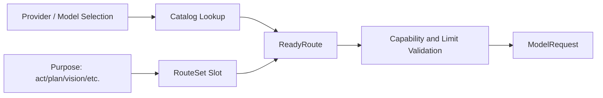

# Capability Negotiation and Route Resolution

English | [简体中文](../../zh-CN/04-model-and-provider/03-capability-and-routing.md)

## Learning Objectives

Understand how requested behavior is checked against Model capability and how
different Agent purposes select explicit routes.

## Prerequisites

Read [Provider Adapters, Model Catalog, and Wire IDs](./02-provider-and-catalog.md).

## Problem Background

Sending unsupported fields produces remote 400s after work has started.
Routing every task to one model also wastes cost or misses required vision,
reasoning, search, or Tool Calling.

## Resolution Flow



`Resolver` turns selection into validated `ReadyRoute`. `RouteSet` maps
purposes to routes while retaining an Act default. Request validation checks
reasoning, native search, Tool Calls, prompt cache, and output limits before
network I/O.

## Capability Evidence

Capabilities begin with Catalog declarations. Runtime observations can record
success/failure evidence and confidence without rewriting the immutable
Catalog. A locked Turn preserves its chosen slot so mid-Turn configuration
changes do not switch model identity.

## Evidence Lattice

Capability updates are intentionally asymmetric:

```text
catalog true + negative probe  -> false  (tighten)
catalog false + positive probe -> false  (unless operator trusts widening)
trusted positive observation   -> true on a copied Route
unknown capability name        -> reject
```

A negative observation can prevent an unsafe request immediately. A positive
probe cannot silently grant a feature because probing may hit a different
deployment, account tier, or temporary behavior.

`ForceCapabilities` exists only to let a controlled probe request leave local
validation long enough to learn the remote truth. It is not used for ordinary
sampling authority.

## Purpose Routing Is Not a Complexity Router

Purpose slots (`act`, `plan`, `vision`, and other internal purposes) are
explicit configuration. Auto resolution still requires a unique Model ID match
after capability filtering; it does not choose "the smartest" or cheapest
model. An unwired locked purpose fails instead of silently falling back to Act.

This makes route selection explainable and keeps Usage/cost attributed to the
actual purpose and Route.

## Code Map

| Concern | Source |
| --- | --- |
| Capability shape | `model/capability.go` |
| Resolver | `model/route.go` |
| Purpose slots | `model/purpose.go`, `routeset.go` |
| Runtime probe overlay | `runtime/app/wire/model_probe.go`, `probe_overlay.go` |
| Engine selection | `runtime/agent/engine/route_test.go` |

## Tradeoffs and Alternatives

Optimistic “send and see” uses provider errors as negotiation but delays
failure and complicates fallback. Static capability flags are deterministic but
can become stale. CodeHelper combines validated Catalog facts with explicit
observations and does not silently upgrade unknown capability.

## Failure Modes and Security Boundaries

- Missing Provider/Model or purpose slot fails before sampling.
- Unsupported reasoning/search/tools/cache fields fail request validation.
- Output limit above Model maximum is rejected locally.
- Locked Turn cannot silently move to a different route.
- Fallback must preserve required capability and credential/endpoint policy.

## Tests and Verification

```bash
go test ./internal/adapter/model
go test ./internal/runtime/app/wire -run 'Test.*Route'
go test ./internal/runtime/agent/engine -run 'Test.*Route'
```

## Hands-On Lab

Read a `RouteSet` test with separate Plan and Act routes. Predict which Route
each Purpose receives, then run the test. Add a reasoning request to a
non-reasoning descriptor in a local test and observe local validation.

## Review Questions

1. Why is a capability bit an executable contract?
2. Why should a Turn lock its selected route?
3. When may runtime observation narrow or expand Catalog claims?
4. Why is positive probe evidence weaker than negative evidence by default?
5. Why does auto routing require a unique identity match?

## Further Reading

- [Streaming, Reasoning, and Usage](./04-streaming-reasoning-and-usage.md)

## Sources and Verification

| Item | Value |
| --- | --- |
| Catalog ID | `model-capability-routing` |
| Status | `draft` |
| Last verified | Not yet verified |
