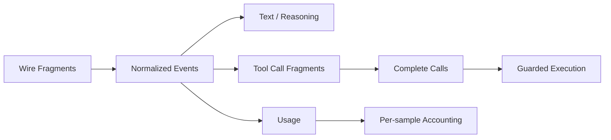

# Streaming, Reasoning, Tool Calls, and Usage

English | [简体中文](../../zh-CN/04-model-and-provider/04-streaming-reasoning-and-usage.md)

## Learning Objectives

Understand normalized Stream event semantics, Tool Call assembly, reasoning
separation, and correct usage/cost accounting across multiple samples.

## Prerequisites

Read [Wire Protocols](./01-wire-protocols.md) and
[Streaming, Cancellation, and Errors](../03-runtime-kernel/05-streaming-cancellation-errors.md).

## Stream Semantics



Text and reasoning are separate blocks/events. Reasoning signatures are opaque
Provider artifacts used only where supported. Tool Call fragments are grouped
by index/ID and must yield valid name and JSON arguments before execution.

## Fragment Assembly Invariants

Tool streaming is a small state machine:

1. identify a logical Call by protocol index/ID;
2. accept ID/name fragments according to protocol ordering;
3. append argument bytes without parsing partial JSON;
4. require a terminal Stream marker;
5. validate complete name, Call ID, and JSON object;
6. bind local Catalog identity after sampling;
7. only then admit the Call to Guard/scheduler.

Fragments are never executable. Two interleaved Calls keep separate buffers,
and an abrupt EOF cannot promote an incomplete buffer into a Tool Call.

Reasoning text, visible text, opaque signature/provider data, and Tool
arguments remain separate Content Blocks so replay does not change their role.

## Usage and Cost

One Turn can make several Provider samples, including Tool-driven subcalls.
Usage is cumulative within a sample, so aggregation keeps the latest report per
sample rather than summing every delta. Sample index and Purpose distinguish
main Act calls from vision or Tool sampling.

Cost uses the Route actually sampled. `CostKnown` distinguishes a true zero
price from missing pricing. Latency separates queue, model, first token, Tool,
Approval, and verification phases.

Normalized Usage preserves subset invariants:

```text
CachedTokens    <= InputTokens
ReasoningTokens <= OutputTokens
TotalTokens      = InputTokens + OutputTokens
```

Cached and reasoning tokens are breakdowns, not additional totals. Anthropic
cache read/write fields are normalized into input totals at the Adapter. Across
stream updates, the Runtime keeps the latest cumulative report for each sample;
across samples, it sums the final reports.

Cost is computed from that sample's actual Route and pricing provenance, not
from the Turn's default model name.

## Code Map

| Concern | Source |
| --- | --- |
| StreamEvent/Usage | `provider/types.go` |
| Vendor decoders | `provider/openai`, `provider/anthropic` |
| Engine consumption | `agent/engine/engine.go` |
| Tool-side model samples | `agent/engine/toolsample.go` |
| Cost/usage storage | `observability/usage` |
| Latency spans | `agent/engine/tracing.go` |

## Tradeoffs and Alternatives

Combining reasoning with visible text simplifies UI but can expose opaque
internal material and breaks replay semantics. Summing every usage event is
easy but overcounts cumulative reports. Explicit block and sample identity
preserves meaning.

## Failure Modes and Security Boundaries

- Malformed Tool fragments fail before Guard.
- Usage emission/storage failure can fail the Turn to avoid dishonest records.
- Unknown pricing is reported, not treated as free.
- Reasoning signature is never interpreted as authority.
- Stream termination without complete Tool arguments is a Provider failure.

## Tests and Verification

```bash
go test ./internal/adapter/provider/openai ./internal/adapter/provider/anthropic
go test ./internal/runtime/agent/engine \
  -run 'Test(EngineAttachesCostToStreamingUsage|EngineNumbersUsageBySampleAcrossCalls|TurnReportsEveryLatencyPhase)'
```

## Hands-On Lab

Run the OpenAI stream normalization test with `-v`. Build a table from each SSE
frame to normalized Event, sample number, visible output, and accounting
effect.

## Review Questions

1. Why is Usage cumulative per sample?
2. Why must unknown price differ from zero cost?
3. Why are reasoning signatures opaque?
4. Why must partial Tool arguments remain unparsed and unexecutable?
5. Which Usage fields are subsets rather than additions?

## Further Reading

- [Credential Lifecycle](./05-credential-lifecycle.md)
- [State and Observability navigation](../NAVIGATION.md)

## Sources and Verification

| Item | Value |
| --- | --- |
| Catalog ID | `model-stream-reasoning-usage` |
| Status | `draft` |
| Last verified | Not yet verified |
