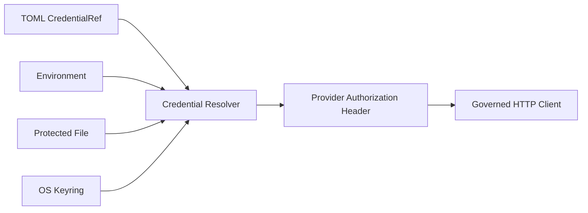

# Credential References and Secret Lifecycle

English | [简体中文](../../zh-CN/04-model-and-provider/05-credential-lifecycle.md)

## Learning Objectives

Understand why configuration stores references, where secret values are
resolved, and which boundaries prevent credentials entering prompts or logs.

## Prerequisites

Read [Provider and Catalog](./02-provider-and-catalog.md).

## Secret Flow



TOML contains `kind` and `name`, not the value. Resolution happens immediately
before Provider HTTP construction. Prompt context, Events, Receipts, and Model
Requests never need the raw secret.

## Reference Kinds

- `env`: read an explicitly named environment variable.
- `keyring`: query the OS credential service by account name.
- `file`: supported by the resolver for trusted/injected references under
  `CODEHELPER_SECRET_DIR`, with ownership, permission, traversal, symlink, and
  open-time identity checks.

The current Model Catalog accepts `env` and `keyring` Provider references.
`file` is a lower-level resolver capability, not a value that ordinary Catalog
validation silently enables. This distinction prevents a config entry from
turning an arbitrary path into a credential source.

CLI auth commands create/update references and can copy an environment value
into Keyring without serializing it into TOML.

## Lifecycle

Provision outside tracked source, resolve at use, redact from diagnostics,
rotate after exposure, and delete/revoke when no longer needed. Debug dumps
record sanitized request metadata and must never include Authorization.

## Exposure Window and Data Flow

The raw value should exist for the shortest practical interval:

```text
Reference in validated Route
  -> resolve after concurrency/rate admission
  -> set protocol-specific Authorization header
  -> send through governed HTTP client
  -> discard with request scope
```

The value must not enter:

- `ModelRequest` JSON or prompt messages;
- Operation/Event/Receipt/Trace fields;
- Catalog/Route descriptions returned to users;
- retry diagnostics, response dumps, or command arguments;
- child-process environment unless that process explicitly owns the credential.

Redaction is defense in depth, not permission to log first.

## Rotation and Failure

References allow rotation without rewriting persisted Sessions. A new request
resolves the current value; an in-flight request retains only its request-scoped
header. Missing, empty, oversized, NUL-containing, insecure, or changed-during-
open values fail before network I/O.

Errors identify the reference/source but must not include secret values or raw
Keyring backend messages that may contain them.

## Code Map

| Concern | Source |
| --- | --- |
| CredentialRef | `adapter/model/catalog.go` |
| Resolver | `provider/httpclient/credentials.go` |
| Platform file checks | `credential_file_*.go` |
| OS Keyring | `security/keyring` |
| CLI management | `host/cli/auth_cmd.go` |

## Tradeoffs and Alternatives

Environment variables are automation-friendly but inherited by processes.
Files support secret injection but require permission and symlink checks.
Keyring is suitable for desktops but depends on OS/UI access. References let
deployment choose without changing Provider logic.

## Failure Modes and Security Boundaries

- Missing/empty value fails before network I/O.
- Unsafe file type, ownership, permissions, or path is rejected.
- Secret is not accepted as a normal Catalog field.
- Logs/debug dumps redact known sensitive headers.
- Model-visible Context cannot request raw Credential resolution.

## Tests and Verification

```bash
go test ./internal/adapter/provider/httpclient -run 'Test.*Credential'
go test ./internal/security/keyring
make secret-leak-test
```

## Hands-On Lab

Create a temporary environment-reference config with a fake value, run
`codehelper config show`, and confirm only provenance/reference appears. Do not
send a Provider request and delete the temporary config afterward.

## Review Questions

1. Why is a Credential Reference safe to persist while a value is not?
2. Which risks differ among env, file, and Keyring?
3. At what latest point should the raw value be resolved?
4. Why does resolver support not automatically imply Catalog support?
5. Why is redaction not sufficient justification to log a secret?

## Further Reading

- [Security manual](../../../en/security.md)
- [Provider Failures](./06-provider-failures.md)

## Sources and Verification

| Item | Value |
| --- | --- |
| Catalog ID | `model-credential-lifecycle` |
| Status | `verified` |
| Last verified | 2026-08-06 |
