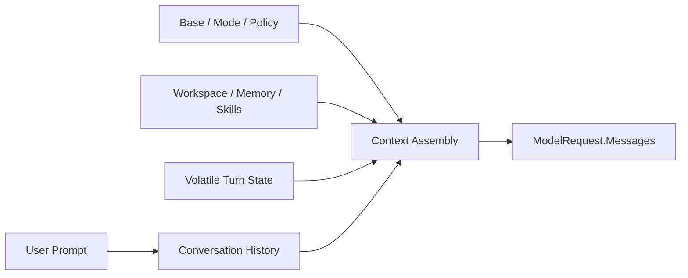

# Prompts, Messages, and Context

English | [简体中文](../../zh-CN/05-context-engineering/01-prompt-message-context.md)

## Learning Objectives

Distinguish a user Prompt, normalized Message history, and assembled Context;
understand why Context is a budgeted runtime product rather than a string.

## Prerequisites

Read [How Models, Context, and Tools Cooperate](../02-codehelper-overview/06-model-context-and-tool.md).

## Problem Background

“Prompt” is often used for every byte sent to a model. That hides ownership.
The user supplies intent, the Runtime supplies policy and evidence, Tools
supply observations, and history supplies prior interaction. Treating all of
them as one mutable string makes injection, truncation, and audit impossible to
reason about.

## Core Concepts

- **Prompt:** current user request before Runtime expansion.
- **Message:** normalized role plus typed content blocks.
- **History:** ordered Messages retained across samples or Turns.
- **Context:** the complete bounded set of Messages and Tool Definitions sent
  for one sample.
- **Partition:** one Context source with its own budget and receipt.



## Message Model

Provider Messages use system, user, assistant, and tool roles with typed
content blocks. Assistant Tool Calls and Tool Results retain Call IDs.
Reasoning and signatures remain separate from visible text. This normalized
shape is encoded differently for each Provider protocol.

## Authority Is Not the Message Role

System-role placement is a transport mechanism, not proof of authority.

| Source | Intended role | Authority interpretation |
| --- | --- | --- |
| Runtime base/Constitution | system | enforced Runtime constraint |
| Mode/policy summary | system | description of current governed state |
| Repository instructions | system partition | untrusted project guidance |
| Skill/memory | system partition | selected extension/user data |
| Repo Map/Working Set/Evidence | system tail | observed data with provenance |
| User Prompt | user | current intent, not policy override |
| Tool Result | tool | untrusted observation from execution |

Repository text that says "ignore policy" remains repository data even if it
is rendered in a system Message for provider compatibility. Actual authority is
enforced outside the prompt by Policy, Guard, and Sandbox.

## Stored, Rendered, and Sampled Context

These are different:

- **stored state:** history, memory, World State, Working Set, Evidence;
- **rendered context:** bounded Messages assembled from that state;
- **sampled request:** rendered Messages plus Route-specific Tool Definitions
  and options;
- **receipt:** metadata proving what was retained, omitted, or truncated.

Volatile Turn Context is appended for sampling but not committed into durable
conversation history. Otherwise every sample would duplicate Repo Map and
Evidence and later compaction would treat stale observations as conversation.

## Stable Context Assembly

`promptcontext.Assemble` emits stable partitions in deterministic order:
base system, mode, repository instructions, pinned files, skills, user memory,
plan, constitution, world-state sections, and Tool prefix.

Repository instructions are read only from fixed workspace-rooted paths.
Working files are canonicalized, sorted, and checked against symlink escape.
Each retained section becomes a system Message and a Receipt.

## Volatile Tail

At every sample, the Engine appends current Tool Catalog, repository map,
working set, evidence, and plan after history. Nothing follows this tail, so
changing it does not invalidate a cacheable stable prefix.

Context is therefore sample-specific even inside one Turn.

## Code Map

| Concern | Source |
| --- | --- |
| Message/content blocks | `adapter/provider/types.go` |
| Stable assembly | `agent/promptcontext/context.go` |
| Turn tail | `agent/promptcontext/turn.go` |
| World state | `agent/promptcontext/worldstate.go` |
| Fragment markers | `agent/promptcontext/fragment.go` |

## Tradeoffs and Alternatives

One giant system string is easy to print but cannot attribute source or budget.
One Message per file is auditable but may create excessive protocol overhead.
CodeHelper partitions by semantic owner and records receipts while still using
normalized Messages.

## Failure Modes and Security Boundaries

- Workspace path or symlink escape is rejected.
- Non-UTF-8 or unreadable required content fails assembly.
- Repository content remains untrusted data, not higher authority.
- Empty, omitted, and truncated partitions are distinguishable.
- Skills and Constitution fragments have hard token ceilings.
- Secret values are never a legitimate Context source.

## Tests and Verification

```bash
go test ./internal/runtime/agent/promptcontext \
  -run 'Test(AssembleStableOrderAndWorkspaceBoundaries|AssembleBudgetsAreDeterministicUTF8SafeAndReceipted|AssembleTurnRendersBothSectionsAsSystemMessages)'
```

## Hands-On Lab

Read `TestAssembleStableOrderAndWorkspaceBoundaries`. Draw the resulting Message
order and label which source is user intent, Runtime authority, repository
data, and dynamic evidence.

## Review Questions

1. Why is Context not a synonym for Prompt?
2. Why does the volatile tail follow history?
3. What does a Receipt prove that a Message alone cannot?
4. Why does system-role rendering not automatically grant authority?
5. Why is volatile Context sampled but not stored as conversation history?

## Further Reading

- [Context Sources and Lifecycle](./03-source-priority-lifecycle.md)

## Sources and Verification

| Item | Value |
| --- | --- |
| Catalog ID | `context-prompt-message` |
| Status | `draft` |
| Last verified | Not yet verified |
