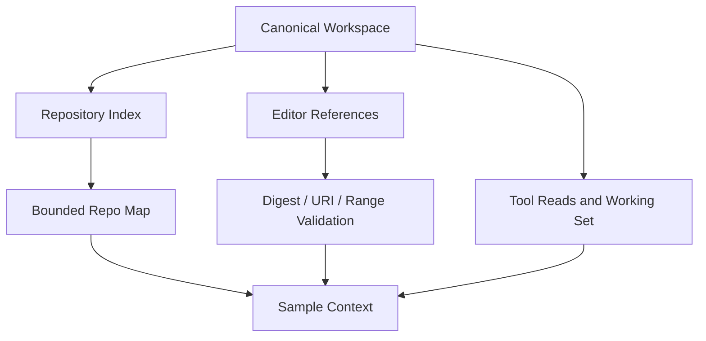

# Workspace, Repository Index, and Editor Context

English | [简体中文](../../zh-CN/05-context-engineering/02-workspace-index-editor.md)

## Learning Objectives

Understand Workspace identity, indexed repository orientation, focused Editor
Context, and the validation that prevents context drift or path escape.

## Prerequisites

Read [Prompts, Messages, and Context](./01-prompt-message-context.md).

## Three Views of the Repository



The Workspace is the authority boundary. The Index provides broad structure,
Editor Context provides explicit user focus, and Tool observations provide
current evidence.

## Repository Index and Map

`repoindex.Index` incrementally records files, languages, symbol declarations,
and snapshot status. It refreshes changed files, prunes deleted files, and
reports pending/degraded/truncated states rather than pretending completeness.

Symbol and reference queries prefer a language-level Semantic Provider.
Results record semantic or lexical source, provider version,
confidence, and fallback reason. Lexical matching remains available when the
language service is absent, but the Receipt never relabels that fallback as a
semantic answer.

`repomap.Build` converts the full index into a bounded orientation: build
manifests, entry points, directory counts/languages, and outlines for focused
files. Directories with more declarations survive limits; final presentation
is path-sorted.

`repocontext.Provider` builds the expensive map at most once per Turn while
rerendering Working Set and Evidence every sample.

## Three Freshness Clocks

Repository context does not have one universal "current" timestamp:

| View | Freshness evidence | Update cadence |
| --- | --- | --- |
| Index/Repo Map | index snapshot, indexer version, truncated/degraded status | incremental build, map once per Turn |
| Editor Context | Workspace identity, document version, content digest | captured by Host, verified at Turn start |
| Tool observation | Call/Turn, path, digest, Result metadata | immediately after governed execution |

A Tool read may be fresher than the Turn-cached Repo Map. An Editor selection
may be rejected even when its path still exists because its digest no longer
matches. Consumers must compare the clock appropriate to the claim.

## Index State Is Part of the Result

The Index distinguishes:

- `pending`: no complete build yet;
- `ready`: snapshot available;
- `degraded`: storage/index operation failed;
- `truncated`: file ceiling prevented full coverage;
- disabled/unavailable: feature intentionally absent.

The Repo Map renders the reason instead of converting absence into an empty
repository. Unsupported/rejected files may still contribute path/language
orientation even when no symbols are available.

## Editor Context

An Editor reference contains kind, source, workspace-relative path, canonical
URI, document version, digest, optional range/symbol, and diagnostics.
`resolveEditorContext`:

1. validates Workspace Identity;
2. resolves a canonical path inside Workspace;
3. verifies Editor URI belongs to that identity;
4. reads bounded UTF-8 content;
5. compares SHA-256 digest to detect drift;
6. validates selection/symbol/diagnostic ranges;
7. crops per-item/total bytes;
8. appends JSON explicitly labeled untrusted data.

Receipts preserve retained bytes, digest, ranges, and diagnostic counts.

## Code Map

| Concern | Source |
| --- | --- |
| Workspace identity | `runtime/protocol/workspace_identity.go` |
| Editor validation | `runtime/app/editor_context.go` |
| Incremental index | `persist/repoindex` |
| Semantic symbols/references | `adapter/lsp/semantic.go`, `platform/symbols/semantic.go` |
| Bounded map | `runtime/agent/repomap` |
| Per-sample provider | `runtime/agent/repocontext` |
| Working-set ledger | `runtime/agent/workingset` |

## Tradeoffs and Alternatives

Sending the whole index is comprehensive but unaffordable. Sending only editor
selection misses repository structure. CodeHelper combines a bounded global
map, explicit focused content, and on-demand Tool reads.

Map caching once per Turn means a newly read file enters the Working Set
immediately but its outline may appear next Turn. This avoids walking the
repository every sample.

## Failure Modes and Security Boundaries

- Absolute, non-canonical, traversal, and symlink-escape paths fail.
- URI/Runtime Workspace identity mismatch fails.
- Changed digest rejects stale editor capture.
- Invalid ranges, binary text, and excessive content fail or crop explicitly.
- Disabled/degraded Index says why no map is available.
- Repository text is marked untrusted and cannot override system authority.

## Tests and Verification

```bash
go test ./internal/runtime/app -run TestResolveEditorContext
go test ./internal/runtime/agent/repocontext ./internal/runtime/agent/repomap
go test ./internal/persist/repoindex
```

## Hands-On Lab

Run `TestResolveEditorContextRejectsDriftAndIdentityMismatch`, then trace one
valid selection from protocol reference through digest/range validation to the
rendered JSON and receipt.

## Review Questions

1. Why are Workspace URI and Runtime path both required?
2. Why is Repo Map cached once per Turn while Working Set is not?
3. How does a digest prevent stale editor content from becoming evidence?
4. Why can a Tool read be fresher than the Repo Map in the same Turn?
5. Why must pending, degraded, truncated, and empty Index states differ?

## Further Reading

- [Context Source Lifecycle](./03-source-priority-lifecycle.md)

## Sources and Verification

| Item | Value |
| --- | --- |
| Catalog ID | `context-workspace-index-editor` |
| Status | `draft` |
| Last verified | Not yet verified |
