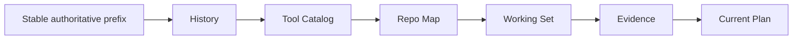

# Context Sources, Priority, and Lifecycle

English | [简体中文](../../zh-CN/05-context-engineering/03-source-priority-lifecycle.md)

## Learning Objectives

Classify Context by authority, stability, and lifetime; understand ordering,
digest skipping, Working Set decay, and Evidence priority.

## Prerequisites

Read the first two Context Engineering chapters.

## Source Matrix

| Source | Authority | Lifetime | Refresh |
| --- | --- | --- | --- |
| Base system | Runtime | session/build | startup |
| Mode/policy/constitution | Runtime/operator | Turn/session | policy change |
| Repository instructions | untrusted repository guidance | session | assembly |
| Pinned/editor files | user-selected data | Turn/session | capture/digest |
| Skills/memory | configured extension/user data | session+ | startup/update |
| Conversation history | prior Runtime facts | Thread | each Turn |
| Tool catalog | Runtime capability | sample | catalog generation |
| Repo map | indexed data | Turn | once per Turn |
| Working Set/evidence/plan | observed task state | sample | every sample |

Authority and recency are independent. Recent repository text does not outrank
Constitution; old verified evidence may be more useful than recent speculation.

## Ordering and Priority



Stable sources come first for cache reuse. Dynamic task-specific sources come
last. Within Evidence, reminders and risks precede facts so prefix-preserving
truncation retains obligations before repeatable lookups.

## Lifecycle Mechanisms

World State sections have stable IDs and digests. If a section is unchanged,
assembly emits a receipt without reinjecting its body. Skills and Constitution
are marked fragments so compaction can remove stale copies and inject current
versions afterward.

Working Set observations merge source provenance. Recency decays, critical
paths sort first, and deterministic path order breaks ties. Evidence tracks
facts, unverified/blind changes, open diagnostics, repeated calls, and stale
handles.

## Observation and Invalidation Rules

Context quality depends on removing claims at the right time:

| Event | State transition |
| --- | --- |
| Search/read Result | add Fact and Working Set provenance |
| File write after prior read | mark changed/unverified, not blind |
| File write without prior read | mark changed/unverified and blind risk |
| Successful verification for paths | clear unverified risk for those versions |
| Later write | invalidate earlier verification |
| Diagnostic opens/closes | add/remove diagnostic risk |
| Same Tool+arguments repeated | add next-Turn reminder |
| Handle issued but not consumed | add reminder, later expire |
| Fork | clone current state without sharing future mutation |
| New Turn | decay Working Set weights and reset Turn-local reminders |

Evidence is a ledger of observed transitions, not a free-form model summary.
Unknown Fact kinds and blank paths are ignored rather than becoming convincing
but unrenderable claims.

## Priority Under Pressure

Priority is multi-dimensional:

```text
authority > unresolved risk > task relevance > freshness > deterministic tie-break
```

This is not one global sort across every Message. It guides partition order,
Working Set selection, Evidence rendering, and compaction separately. The
Receipt exposes where each local policy removed information.

## Code Map

| Concern | Source |
| --- | --- |
| Stable partitions | `promptcontext/context.go` |
| Volatile partitions | `promptcontext/turn.go` |
| Digest sections | `promptcontext/worldstate.go` |
| Fragment lifecycle | `promptcontext/fragment.go` |
| Working Set | `agent/workingset` |
| Evidence | `agent/evidence` |

## Tradeoffs and Alternatives

Pure recency ordering is simple but can bury hard policy. Pure authority
ordering can hide current task state. CodeHelper uses a stable authority prefix
plus a dynamic task tail and records each partition independently.

## Failure Modes and Security Boundaries

- Repository instructions remain untrusted even when loaded automatically.
- Unknown Working Set sources and blank paths are ignored.
- A new write invalidates earlier verification evidence.
- Unchanged World State must not be duplicated.
- Stale contextual fragments are removed during compaction.
- Empty section and disabled section remain distinguishable in receipts.

## Tests and Verification

```bash
go test ./internal/runtime/agent/promptcontext
go test ./internal/runtime/agent/workingset ./internal/runtime/agent/evidence
```

## Hands-On Lab

Take one successful Turn and label every Context section with authority,
lifetime, and refresh point. Then use `TestWorldStateSectionsDigestSkip` to
observe a body omitted while its receipt remains.

## Review Questions

1. Why is Context recency not equivalent to authority?
2. Why do risks precede facts?
3. Why are Skills/Constitution marked before compaction?
4. Which state transition invalidates a previously passing verification?
5. Why is priority implemented per partition rather than as one global score?

## Further Reading

- [Budget and Compaction](./04-budget-and-compaction.md)

## Sources and Verification

| Item | Value |
| --- | --- |
| Catalog ID | `context-source-lifecycle` |
| Status | `verified` |
| Last verified | 2026-08-06 |
