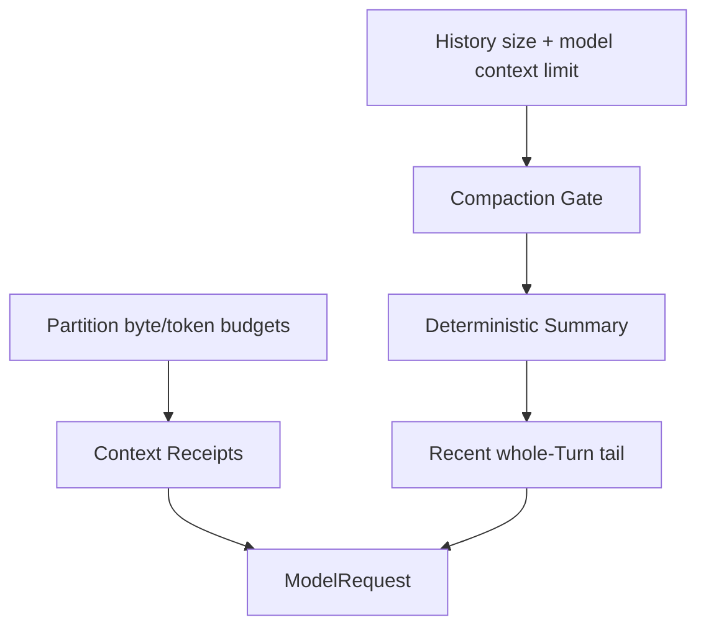

# Token Budgets, Compaction, and Information Loss

English | [简体中文](../../zh-CN/05-context-engineering/04-budget-and-compaction.md)

## Learning Objectives

Understand partition budgets, context-window checks, deterministic compaction,
and how receipts make information loss explicit.

## Prerequisites

Read [Context Sources, Priority, and Lifecycle](./03-source-priority-lifecycle.md).

## Problem Background

Context is finite. Truncating arbitrary bytes can split UTF-8, Tool pairs, or
lists and make missing information look like complete information. Asking the
model to summarize itself can also invent claims such as “tests passed.”

## Two Budget Layers



Partition budgets bound each source during assembly. History compaction runs
before the first sample or mid-Turn when byte/context-token limits are reached.
Configured output tokens are reserved when checking Model context capacity.

## Capacity Accounting

The pre-sampling decision is conceptually:

```text
estimated_input_tokens
  + reserved_max_output_tokens
  <= selected_model_context_tokens
```

Input includes stable partitions, history, volatile tail, Tool Definitions, and
protocol overhead estimates. Partition byte ceilings remain useful even when a
precise vendor tokenizer is unavailable: they provide deterministic local
bounds and UTF-8-safe retention.

Token estimation is evidence with a method, not an exact Provider bill. Actual
Usage arrives from the Provider and is recorded separately.

## Three Classes of Information Loss

| Mechanism | Scope | Recoverability |
| --- | --- | --- |
| partition truncation | one source in one assembly | original source may be reread |
| Tool/Repo Map selection | entries omitted by rank/count | can search/read on demand |
| history compaction | old whole-Turn groups replaced | durable Events remain, model sees summary |

Each class needs its own Receipt. A single `truncated=true` cannot explain
whether bytes, entries, or causal history were removed.

Compaction is model-context loss, not necessarily durable-data deletion.
Reconstruction and audit may retain Events that no longer enter the next
sample.

## Deterministic Summary

Compaction does not call a model. It derives Summary from observed Goal, open
Todos, failed attempts, Changes, critical paths, lookup Facts, and a bounded
message Digest. Sections are ordered by cost of loss:

```text
goals -> todos -> failures -> changes -> critical paths -> facts -> digest
```

Whole sections drop from the tail when they do not fit; Digest may drop oldest
independent lines. Markers and a truncation notice survive even under a tiny
budget. Previous summary content is carried so repeated compaction does not
flatten it into an ambiguous line.

## Turn Integrity

The cut occurs at whole-Turn groups, preserving Assistant Tool Calls with Tool
Results. Contextual Skills/Constitution fragments are stripped from old history
and freshly reinjected. Recent tail history remains verbatim.

## Receipts

Compaction Receipt reports original/retained bytes and Messages, removed Turns,
retained sections, truncation reason, Working Set, critical paths, and Prompt
Context receipts. A Host can distinguish “no data” from “data was dropped.”

## Code Map

| Concern | Source |
| --- | --- |
| Partition retain/receipt | `promptcontext/context.go` |
| Summary structure/render | `agent/compact/compact.go` |
| Cut and replacement | `agent/engine/engine.go`, `compaction.go` |
| Thread compact operation | `runtime/app/compact_window.go` |

## Tradeoffs and Alternatives

Model-generated summaries are fluent but not trustworthy evidence and add cost.
Naive oldest-message deletion is deterministic but can break Tool pairing and
lose the task goal. Structured observed-state summaries prioritize correctness
over prose.

## Failure Modes and Security Boundaries

- UTF-8 retention remains valid.
- Truncation emits an explicit notice and receipt.
- Tool pairs and whole Turn groups remain atomic.
- Tiny budgets keep wrapper/provenance rather than silently empty Context.
- Context limit calculation includes requested output capacity.
- Summary never invents verification not present in evidence.

## Tests and Verification

```bash
go test ./internal/runtime/agent/compact
go test ./internal/runtime/agent/engine -run 'TestEngineCompact|TestEngineCompaction'
go test ./internal/runtime/app -run 'TestCompact(Window|Fork)'
```

## Hands-On Lab

Run `TestRenderDropsCheapestSectionsFirst` and progressively shrink the budget.
Record which sections disappear and confirm Goal/Todo survive before repeatable
Facts/Digest.

## Review Questions

1. Why is model-generated self-summary unsafe as evidence?
2. Why must the cut preserve whole Tool exchanges?
3. What is the difference between partition truncation and history compaction?
4. Why must output capacity be reserved before sampling?
5. Which information loss is recoverable by reread, replay, or neither?

## Further Reading

- [Memory and Snapshot](./05-memory-and-snapshot.md)

## Sources and Verification

| Item | Value |
| --- | --- |
| Catalog ID | `context-budget-compaction` |
| Status | `verified` |
| Last verified | 2026-08-06 |
