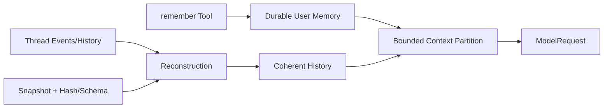

# Memory, Snapshots, and Recovery

English | [简体中文](../../zh-CN/05-context-engineering/05-memory-and-snapshot.md)

## Learning Objectives

Distinguish user memory, conversation history, compact summary, session
metadata, and state snapshots; understand which data enters model context.

## Prerequisites

Read [Budget and Compaction](./04-budget-and-compaction.md) and
[Resume and Recovery](../03-runtime-kernel/06-resume-and-recovery.md).

## Five Different Persistence Concepts

| Concept | Purpose | Model-visible |
| --- | --- | --- |
| User memory | explicit durable preferences/facts | bounded opt-in partition |
| Thread history | causal user/assistant/tool exchange | yes, until compacted |
| Compact summary | deterministic replacement for old history | yes |
| Session metadata | organize threads/workspaces | generally no |
| Snapshot | validated restoration/checkpoint payload | only after reconstruction |

Calling all of these “memory” hides different authority and retention rules.

## Data Flow



## User Memory

The `remember` Tool appends a terse note to the configured Store. It is a write
Tool with a declared memory resource and explicit instruction not to store
secrets. Memory is injected only when enabled, within `MaxPromptBytes`, and
receipted like other partitions.

Memory content is user data, not Constitution. It can guide preferences but
cannot grant authority.

## Memory Write and Read Boundaries

The governed Tool validates note size, rejects likely secrets, declares a
memory write Resource, and serializes concurrent appends. The Store remains
inside its configured root and rejects symlink/path escape.

Secret detection is a preventive heuristic, not complete DLP. Users must not
ask the Agent to persist credentials, tokens, private keys, or sensitive
repository contents. Rotation/deletion is still required after exposure.

At read time, the Store distinguishes disabled, missing, present, and
truncated. It wraps content with source/provenance and applies a separate prompt
budget. Persisted bytes and model-visible bytes are therefore not identical.

## Retention and Authority Matrix

| Data | Retention owner | Invalidated by | Authority |
| --- | --- | --- | --- |
| User memory | user/configured Store | explicit edit/delete | preference data |
| Thread history | Runtime/Event lifecycle | revert/compaction view | causal facts |
| Compact summary | Runtime | later compaction/revert | derived context |
| Session metadata | session repository | user/session lifecycle | organization only |
| Snapshot | snapshot repository/CAS | newer Events/schema policy | restore hint |

No item becomes policy merely because it persists longer.

## Snapshot and Reconstruction

Snapshot repositories store versioned payloads with content hash. Load rejects
corruption and unsupported schema. Runtime reconstruction combines durable
Events and snapshots, retaining only completed Tool-paired history.

A Snapshot accelerates restore; it does not override later Events or make an
incomplete Turn valid. Resume and recovery rules remain in the application
Runtime.

Snapshot validation is layered:

1. schema/version says the payload shape is understood;
2. content hash says stored bytes match the recorded digest;
3. identity says the Snapshot belongs to the requested Thread/Turn;
4. Event reconstruction says it is not newer authority than subsequent facts;
5. semantic reconstruction drops incomplete Tool exchanges.

Hash integrity proves byte equality, not freshness or truth.

## Code Map

| Concern | Source |
| --- | --- |
| User memory Store | `internal/adapter/memory` |
| Remember Tool | `internal/adapter/tool/memory` |
| Memory partition | `promptcontext/context.go` |
| Session metadata | `internal/persist/session` |
| Snapshot integrity | `internal/persist/snapshot` |
| History reconstruction | `runtime/app/reconstruct.go` |

## Tradeoffs and Alternatives

Automatically extracting memory is convenient but can persist prompt injection
or secrets. CodeHelper uses an explicit governed Tool and bounded injection.
Event-only replay is authoritative but can be expensive; snapshots improve
speed while hash/schema checks prevent blind trust.

## Failure Modes and Security Boundaries

- Memory is disabled unless configured.
- Note size and Prompt partition have separate limits.
- Secret content must not be stored.
- Snapshot hash/schema mismatch is rejected.
- Incomplete Tool pairs do not enter reconstructed history.
- Session metadata is not automatically model-visible.

## Tests and Verification

```bash
go test ./internal/adapter/tool/memory
go test ./internal/persist/snapshot ./internal/persist/session
go test ./internal/runtime/app -run TestReconstructThread
```

## Hands-On Lab

Read `TestSnapshotRoundTripVerifiesSchemaAndHash`, then corrupt one byte in a
temporary test payload and observe rejection. Compare that integrity check with
the separate semantic checks in `TestReconstructThreadCommitsOnlyCompletedPairedToolHistory`.

## Review Questions

1. Why is user memory not policy authority?
2. What does Snapshot integrity prove, and what does it not prove?
3. Why should memory insertion be an explicit governed Tool?
4. Why can persisted memory be larger than model-visible memory?
5. What does Snapshot hash validation still fail to prove?

## Further Reading

- [Context Quality](./06-context-quality.md)

## Sources and Verification

| Item | Value |
| --- | --- |
| Catalog ID | `context-memory-snapshot` |
| Status | `verified` |
| Last verified | 2026-08-06 |
