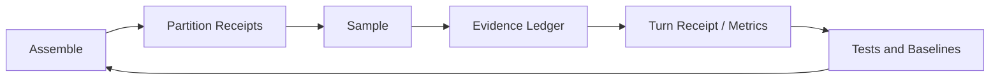

# Evaluating Context Quality

English | [简体中文](../../zh-CN/05-context-engineering/06-context-quality.md)

## Learning Objectives

Replace “the prompt looks good” with measurable Context properties: coverage,
precision, freshness, provenance, budget efficiency, and outcome evidence.

## Prerequisites

Read [Context Source Lifecycle](./03-source-priority-lifecycle.md) and
[Budget and Compaction](./04-budget-and-compaction.md).

## Quality Dimensions

| Dimension | Question | Observable signal |
| --- | --- | --- |
| Coverage | Was required state present? | critical paths, missing/degraded sections |
| Precision | Was irrelevant state excluded? | retained/original ratio, omitted entries |
| Freshness | Did state match this sample? | digest, Turn, document version |
| Provenance | Can each claim be traced? | source path, receipt, evidence kind |
| Integrity | Was content validated? | hash, canonical path, paired history |
| Efficiency | What did useful context cost? | bytes/tokens, cache-stable prefix |
| Outcome | Did it improve correct work? | repeat calls, blind edits, verification |

No single token count measures quality. A small Context can omit a critical
file; a large Context can bury the only relevant diagnostic.

## Measurement Loop



## Receipts and Evidence

Prompt Receipts report source, digest, original/retained bytes/tokens, and
truncation reason. Evidence reports Facts, Risks, Reminders, and Change marks.
Turn Receipts combine these with usage, latency, verification, and changed
paths.

Working Set and affected-test entries also preserve selection explanation:
entry kind, reason, supporting evidence, score, and per-entry truncation.
Hosts project these fields from the Receipt. They must not reconstruct a
plausible reason from a filename, because presentation inference would turn
an observation into false authority.

This allows questions such as:

- Did a failed Turn lack the relevant file or ignore present evidence?
- Did catalog growth consume more Context without adding used Tools?
- Did a write happen without a prior read?
- Was a successful verification later invalidated by another write?

## Baselines and Experiments

`catalog_benchmark_test.go` holds a default Tool Catalog size baseline.
Deterministic tests assert stable ordering and digests. Context changes should
compare both structural metrics and task outcomes; shrinking bytes alone is
not success.

A useful experiment varies one source/budget at a time over the same Fixture
task and records completion, Tool calls, repeated reads, verification, input
tokens, truncation, and latency.

## Derived Metrics and Their Limits

Useful derived signals include:

```text
retention_ratio = retained_bytes / original_bytes
risk_clearance  = risks_cleared_by_verification / risks_opened
repeat_rate     = repeated_equivalent_calls / total_calls
evidence_yield  = consumed_facts / context_or_tool_cost
cache_stability = samples_with_same_stable_digest / comparable_samples
```

These are diagnostic, not universal scores. A low retention ratio is healthy
for a noisy Catalog and dangerous for a critical file. "Consumed fact" also
requires an operational definition; model prose alone cannot prove causality.

## Controlled Experiment Checklist

1. Freeze repository revision, Fixture/Model Route, Tool Catalog, mode, and
   security posture.
2. Change one source, ordering rule, or budget.
3. Run enough deterministic cases to expose variance.
4. Compare both success criteria and failure categories.
5. Inspect receipts to confirm the intended Context actually changed.
6. Check cost/latency and repeated work, not only completion.
7. Record regressions where a smaller Context loses critical evidence.

Without a stable task and Route, token or success differences cannot be
attributed to Context.

## Failure Diagnosis Matrix

| Symptom | Context hypothesis | Evidence to inspect |
| --- | --- | --- |
| repeated file reads | missing/stale Working Set or reminder ignored | read digests, reminders, tail receipt |
| blind edit | relevant file absent or read evidence not recorded | change risks, Tool receipts |
| wrong module edited | poor Repo Map/Editor focus | outlines, critical paths, editor digest |
| policy bypass attempt | untrusted text presented as authority | partition source and Guard decision |
| verification claim without run | summary/model invention | verification receipt |
| high cost with no progress | oversized/noisy partitions or Tool Catalog | retained ratios, Usage per sample |

## Code Map

| Concern | Source |
| --- | --- |
| Partition receipts | `promptcontext/context.go` |
| Evidence ledger | `agent/evidence` |
| Turn receipts | `runtime/app/receipt.go` |
| Usage/latency | `internal/observability` |
| Catalog baseline | `promptcontext/catalog_benchmark_test.go` |

## Tradeoffs and Alternatives

Manual prompt review catches wording defects but is subjective. End-to-end
success rate is meaningful but gives weak diagnosis. CodeHelper combines
deterministic structural checks, provenance receipts, evidence signals, and
task-level outcomes.

## Failure Modes and Security Boundaries

- A digest proves equality, not truth or authority.
- A passing test is evidence only for its covered scope.
- Missing receipt data must not be interpreted as zero usage.
- Quality telemetry must not log raw secrets or sensitive content.
- Benchmarks require explicit review when intentional Context growth occurs.
- Correlation between Context size and success is not causation.

## Tests and Verification

```bash
go test ./internal/runtime/agent/promptcontext
go test ./internal/runtime/agent/evidence
go test ./internal/runtime/app -run 'TestReceipt(ReportsReadPathsAndContextSections|ReportsEvidence)'
```

## Hands-On Lab

Choose one Fixture Turn and build a table of partition bytes, truncation,
evidence risks, Tool calls, usage, and verification. Change one partition
budget, rerun, and explain whether quality improved rather than merely became
smaller.

## Review Questions

1. Why is token count insufficient as a quality metric?
2. What can a digest prove?
3. Which signals reveal irrelevant or stale Context?

## Further Reading

- [Verification and evidence](../06-tools-and-execution/05-verification-and-evidence.md)

## Sources and Verification

| Item | Value |
| --- | --- |
| Catalog ID | `context-quality` |
| Status | `draft` |
| Last verified | Not yet verified |
