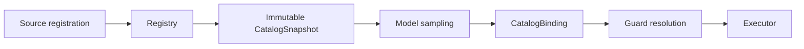

# Tool Schema, Registry, and Dynamic Catalog

English | [简体中文](../../zh-CN/06-tools-and-execution/01-schema-registry-catalog.md)

## Learning Objectives

Understand Tool descriptors, Registry authority, immutable sampling snapshots,
deferred materialization, and catalog-bound execution.

## A Tool Is More Than a Function

`Descriptor` declares name, description, JSON input schema, visibility,
capability, resource resolver, access mode, parallel policy, sandbox
requirement, aliases, availability, and deferred-loading state.



Schema describes call shape; Capability and Resource Resolver describe security
meaning. The Registry validates both when registering a Tool.

## Four Contracts in One Descriptor

| Contract | Descriptor fields | Consumer |
| --- | --- | --- |
| Model interface | name, description, input schema, aliases, visibility | Provider/Context |
| Authority | capability, access mode, Resource Resolver, Sandbox requirement | Guard/Policy |
| Scheduling | parallel policy and resolved Resources | Claims/Scheduler |
| Lifecycle | availability, deferred state, source/revision | Catalog/Host |

These contracts must agree. A write-capable schema paired with read access
metadata is not "mostly correct"; it can authorize or schedule the Call under
the wrong assumptions. Registration validates closed enums, schema
compilation, aliases, Resource templates, and availability consistency.

The model sees only the public Tool Definition. Private Catalog authority and
execution metadata never enter the Provider request.

## Dynamic Catalog

Each Registry has a Catalog ID and Generation. Each entry has Source, Revision,
private Authority token, lifecycle state, and frozen Descriptor. `Reconcile`
atomically applies one source's desired state with optional generation CAS.
Replacement/revocation changes authority and leaves tombstones for stable error
classification.

`CatalogSnapshot` is deep-cloned and sorted. A sampled Tool Call carries ID,
generation, revision, and private in-process authority. `ResolveBound` rejects
calls that were not advertised or whose entry changed after sampling.

Catalog identity answers different questions:

- Catalog ID: which Registry namespace advertised the Tool?
- Generation: which atomic catalog state was sampled?
- Revision: which source entry version supplied this Tool?
- Authority token: is this the exact in-process executor admission?

Matching a name is insufficient for all four.

## Deferred Tools and Search

Deferred entries expose a Descriptor before loading an Executor. `tool_search`
ranks visible Tools, materializes selected matches, and returns their schema.
Entry-count and schema-byte limits prevent unbounded prompt/catalog growth.
Concurrent loads coalesce; schema or authority drift during loading fails.

Large Results are also governed Catalog behavior: the Registry stores bounded
content and returns a Handle when inline output exceeds limits. `result_get`
provides bounded retrieval; a Handle does not bypass hard output caps.

## Code Map

| Concern | Source |
| --- | --- |
| Descriptor/Registry | `adapter/tool/tool.go` |
| Snapshot/reconcile | `adapter/tool/catalog.go` |
| Deferred discovery | `adapter/tool/toolsearch` |
| Dynamic sources | `adapter/tool/dynamic` |
| MCP reconciliation | `adapter/tool/mcp` |

## Tradeoffs and Alternatives

A static list is simpler but cannot support MCP/plugin churn. Resolving by name
alone permits time-of-check/time-of-use substitution. Snapshot bindings keep
dynamic discovery while ensuring the sampled authority is the executed one.

## Failure Modes and Security Boundaries

- Invalid schema, capability, access, or sandbox metadata rejects registration.
- Alias conflicts make reconcile atomic-fail.
- Revoked and stale entries have distinct categories.
- Unadvertised Tool Calls cannot execute.
- Deferred loader cannot change frozen schema or aliases.
- Materialization limits fail without partially changing the catalog.

## Tests and Verification

```bash
go test ./internal/adapter/tool \
  -run 'Test(CatalogSnapshot|Registry|DynamicCatalog)'
go test ./internal/adapter/tool/toolsearch ./internal/adapter/tool/mcp
```

## Hands-On Lab

Trace `TestRegistryResolveBoundRejectsReplacedAndRevokedEntries`: capture a
Snapshot binding, replace then revoke the entry, and explain each refusal.

## Review Questions

1. Why is JSON Schema insufficient as security metadata?
2. What does Catalog Binding prevent?
3. Why must deferred loading preserve the frozen Descriptor?
4. Which Descriptor fields affect authorization rather than model syntax?
5. Why are Catalog ID, generation, revision, and authority distinct?

## Further Reading

- [The Tool Guard Pipeline](./03-tool-guard-pipeline.md)

## Sources and Verification

| Item | Value |
| --- | --- |
| Catalog ID | `tool-schema-registry` |
| Status | `verified` |
| Last verified | 2026-08-06 |
