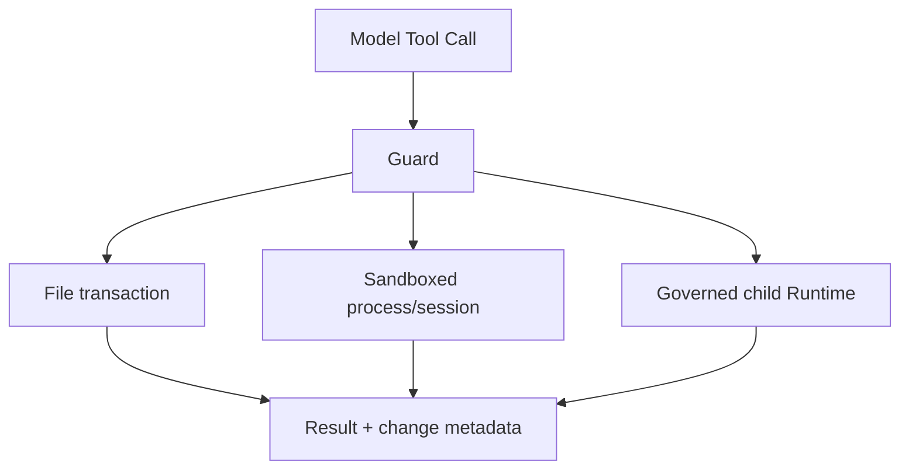

# File, Shell, and Agent Tools

English | [简体中文](../../zh-CN/06-tools-and-execution/02-file-shell-agent-tools.md)

## Learning Objectives

Understand the principal built-in Tool families, their declared resources, and
why their execution semantics remain behind Registry and Guard.

## Built-in Construction

`builtin.NewWithIndex` requires an injected sandbox backend and process manager,
binds the backend to Workspace policy, then registers file, search, web, git,
LSP, content, shell, quality, GitHub, result, and handle Tools. Missing optional
capabilities become unavailable descriptors rather than disappearing silently.

## File Tools

| Tool | Semantics |
| --- | --- |
| `file_read` | bounded UTF-8 range or selected PDF pages |
| `file_list` | bounded structured directory pagination |
| `file_write` | atomic full-text write |
| `file_edit` | atomic exact single replacement |
| `file_apply` | validate-then-commit multi-file transaction |
| `file_patch` | atomic unified diff under strong sandbox |

Paths are Workspace-relative after Guard rewriting. Transactions compose all
changes in memory and write only after every precondition passes. Dry-run
returns the exact diff without writing.

## Resource and Effect Envelopes

| Tool family | Typical Resource | Effect boundary |
| --- | --- | --- |
| file read/search | file/tree read | bounded Workspace observation |
| file write/edit/apply/patch | explicit file/tree write | mediated filesystem transaction |
| shell/terminal | Workspace tree + process session | arbitrary command inside Sandbox profile |
| web/GitHub | network host + logical object | governed remote effect |
| Agent spawn/merge | child slot/worktree + target files | child Runtime and explicit merge |
| result/handle | content object read | bounded retrieval only |

Resource declaration is used by Policy, Approval, Claims, Journal scope, and
Receipt attribution. Under-declaring is a security defect; over-declaring
causes unnecessary serialization and Approval.

Hierarchical Claims allow read/read overlap while blocking write/tree conflicts
on canonical targets. `ParallelSerial` adds a synthetic serial claim even when
arguments name disjoint files.

## Shell Tools

`shell_run` and `terminal_run` declare Process capability, serial policy, whole
Workspace/process resources, and strong sandbox. Commands run in a validated
Workspace directory with sanitized environment, timeout/cancellation, bounded
streaming, exit metadata, and hints for background execution.

Background session Tools preserve job identity and separate start, poll, input,
and cancel operations.

A Shell Tool is not made safe by argument schema. Its command language is broad,
so it requires strong OS Sandbox, sanitized environment, canonical working
directory, process-group cancellation, output limits, and explicit network
Policy. If the platform cannot satisfy the required strength, execution fails
closed.

## Agent Tools

`agent`, wait/list/followup/interrupt/close, and `agent_merge` operate through
the orchestration Manager and Governor. They enforce depth, parallelism, token,
cost, wall-clock, stance, worktree, and merge rules. Child receipts distinguish
pending/self-reported work from gate-proven verification.



## Code Map

| Concern | Source |
| --- | --- |
| Built-in wiring | `tool/builtin/builtin.go` |
| File operations | `tool/file` |
| Process/session | `tool/shell` |
| Child agents/merge | `tool/agent` |
| Process backend | `internal/platform/process` |

## Tradeoffs and Alternatives

Direct `os`/`exec` calls are smaller but bypass path, sandbox, approval, journal,
and observability contracts. Built-ins expose narrow structured operations and
reuse the same Guard regardless of Host.

## Failure Modes and Security Boundaries

- File traversal, unsafe objects, binary edits, and stale reads fail.
- Multi-file validation failure writes nothing.
- Process Tools fail closed without strong sandbox.
- Timeout/cancel terminates process groups and returns attributed status.
- Agent admission fails on depth/concurrency/budget violations.
- Agent merge checks baseline drift and file claims.

## Tests and Verification

```bash
go test ./internal/adapter/tool/file ./internal/adapter/tool/shell
go test ./internal/adapter/tool/agent
go test ./internal/adapter/tool/builtin
```

## Hands-On Lab

Compare `file_apply` dry-run and commit tests. Identify the same plan,
preconditions, resources, and resulting change metadata across both paths.

## Review Questions

1. Why do optional Tools stay visible as unavailable?
2. Why is shell serialization also represented as a resource claim?
3. Why is an Agent merge treated as a workspace write?
4. What breaks when a Tool under-declares or over-declares Resources?
5. Why can a valid Shell schema still require strong Sandbox enforcement?

## Further Reading

- [Edit Plans, Journals, and Receipts](./04-edit-journal-receipt.md)

## Sources and Verification

| Item | Value |
| --- | --- |
| Catalog ID | `tool-builtins` |
| Status | `verified` |
| Last verified | 2026-08-06 |
