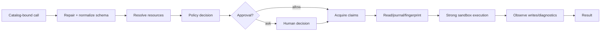

# The Tool Guard Pipeline

English | [简体中文](../../zh-CN/06-tools-and-execution/03-tool-guard-pipeline.md)

## Learning Objectives

Follow one Tool Call from catalog resolution through validation, Policy,
Approval, resource claims, sandboxed execution, journaling, and diagnostics.

## Pipeline



Policy receives only a `Validated: true` invocation. This ordering matters:
rules evaluate canonical Tool identity, normalized arguments, and explicit
resources, not model-authored claims.

## Preparation

`prepare` resolves the sampled Catalog Binding, repairs fenced JSON, normalizes
against schema, expands trusted arguments, rewrites allowed absolute Workspace
paths, resolves resources, adds a serial claim when required, and verifies the
injected strong sandbox.

## Trust Transitions

| Stage | Input trust | Output guarantee |
| --- | --- | --- |
| sampled call | untrusted name/JSON | none |
| bound resolution | Catalog identity | exact advertised Descriptor/Executor |
| schema normalization | model arguments | canonical typed JSON |
| Resource resolution | normalized arguments | canonical effect targets |
| Policy | validated Invocation | deny/hold/ask/allow decision |
| Approval | human/Hook decision | scoped, expiring authority |
| Claims | canonical Resources | conflicting effects excluded |
| Sandbox/egress | authorized attempt | OS/network boundary applied |
| observation | executor result + actual state | changes/diagnostics/Receipt evidence |

No later guarantee may be assumed earlier. In particular, schema-valid does not
mean authorized, and approved does not mean successfully sandboxed.

## Policy and Approval

Policy combines repository rules, Tool grants, mode, permission posture, and
granular surface tightening. Deny/Hold fail immediately. Ask can use a scoped,
argument/resource-bound approval cache or an asynchronous host request.

Replacement arguments are prepared and evaluated again. Edit-plan approval is
one-shot. Network redirects and typed Sandbox denial amendments require
distinct resources; prior approval of the original call does not imply them.

Approval-cache reuse is a subset check over canonical Tool, arguments,
Resources, scope, and expiry. Deny always wins; a broader mode or permission
cannot weaken Constitution/repository denial. A missing asynchronous Approval
Host fails closed when interaction is required.

## Execution and Observation

Resource claims serialize conflicting access. Hooks run around execution.
Writes establish before-images/fingerprints, execute through the Registry, then
observe actual disk changes and run diagnostics. Results may be routed to
bounded content handles.

A structured, amendable Sandbox denial may request one path, Host/Port, or
Process capability through a separate critical one-shot Approval. The amended
Profile receives a new revision and digest, preserves immutable denies, and
retries once under the same strong Sandbox. Untyped or repeated denial fails
closed.

Claims are acquired after authority is known and released on every return path,
including cancellation and panic-safe execution boundaries. They coordinate
concurrent Calls; they do not replace filesystem preconditions or Journal
fingerprints because external processes may still mutate the Workspace.

## Code Map

| Concern | Source |
| --- | --- |
| Pipeline | `tool/guard/guard.go` |
| Escalation | `tool/guard/escalation.go` |
| Policy | `security/policy/policy.go` |
| Approval cache | `security/policy/approval.go` |
| Sandbox backend | `security/sandbox` |
| Egress gate | `security/egress` |

## Tradeoffs and Alternatives

Checking permissions inside each Tool duplicates policy and creates gaps.
Authorizing before schema/resource resolution lets malformed calls influence
rules. A central Guard keeps execution uniform and fails closed.

## Failure Modes and Security Boundaries

- Missing Call ID, Registry, Policy, or strong backend fails.
- Malformed arguments fail before Policy.
- Unknown mode/posture/capability is denied.
- Approval is bound to call, arguments, resources, scope, and expiry.
- Replacement arguments repeat validation and Policy.
- Sandbox escalation and new network hosts require separate authority.
- Every executed Attempt receipt binds the Profile revision/digest, backend,
  roots, network mode, Grant provenance, denial, and amendment decision.
- Claims are released on every return path.

## Tests and Verification

```bash
go test ./internal/adapter/tool/guard
go test ./internal/security/policy ./internal/security/sandbox ./internal/security/egress
```

## Hands-On Lab

Trace `TestSandboxStrongApprovalDoesNotCoverAdditionalPermission`. List the
resources, Profile revisions/digests, typed denial, and Approval decision for
both strong attempts. Verify that the first amendment's replacement digest is
the second Attempt's Profile digest.

## Review Questions

1. Why must Policy run after resource resolution?
2. Why are replacement arguments evaluated from the beginning?
3. Why does sandbox escalation require a new approval?
4. At which stage does a Tool Call first become authorized?
5. Why do Resource Claims not replace read-before-edit fingerprints?

## Further Reading

- [Approval, Constitution, and Sandbox](../07-security-governance/03-approval-constitution-sandbox.md)

## Sources and Verification

| Item | Value |
| --- | --- |
| Catalog ID | `tool-guard-pipeline` |
| Status | `draft` |
| Last verified | Not yet verified |
