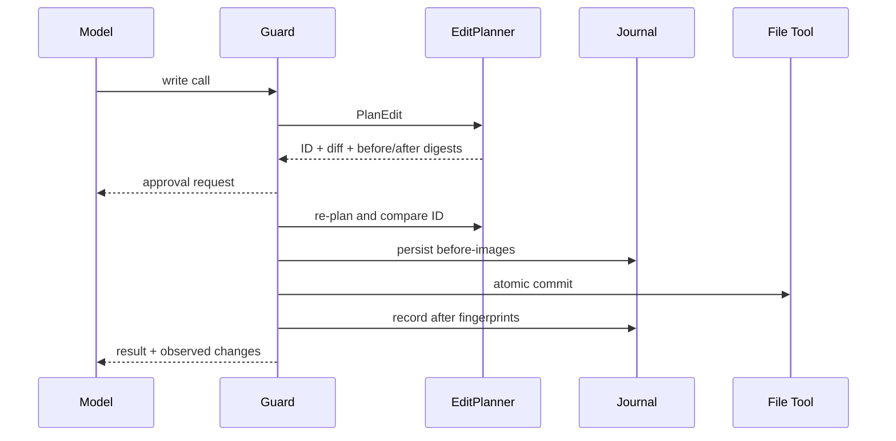

# Edit Plans, Journals, and Receipts

English | [简体中文](../../zh-CN/06-tools-and-execution/04-edit-journal-receipt.md)

## Learning Objectives

Understand preview-bound edits, read-before-edit fingerprints, durable
before-images, observed Turn diffs, rollback conflicts, and audit receipts.

## Write Lifecycle



## Edit Plans

An `EditPlan` is a side-effect-free preview containing exact files, before and
after content/digests, and unified diff. Approval names its Plan ID. Before
execution Guard recomputes the plan; changed Workspace state produces
`edit_plan_stale`. Planned writes use one-shot approval.

## Read-before-edit and Journal

`file_read` records content and filesystem identity. Existing files must still
match that fingerprint before mediated edits. The Journal stores each path's
first before-image before the write and records the after fingerprint.

Durable ledger entries precede described writes, enabling interrupted-Turn
recovery. Rollback restores only when current state still matches expected
after-state; external edits produce conflicts and are never clobbered.

## Write Crash Windows

| Crash point | Durable fact | Recovery action |
| --- | --- | --- |
| before plan/approval | none | no write to recover |
| after approval, before Journal | approval only | no file effect claimed |
| after before-image, before write | before-image + owner | settle/restore safely |
| during multi-file commit | before-images + partial after-state | transaction rollback/recovery |
| after write, before Turn commit | expected after fingerprints | dead owner may be rolled back |
| after Turn commit | committed Journal state | keep writes |
| after external later edit | fingerprint mismatch | report conflict, never clobber |

The Journal records the first before-image for a path in a Turn. Line counts
and rollback therefore compare against the Turn's starting content, even if
several Tools edit the same file.

## Observation and Receipt

Declared write resources determine what Guard snapshots, but actual before/after
content determines whether a change occurred. Turn Diff records path, Tool,
created/modified/deleted, and cumulative line counts.

Execution Receipt combines changes, rollback conflicts, read paths, approvals,
verification, evidence, context sections, catalog identity, usage, cost,
latency, and unresolved issues. Missing measurement is not reported as zero.

Verification is an attempt history, not a single final badge. Each attempt
records scope, command, derivation, outcome, and failure category. Repair
rounds append new attempts and verify the final Workspace again; any later
write invalidates earlier passing evidence. The Receipt also records repair
count, rollback/revert result, conflicts, and final Workspace outcome so
“model completed,” “files remain changed,” and “verification passed” cannot be
collapsed into one status.

## Evidence Scope

Different records prove different facts:

- Edit Plan: what was proposed at one Workspace state;
- Approval: what the user authorized, with scope and expiry;
- Journal: before/expected-after file state and recovery ownership;
- observed change: what bytes actually differed after execution;
- Verification Receipt: what checks ran and their outcomes;
- Execution Receipt: a projection joining these facts for one Turn.

The joined Receipt is convenient but does not replace source records. A missing
Journal means rollback is unavailable, even if a Tool Result claims success.

## Code Map

| Concern | Source |
| --- | --- |
| EditPlan contract | `adapter/tool/tool.go` |
| Transaction/plan | `adapter/tool/file/apply.go` |
| Guard observation | `adapter/tool/guard/guard.go` |
| Journal/recovery | `persist/workspacejournal` |
| Turn Diff | `runtime/agent/engine/turndiff.go` |
| Receipt projection | `runtime/app/receipt.go` |

## Tradeoffs and Alternatives

Argument-based change reporting misses patches and hidden side effects.
Executor self-report can lie accidentally. Comparing fingerprints observes the
Workspace; Journal before-images additionally make rollback possible.

## Failure Modes and Security Boundaries

- Existing files require a fresh successful read.
- Plan ID mismatch or Workspace drift fails before execution.
- Before-image storage failure blocks the write.
- Multi-file validation/commit is all-or-nothing.
- Rollback never overwrites an external post-Turn edit.
- Binary or unavailable line counts remain absent, not false zero.
- Non-file side effects are explicitly not claimed as reverted.

## Tests and Verification

```bash
go test ./internal/adapter/tool/file -run 'Test(FileApply|ForcedEditPlan|ReadBeforeEdit)'
go test ./internal/persist/workspacejournal
go test ./internal/runtime/app -run TestReceiptReportsLineStatsAndRollbackConflicts
```

## Hands-On Lab

Run `TestJournalRollbackNeverClobbersAnExternalEdit`. Draw the before,
expected-after, and current fingerprints that turn a rollback into a conflict.

## Review Questions

1. Why is an approved diff recomputed before execution?
2. Why does Guard observe disk changes instead of trusting Tool output?
3. What can a Journal rollback safely promise?
4. Why is the first before-image retained across multiple edits in one Turn?
5. Which record proves proposal, authorization, actual change, and verification?

## Further Reading

- [Verification Gates and Evidence](./05-verification-and-evidence.md)

## Sources and Verification

| Item | Value |
| --- | --- |
| Catalog ID | `tool-edit-journal-receipt` |
| Status | `verified` |
| Last verified | 2026-08-06 |
