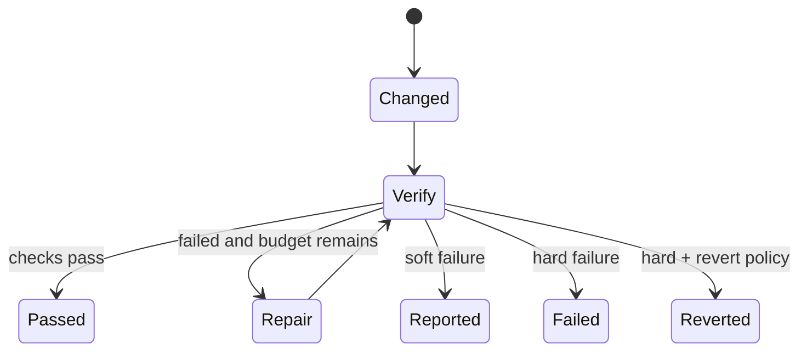

# Verification Gates and Evidence

English | [简体中文](../../zh-CN/06-tools-and-execution/05-verification-and-evidence.md)

## Learning Objectives

Understand post-edit diagnostics, scoped verification, repair rounds, soft/hard
outcomes, rollback, and the difference between evidence and claims.

## Gate Lifecycle



The Gate runs only when configured and the Turn observably changed files.
Changed paths come from Turn Diff, including Tools whose arguments did not
directly name paths.

## Diagnostics and Verification

Guard runs post-edit diagnostics per mediated file. The final Gate can verify
diagnostics scope or repository scope through `verify.Runner`, with timeout.
Checks return status, command, exit code, bounded output, errors, and warnings.

Soft mode reports failed/unavailable checks without changing Turn outcome. Hard
mode requires a working runner and eventually fails or reverts. Repair rounds
use a separate step allowance and inject bounded `[verify]` user feedback
rather than inventing a Tool Call.

## Verification Status Is Not Boolean

| Status | Meaning | May clear risk? |
| --- | --- | --- |
| not evaluated | no applicable check ran | no |
| unavailable | intended check could not run | no |
| failed | check ran and found failure | no |
| passed | named check passed for stated scope | yes, only covered paths/scope |

This prevents "no test runner", "no changed files", and "tests passed" from
collapsing into the same false value.

## Evidence Strength

```text
model/self-report
  < Tool success metadata
  < observed filesystem change/read digest
  < diagnostics for a file/version
  < configured Verification Receipt for named scope
```

The ordering is contextual, not absolute: a repository check can still miss a
behavior, and a search Fact can be the right proof for symbol location. Every
claim must name its scope and provenance.

## Evidence Ledger

Successful search results contribute typed Facts. Observed writes create risks
until covered by passing diagnostics/verification. A write without prior read
is separately marked. Repeated calls and unconsumed handles create reminders.

Only passing verification clears the unverified-change gap. Unavailable and
failed checks remain explicit evidence. Child-agent self-report is not upgraded
to gate-proven status.

Repair rounds consume a separate bounded allowance but still count toward
overall spend and latency. Repair output can create new changes, so the Gate
must evaluate the final state again; a previously passing Receipt cannot be
reused after a later write.

## Code Map

| Concern | Source |
| --- | --- |
| Gate/action | `agent/engine/verify.go` |
| Runner/scope | `observability/verify` |
| Evidence ledger | `agent/evidence` |
| Tool metadata fold | `agent/engine/evidence.go` |
| Protocol receipt | `runtime/app/receipt.go` |

## Tradeoffs and Alternatives

Always running the whole suite is strong but expensive. Diagnostics-only checks
are fast but incomplete. Configurable scope plus explicit status avoids
presenting “not run” as “passed.”

## Failure Modes and Security Boundaries

- No changed bytes means no verification claim.
- Runner error is unavailable in soft mode and terminal in hard mode.
- Repair feedback is bounded and accurately attributed.
- New writes invalidate earlier verification.
- Passing checks prove only their covered paths/scope.
- Revert conflicts remain unresolved issues rather than hidden success.

## Tests and Verification

```bash
go test ./internal/runtime/agent/engine -run 'TestVerifyGate|Test.*Evidence'
go test ./internal/observability/verify
go test ./internal/runtime/app -run 'TestReceiptReportsVerification|TestVerificationData'
```

## Hands-On Lab

Run the repair-round and hard-revert tests. Compare emitted Verification
Receipts, added model feedback, step accounting, and final Workspace state.

## Review Questions

1. Why does an unavailable runner differ from a failed check?
2. Why is verification feedback a user Message rather than Tool Result?
3. What exactly clears an unverified-change risk?
4. Why are not-evaluated, unavailable, failed, and passed distinct?
5. Why must a repair round verify the final state again?

## Further Reading

- [Feeding Tool Failures Back to the Model](./06-failure-feedback.md)

## Sources and Verification

| Item | Value |
| --- | --- |
| Catalog ID | `tool-verification` |
| Status | `verified` |
| Last verified | 2026-08-06 |
