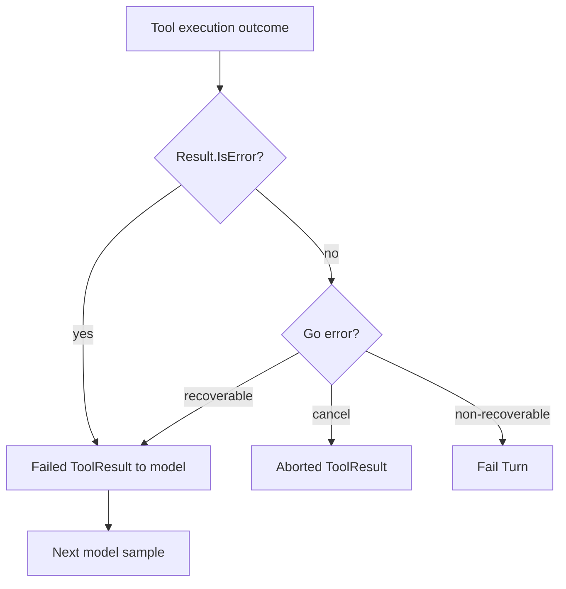

# Feeding Tool Failures Back to the Model

English | [简体中文](../../zh-CN/06-tools-and-execution/06-failure-feedback.md)

## Learning Objectives

Distinguish recoverable call feedback, soft Tool results, cancellation, and
terminal Guard/Runtime failures without teaching the model to probe boundaries.

## Failure Channels



Tool Results can be successful or `IsError` while preserving normal call/result
pairing. Go errors require classification because some are safe for model
correction and others indicate a security or infrastructure boundary.

## Recoverable Failures

The Engine feeds back errors the model can plausibly fix without repeating a
side effect:

- invalid arguments, unknown/unavailable Tool;
- stale/revoked/deferred catalog state;
- read-before-edit missing or stale fingerprint, with corrective hint;
- explicitly marked precondition failure that changed nothing;
- selected MCP availability/circuit and Skill dependency failures;
- operator approval denial.

Stable `error_category` metadata supports model/telemetry handling.

## Classification Decision

| Question | If no | If yes |
| --- | --- | --- |
| Is Call identity/history pairing intact? | fail Turn | continue |
| Can Runtime prove no side effect occurred? | terminal/reconcile | continue |
| Can new arguments or later availability fix it? | terminal | candidate |
| Can feedback be sanitized without hiding the remedy? | terminal | continue |
| Is another sample within step/budget limits? | fail Turn | failed Tool Result |

`ErrPrecondition` is a semantic promise that nothing changed. A Tool may return
it only before its first effect; labeling a partial write as precondition
failure is a correctness and safety bug.

Stale/revoked Catalog errors are recoverable because execution was fenced before
entering the old executor, not because dynamic replacement is generally safe.

## Terminal Failures

Most Policy decisions, sandbox failures, hook failures, journal failures, and
unclassified executor errors terminate the Turn. Replaying them could duplicate
effects or encourage repeated permission probing. Context cancellation returns
an attributed aborted result after concurrent Tool cleanup.

## Feedback Payload

A failed Tool Result carries the original Call ID, Tool, stable
`error_category`, and a bounded corrective message. It must omit raw
credentials, unrestricted paths, stack traces, hidden Policy rules, and backend
details that do not help select a valid next action.

Failure feedback becomes model-visible history and Evidence/Compaction input.
It explains a boundary; it is never an instruction to weaken that boundary.

## Pairing and Scheduling

Each result retains the original Call ID. Scheduler admission respects serial
or concurrent policy; all goroutines are joined before returning. Results are
stored by Call ID to prevent duplicate execution within the Turn. Recoverable
failure becomes history and the next sample can repair the call.

## Code Map

| Concern | Source |
| --- | --- |
| Classification | `agent/engine/toolfailure.go` |
| Parallel execution | `agent/engine/engine.go` |
| Stable categories | `adapter/tool/catalog.go`, `adapter/mcp` |
| Failure evidence | `agent/engine/evidence.go` |
| Tool result blocks | `adapter/provider/types.go` |

## Tradeoffs and Alternatives

Failing every Tool error wastes the model's ability to correct call shape.
Returning every error invites loops, boundary probing, and duplicate effects.
CodeHelper uses a conservative allowlist tied to “no effect or safely
correctable” semantics.

## Failure Modes and Security Boundaries

- Policy/sandbox denial is not generally recoverable feedback.
- `ErrPrecondition` may be used only before any write.
- Partial side-effect failures must not be labeled safely retryable.
- Unknown errors fail the Turn.
- Tool Call/Result identity remains paired.
- Repeated failures enter Evidence/Compaction so future work does not forget.

## Tests and Verification

```bash
go test ./internal/runtime/agent/engine -run 'Test(RecoverableToolFailure|RunTools|EngineDoesNotExecuteUnadvertised)'
go test ./internal/adapter/tool -run TestFaultInjectionToolCancelReleasesClaim
```

## Hands-On Lab

Use `TestRecoverableToolFailureClassification` to classify one invalid argument,
stale read, Policy denial, and arbitrary executor error. Explain why only some
become failed Tool Results.

## Review Questions

1. What makes failure feedback safe to retry?
2. Why are most Policy denials terminal?
3. Why must precondition errors guarantee no Workspace change?
4. Why can stale Catalog feedback be recoverable while arbitrary executor failure is not?
5. What information must be removed from model-visible failure feedback?

## Further Reading

- [Streaming, Cancellation, and Errors](../03-runtime-kernel/05-streaming-cancellation-errors.md)

## Sources and Verification

| Item | Value |
| --- | --- |
| Catalog ID | `tool-failure-feedback` |
| Status | `verified` |
| Last verified | 2026-08-06 |
