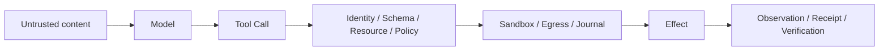

# Agent Runtime Threat Model

English | [简体中文](../../zh-CN/07-security-governance/01-threat-model.md)

## Learning Objectives

Identify assets, authority roots, untrusted inputs, trust boundaries, attacker
goals, and residual risk for a local Coding Agent Runtime.

## Assets and Authority Roots

| Asset | Required property |
| --- | --- |
| Workspace source and Git state | bounded, attributable mutation |
| Credentials/signing keys | confidentiality and rotation |
| User intent/Approval | integrity and narrow scope |
| Runtime Policy/Constitution | non-bypassable enforcement |
| Event log/Journal/Receipt | integrity and recoverability |
| Host machine/process/network | isolation from model-selected effects |
| Plugin/MCP/Skill supply chain | identity, integrity, revocation |

The local operator, reviewed configuration, OS account, and trusted release
keys are authority roots. They are not infallible: mistaken Approval,
compromised dependencies, and a malicious repository remain in scope.

## Untrusted Inputs

User prompts, repository text, generated code, model output, Tool arguments,
Provider/MCP responses, Skills, Plugins, Hooks, Host protocol requests, archives,
symlinks, environment variables, persisted foreign state, and process output
are all untrusted until validated at the boundary that consumes them.



Prompt role does not create authority. Repository instructions rendered as a
system Message remain repository data. Authority is enforced mechanically by
Guard, Policy, Constitution, Sandbox, and Egress.

## Threats and Controls

| Threat | Primary controls |
| --- | --- |
| prompt injection causes Tool use | Mode, Policy, Approval, Constitution |
| path traversal/symlink race | canonical Workspace, descriptor-relative I/O |
| command escapes process boundary | strong OS Sandbox, sanitized environment |
| credential exfiltration | references, redaction, Egress host gate |
| TOCTOU Tool replacement | Catalog Binding and authority token |
| stale Approval applied to new effect | argument/resource fingerprint, expiry |
| interrupted/partial write | Edit Plan, atomic Tool, durable Journal |
| malicious extension update | signature/digest/capability receipt/revocation |
| misleading success claim | observed changes and Verification Receipt |

## Explicit Non-Goals and Residual Risk

CodeHelper does not make arbitrary approved code semantically safe, prove
provider confidentiality, prevent an authorized user from granting dangerous
power, or guarantee every platform offers strong isolation. A passing test is
not proof of absence of vulnerabilities.

Residual risks must be surfaced as unavailable capabilities, Approval scope,
Receipts, diagnostics, and operational guidance rather than hidden behind a
"secure" label.

## Verification

```bash
make security-test
make sandbox-attack-test
make secret-leak-test
```

## Review Questions

1. Why are both model output and repository instructions untrusted?
2. Which controls protect authority, isolation, recovery, and correctness?
3. What risks remain after a user approves a command?

## Further Reading

- [Mode, Posture, Policy, and Permission](./02-mode-posture-policy.md)
- [Security manual](../../../en/security.md)
