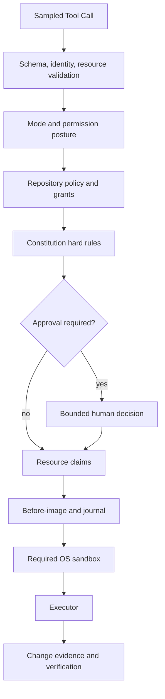

# Guard, Approval, Constitution, and Sandbox

English | [简体中文](../../zh-CN/07-security-governance/03-approval-constitution-sandbox.md)

## Learning Objectives

You will understand why Agent security uses multiple controls, how a Tool Call
moves through Guard, when Approval is valid, what Constitution adds, and why
Sandbox availability is an enforcement fact rather than a UI option.

## Prerequisites

Read [CodeHelper System Architecture](../02-codehelper-overview/02-system-architecture.md).

## Problem Background

A Tool Call is generated from untrusted context by a probabilistic model.
Showing a confirmation dialog is not a complete security design:

- a user can approve arguments that change before execution;
- remembered approval can be too broad;
- an allowed command can escape its working directory;
- a repository can contain prompt injection;
- a missing sandbox can silently turn isolation into unrestricted execution.

Security requires independent controls that answer different questions.

## Layered Control Model



No box is a replacement for another. Approval grants intent; Sandbox limits
the process; Journal supports recovery; Verification tests outcomes.

## Authority and Enforcement Matrix

| Control | Can grant | Cannot grant |
| --- | --- | --- |
| Mode/Grant | eligibility for a class/resource | user consent or OS isolation |
| Constitution | only deny/hold constraints | new execution authority |
| Approval | scoped user consent | bypass of hard deny or missing Sandbox |
| Resource Claim | temporary concurrency exclusion | filesystem integrity against outsiders |
| Sandbox | OS-enforced effect boundary | semantic correctness |
| Journal | file recovery evidence | rollback of network/process effects |
| Verification | scoped outcome evidence | retroactive authorization |

This matrix prevents the common error of treating a later successful control
as compensation for an earlier missing one.

## Guard as the Single Tool Boundary

`Guard.ExecuteBound` performs the consequential path:

1. resolve the canonical Tool and catalog binding;
2. validate arguments and declared resources;
3. evaluate Policy;
4. obtain Permission Hook and human Approval decisions;
5. preview and revalidate mediated file edits;
6. acquire resource claims;
7. run lifecycle Hooks;
8. snapshot/journal expected writes;
9. execute with the required Sandbox;
10. observe reads, writes, egress, and result metadata;
11. release claims on every outcome.

The Registry can execute prepared tools, but Agent paths are wired through
Guard. Keeping this boundary singular is more important than making each Tool
implement its own partial security policy.

## Policy, Mode, and Posture

Policy evaluates a validated Invocation containing Call ID, Tool, arguments,
resources, capability, and repository rules.

- `plan` permits read capability only.
- `act` and `operate` allow broader capability subject to rules.
- Grants establish whether a Tool/resource is in scope.
- Repository rules can deny, hold, ask, or allow.
- Permission posture determines automatic versus interactive treatment.
- Granular surfaces may tighten a decision but never weaken a hard denial.

Missing Policy, unknown capability, unvalidated Invocation, or missing Grant
all deny.

## Constitution

Constitution loads user and repository `constitution.json` documents. It
compiles deny/hold Tool rules and protected write globs into Policy rules, and
can inject a model-visible explanation.

Repository rules take precedence on equal-priority ties. Ordinary session
configuration cannot turn a mechanical Hold into permission. This gives a
repository an enforceable boundary such as protecting `.env` or `secrets/`
even when the model or user posture is permissive.

## Approval Semantics

An Approval is bound to a fingerprint derived from Tool, arguments, resources,
capability, and scope. Scopes are bounded:

- `once`: consumed by one matching invocation;
- `session`: reusable for the same bounded resource before expiry;
- `always`: persisted only where the Tool and policy permit it.

Mediated file writes display an Edit Plan and permit only one-shot approval.
Before execution, Guard recomputes the plan; a changed Plan ID fails as stale.
Replacement arguments are revalidated and re-evaluated instead of inheriting
the old decision.

Pending requests have IDs, expiry, cancellation, and duplicate/late decision
checks. No connected Approval Host means an ask cannot become an allow.

## Sandbox Enforcement

Tool descriptors declare Sandbox requirements. Strong execution passes an
injected Backend into `internal/platform/process`, which verifies:

- Backend capability is available and strong;
- workspace Policy identity matches;
- working directory is pinned;
- executable resolution is explicit;
- environment is sanitized;
- the prepared command still carries verified strength.

Platform implementations differ. Capability probing reports the truth. If
strong isolation is required and unavailable, execution returns
`sandbox_unavailable`.

An optional escalation path may retry without Sandbox only after a separate,
explicit Approval containing a `sandbox:none` resource. Approval for strong
execution does not cover escalation.

## Journal and Verification

For writes, Guard captures expected paths and before-images before execution.
It compares observed changes afterward and records metadata used by Turn
Receipts. Interrupted processes can be recovered from the workspace journal.

Verification is downstream evidence, not authorization. A command can be
authorized and still fail tests; a passing test cannot retroactively authorize
an unapproved write.

## Code Map

| Control | Source |
| --- | --- |
| Central execution boundary | `internal/adapter/tool/guard/guard.go` |
| Sandbox escalation | `internal/adapter/tool/guard/escalation.go` |
| Policy decisions and approval cache | `internal/security/policy` |
| Repository hard rules | `internal/security/constitution` |
| Sandbox policy/backends | `internal/security/sandbox` |
| Process enforcement | `internal/platform/process` |
| Edit recovery | `internal/persist/workspacejournal` |

## Tradeoffs and Alternatives

Per-Tool permission checks are easy to add but inconsistent and difficult to
audit. One Guard increases coupling at the security boundary but makes policy
ordering explicit.

Always asking appears safest but causes habituation and blocks automation.
Scoped caching reduces prompts while preserving resource identity and expiry.

Sandboxing every operation identically is simpler but may be unavailable or
unnecessary for pure reads. Descriptor requirements and fail-closed capability
checks make the boundary explicit.

## Failure Modes and Security Boundaries

- Unknown aliases and stale catalog bindings fail before execution.
- Unanswered, denied, canceled, expired, duplicate, or mismatched approvals fail.
- Edit Plan drift invalidates approval.
- Resource claims are released on cancellation and errors.
- Unexpected writes or missing before-images fail the write path.
- Sandbox denial does not silently retry unrestricted.
- Egress denial requires host-scoped approval before retry.
- `bypass` posture does not bypass Constitution or required Sandbox.

These controls bound authority; they cannot prove that an approved command is
semantically wise.

Approval UI is part of the security boundary: it must show canonical Tool,
Resources, argument changes, expiry/scope, and Edit Plan when present. A vague
"allow command?" prompt cannot support informed consent.

## Tests and Verification

```bash
go test ./internal/security/policy

go test ./internal/adapter/tool/guard \
  -run 'Test(ApprovalOnceSessionExpiryAndModifiedArguments|PendingApprovalExpiresFailClosed|SandboxEscalateRequiresReapproval|SandboxStrongApprovalDoesNotCoverEscalate)'

go test ./internal/platform/process \
  -run 'Test(RunFailsClosedWithoutStrongSandbox|RunUsesInjectedStrongSandboxBackend)'
```

## Hands-On Lab

Inspect platform capability without granting authority:

```bash
make build
./bin/codehelper sandbox status
./bin/codehelper sandbox probe
```

Then run the focused Guard tests above. Compare an Approval denial with a
Sandbox-unavailable failure: both stop execution, but at different control
layers and with different evidence.

## Review Questions

1. Why can Approval not replace Sandbox?
2. Why must replacement arguments be re-evaluated?
3. What extra authority is represented by the `sandbox:none` resource?
4. Why can passing Verification not repair missing authorization?
5. Which canonical facts must an Approval UI display?

## Further Reading

- [Security manual](../../../en/security.md)
- [Why Agents Need a Governed Runtime](../01-agent-engineering/05-why-governed-runtime.md)

## Sources and Verification

| Item | Value |
| --- | --- |
| Catalog ID | `security-approval-sandbox` |
| Status | `draft` |
| Last verified | Not yet verified |
