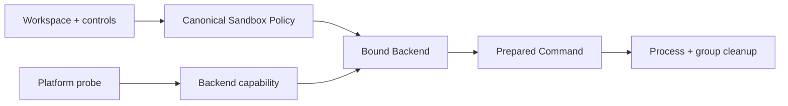

# OS Sandbox and Process Isolation

English | [简体中文](../../zh-CN/07-security-governance/04-process-isolation.md)

## Learning Objectives

Understand capability probing, policy binding, platform backends, safe
Workspace I/O, process cleanup, and why declared isolation differs from proven
isolation.

## Capability and Policy

`sandbox.Probe` reports backend name, strength, availability, and reason.
`BuildPolicy` canonicalizes Workspace, runtime/toolchain read roots, writable
roots, private temp, and network controls. `BindPolicy` binds that Policy to a
Backend; Process Tools receive the injected backend rather than constructing or
disabling one.



`RequireStrong` rejects missing or partial capability. A descriptor requiring
strong isolation cannot be satisfied by a backend merely named "sandbox".

## Platform Backends

- macOS Seatbelt builds an SBPL profile with explicit roots and network mode.
- Linux Bubblewrap uses namespace/mount isolation and may add Landlock through
  a secret-free helper protocol.
- Unsupported or failed probes return an unavailable backend that preserves the
  reason and fails execution.

Platform parity means equivalent documented guarantees, not identical command
lines. Runtime/toolchain roots required to launch a command are read-only and
must never expand to Host root.

## Workspace Filesystem Safety

`sandbox.Workspace` canonicalizes root identity, rejects traversal, wrong case,
unsafe links and special files, and revalidates the root. Descriptor-relative
open/create/write/remove operations resist concurrent symlink swaps and racing
creators. Validation before a later path-based `os.Open` would be insufficient.

## Process Lifecycle

Execution resolves the executable against a sanitized environment, pins CWD,
limits output, propagates Context cancellation, and kills the process group/
tree. PTY and non-PTY paths must preserve the same Policy and cleanup.

Sandbox controls are not containers, VMs, malware analysis, or semantic
validation. Operator backups and version control remain required.

## Verification

```bash
go test ./internal/security/sandbox
go test ./internal/platform/process/...
make sandbox-attack-test
```

## Review Questions

1. Why is backend name insufficient evidence of strong isolation?
2. Why must Workspace I/O use descriptor-relative operations?
3. Which guarantees remain outside the Sandbox?

## Further Reading

- [Fail-Closed Behavior and Platform Claims](./07-fail-closed.md)
