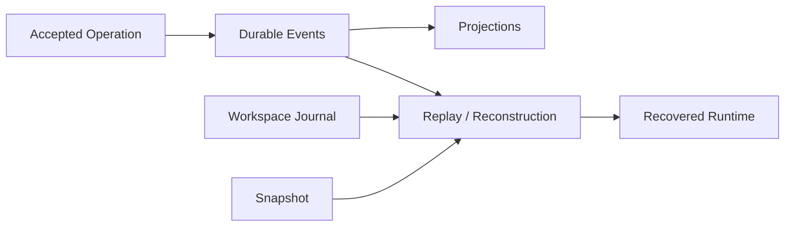

# Why Durable State Is Required

English | [简体中文](../../zh-CN/08-state-observability/01-why-durable-state.md)

## Learning Objectives

Explain which Runtime facts must survive process loss, why replay is different
from retry, and how durable state supports audit and recovery.

## From In-Memory Loop to Runtime

An interactive Agent can appear correct while one process remains alive.
Production behavior also needs accepted Operations, emitted Events, Thread and
Turn identity, pending approvals, Tool pairing, usage, and workspace effects to
remain coherent after a crash or restart.



## Durable Facts

- Event sequence and terminal outcome establish what happened.
- Projections make sessions, tasks, usage, and traces queryable.
- Snapshots accelerate reconstruction but do not replace later Events.
- CAS stores large immutable payloads by verified content identity.
- Workspace Journal records before-images for safe rollback.
- Leases distinguish live ownership from abandoned work.
- Domain Facts record every accepted Kernel transition with a state digest.
- Effects carry durable payload, lifecycle, attempt, and idempotency identity.
- A Terminal Envelope atomically seals final Kernel state, Domain Facts,
  Session Delta, Receipt, Operation commit, and projection Outbox.

## Authority and Lifetime Matrix

| Record | Authority | Lifetime/use |
| --- | --- | --- |
| accepted Operation | request identity/idempotency evidence | admission and duplicate detection |
| Turn Domain Fact | authoritative reducer transition and state digest | restart and invariant audit |
| pending Effect | executable intent plus payload/idempotency identity | conditional continuation |
| Event sequence | canonical lifecycle fact | replay, Host stream, audit |
| SQLite projection | derived query view | listing, filtering, aggregation |
| Snapshot | integrity-checked checkpoint | reconstruction acceleration |
| Workspace Journal | filesystem side-effect evidence | rollback/recovery |
| Trace/Usage | measured observation | diagnosis/accounting |
| Execution Receipt | Turn-level joined projection | user/operator explanation |

Derived records do not outrank their source. A Projection is rebuilt from
Events; a Snapshot cannot override later Events; a Receipt cannot make an
unobserved effect disappear.

## Acceptance Is Not Completion

```text
submit -> durable acceptance/reservation -> engine work
       -> durable events/projections -> commit receipt -> terminal event
```

Each boundary has a different crash meaning. Missing client acknowledgement
never authorizes execution. A pending Turn continues only when it has valid
Domain Facts, a claimable lease, and a supported durable Effect route. A
running Effect is persisted as requeued before dispatch, while a retained
Result Command is resubmitted without repeating its external execution.

Durability is not “serialize every object.” Ephemeral subscribers, open network
streams, mutexes, and process handles are reconstructed or declared lost.

## Correctness Properties

Durable writes need atomicity, ordering, integrity checks, idempotent
projection, renewable ownership leases, and explicit handling of indeterminate
outcomes. Recovery distinguishes “requested but not started,” “started with no
accepted Result,” and “Result retained after state-append failure”; those
states do not share one retry rule.

## Tradeoffs

Event-only replay is authoritative but can be slow. Snapshot-only storage is
fast but weak for audit and partial failure. CodeHelper combines ordered Events,
typed projections, integrity-checked snapshots, and side-effect journals.

## Failure and Safety Boundaries

- Accepted work must have one durable terminal accounting path.
- Sequence gaps and committed corruption fail closed.
- Recovery preserves healthy foreign leases.
- Missing measurement is not converted to zero.
- Workspace rollback never overwrites later external edits.

## Tests and Verification

```bash
go test ./internal/persist/state/...
go test ./internal/runtime/app/wire -run TestPersistentRuntime
go test ./internal/runtime/app -run 'Test(C5|C6|Phase4R)'
go test ./internal/runtime/agent/turnkernel
```

## Hands-On Lab

Read `TestC5RuntimeDispatchesAcceptedTurnWithDomainFacts` and the Phase 4R
restart tests. Identify which facts authorize continuation, when an Effect is
requeued, and which identity keeps terminal projection idempotent.

## Review Questions

1. Why is replay not equivalent to retry?
2. Which state is intentionally not persisted?
3. Why are Events and Journal both required?
4. Which durable records are canonical and which are derived?
5. Why does missing client acknowledgement not authorize retrying a Turn?

## Further Reading

- [SQLite, Event Logs, and Projections](./02-sqlite-event-projection.md)

## Sources and Verification

| Item | Value |
| --- | --- |
| Catalog ID | `state-why-durable` |
| Status | `verified` |
| Last verified | 2026-08-12 |
