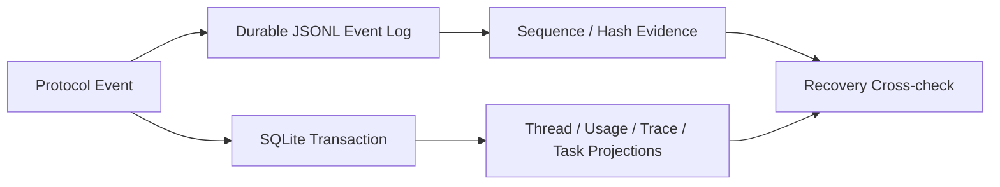

# SQLite, Event Logs, and Projections

English | [简体中文](../../zh-CN/08-state-observability/02-sqlite-event-projection.md)

## Learning Objectives

Understand the initial SQLite schema, append-only Event evidence, and
transactional idempotent projections.

## Storage Roles



SQLite owns relational query state. The Event Log owns ordered durable evidence.
Projection code turns Events into current query views without changing Event
meaning.

## SQLite Store

`sqlite.Open` resolves an absolute path, enables foreign keys, busy timeout and
WAL, creates schema version 1 atomically, verifies pragmas, then runs
`quick_check`. A newer schema is rejected before any write. Multi-statement
writes use `WithTx`.

## Shared Repository Kit (sqlkit)

`internal/persist/sqlkit` holds domain-neutral SQL helpers shared by durable
repositories. `WithTx` runs one callback in one transaction (no retry, no
nesting; a panic rolls back, and a failed rollback is joined into the error).
`ScanAll` consumes rows with one scan per row and verifies iteration errors.
`CanonicalObject`/`CanonicalJSON` validate and compact JSON values through a
single-value decoder that preserves number precision and rejects trailing JSON;
`NullableString`/`NullableTime`/`Timestamp` normalize empty values; and
`RequireAffected` verifies the exact row count promised by an optimistic or
identity-bound write, returning the typed `AffectedRowsError` (actual vs.
expected) so callers can classify the conflict.

SQL text, state transitions, and domain errors stay with the owning
repository. `sqlite.Store.WithTx` delegates to `sqlkit.WithTx` and keeps its
error classification. Session, Task, and Automation repositories share the
same helpers, and a migration-guard test (`ownership_test.go`) fails if they
reimplement them.

Repository reads are part of the contract: Task, Automation, Snapshot, and
Session reads canonicalize and validate the stored JSON they return and fail
closed (never silently repairing) when the stored value is malformed — a
migration-guard test (`TestRepositoryFailsClosedOnMalformedStoredJSON`) injects
malformed rows with `PRAGMA ignore_check_constraints` and asserts that every
read path errors.

## Event Log

Each append checks the next Cursor and records offset, size, and digest evidence.
Replay validates committed bytes. A torn final write can be truncated safely;
corruption inside committed data fails closed. If append rollback itself fails,
the result is explicitly indeterminate.

`ShouldPersist` omits selected noisy streaming Events while retaining lifecycle
and audit facts. Projection recovery preserves sequence gaps rather than
inventing missing Events.

## Projection Rules

Projections are keyed by Event identity/sequence and run transactionally, so
replay is idempotent. Metadata patches and Event appends remain separate
operations. A committed projection without matching durable Event is rejected
during recovery.

## Reservation and Reconciliation Protocol

`state.Store` coordinates two durable systems without pretending they share one
transaction:

```text
reserve sequence in SQLite
 -> append durable Event Log record and evidence
 -> project Event in SQLite transaction
 -> mark reservation committed
```

Startup reconciliation compares reservation state, Event evidence, and
projection rows:

- durable Event with incomplete projection can be replayed;
- projection without matching durable Event is corruption;
- reserved sequence without durable bytes remains a visible gap;
- Event append whose rollback also failed is indeterminate and stops progress.

This protocol makes crash windows explicit instead of claiming atomicity across
SQLite and the filesystem.

## Persistence Policy

Not every live stream delta is durable. `ShouldPersist` removes reconstructible
noise while retaining lifecycle, Tool, Approval, Usage, Receipt, compaction,
and terminal facts. Elision must not remove information needed to establish
ownership, effects, accounting, or final outcome.

## Failure Boundaries

- Foreign-key or integrity failure blocks opening.
- Newer schema is never silently downgraded.
- Duplicate/out-of-order Cursor is rejected.
- Torn tail repair is allowed only at the uncommitted end.
- Projection replay cannot fill an Event sequence gap.

## Tests and Verification

```bash
go test ./internal/persist/state/sqlite
go test ./internal/persist/state/eventlog
go test ./internal/persist/state
go test ./internal/persist/sqlkit
```

## Hands-On Lab

Run the torn-tail and committed-corruption tests. Explain why the first is
repairable while the second must stop startup.

## Review Questions

1. Why use both SQLite and an Event Log?
2. What makes a projection replay idempotent?
3. When is append outcome indeterminate?
4. Why is reservation needed before Event Log append?
5. Which Event kinds may be elided safely?

## Further Reading

- [Sessions, Snapshots, CAS, and Journal](./03-session-snapshot-journal.md)

## Sources and Verification

| Item | Value |
| --- | --- |
| Catalog ID | `state-sqlite-event-projection` |
| Status | `draft` |
| Last verified | Not yet verified |
