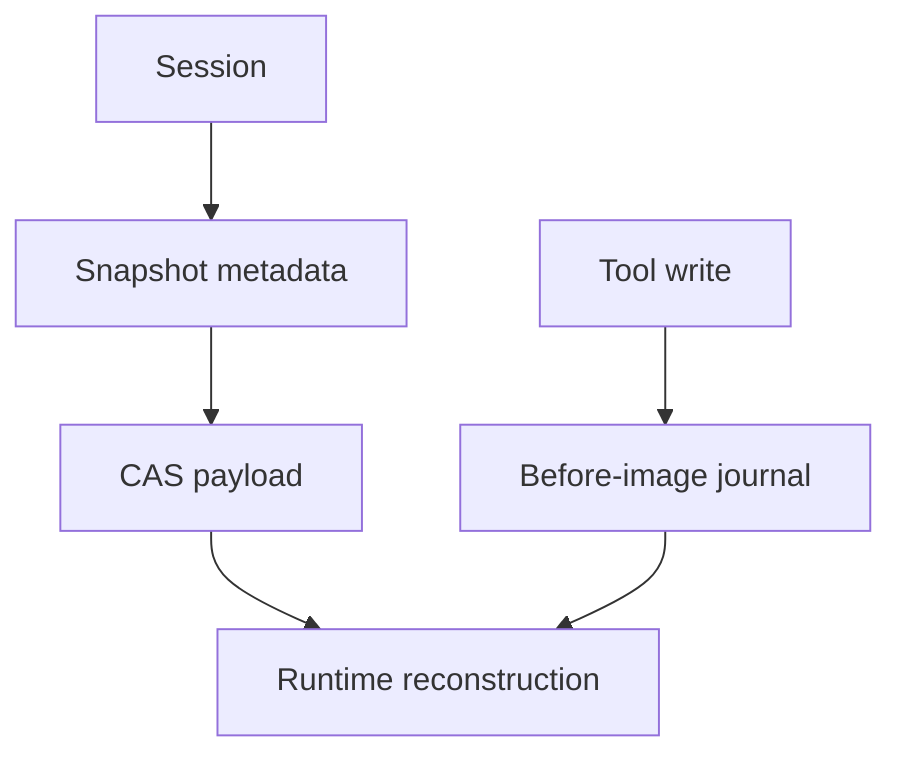

# Sessions, Snapshots, CAS, and Workspace Journal

English | [简体中文](../../zh-CN/08-state-observability/03-session-snapshot-journal.md)

## Learning Objectives

Separate session metadata, snapshot checkpoints, immutable content storage, and
workspace side-effect recovery.

## Four Complementary Stores

| Store | Identity | Purpose |
| --- | --- | --- |
| Session repository | session/workspace/thread ID | lifecycle, Profile, lineage, and listing |
| Snapshot repository | snapshot/thread/sequence | fast state restore |
| CAS | content hash | deduplicated immutable bytes |
| Workspace Journal | Turn/path fingerprint | rollback and crash recovery |



Snapshots carry schema, sequence, content handle, size, and digest. Save retains
CAS content before committing metadata; reads verify content hash and schema.
CAS validates ID-to-content equality, regular-file layout, reference metadata,
atomic writes, and cross-process locks.

The Journal records the first before-image and after fingerprint for each path
in a Turn. Its durable ledger is written before the described workspace write.
Recovery skips a still-live owner, restores abandoned work only when current
state matches, and preserves conflicts for retry.

Session Checkpoints and structured Plan Artifacts reuse Snapshot metadata and
CAS, but they remain Runtime-owned typed artifacts. A Checkpoint binds a
verified model-visible history baseline, Session Profile Revision, source
Thread/Turn, and integrity metadata. Restore selects that state without
executing historical Events. Fork adds explicit parent Session, parent Thread,
and source Checkpoint lineage before a new Turn may run.

Session lifecycle state also includes title, pin/archive status, active Thread,
latest Turn, pending activity, and optimistic Revision. Hosts may cache only
bindings and cursors; they query and mutate canonical Session state through
Runtime operations.

Lifecycle transitions run inside `sqlkit.WithTx`; optimistic Revision bumps and
identity-bound updates assert the exact affected row count with
`RequireAffected`, so a stale Session cannot silently overwrite concurrent
changes. Session and Snapshot repositories reuse the shared `sqlkit` helpers
(`CanonicalObject`, `Timestamp`, `NullableTime`) and canonicalize stored
metadata on read; Profile updates also run in `WithTx` and map a row-count
mismatch to the typed `ProfileRevisionConflictError`.

## Commit and Reference Windows

Snapshot save orders writes so metadata never points at unretained content:

```text
normalize payload -> compute/verify content ID -> CAS Put/Retain
                  -> SQLite snapshot metadata commit
```

Failure after Retain but before metadata may leave reclaimable content;
reversing the order could create an unreadable committed Snapshot. CAS
reference changes use cross-process locking and atomic replacement.

Journal ordering is the side-effect equivalent:

```text
durable owner/before-image -> Workspace write -> after fingerprint -> Turn commit
```

Both protocols prefer recoverable leftovers over dangling authoritative
references.

## Observation Payload Retention

Observation metadata and Observation payloads have different lifetimes.
Privacy policy runs before the Router writes either the Observation Journal or
CAS. `metadata` capture stores only bounded redacted summaries; `failure` and
`full` may retain eligible redacted payloads. Credential and Restricted
payloads are never persisted.

Payload references use time-based retention classes rather than the Runtime
Event-count limit:

| Class | Default lifetime |
| --- | --- |
| audit / diagnostic | 30 days |
| sensitive | 24 hours |
| ephemeral | 1 hour |

Startup retention releases expired references and deletes a CAS object only
when it is unreferenced. Observation metadata remains available for explanation
after its payload expires. Support bundle construction re-redacts selected
records, excludes payloads by default, and creates the archive exclusively with
mode `0600`.

## Identity Boundaries

Session identifies Workspace lifecycle; Thread/Turn identify causal history;
Checkpoint and Plan IDs identify immutable user-visible artifacts; Snapshot
sequence identifies a reconstruction point; CAS ID identifies bytes; Journal
Turn/path identifies an effect. Keeping these identities distinct prevents
cross-Workspace restore, forged Fork lineage, and incorrect rollback.

## Tradeoffs

Putting large payloads in SQLite simplifies transactions but increases database
churn. CAS separates immutable bytes while SQLite owns references. Git alone
cannot represent untracked files, partial Turns, or non-Git workspaces, so the
Journal remains necessary.

## Failure Boundaries

- Snapshot corruption/schema mismatch is rejected; repository reads fail
  closed on malformed stored metadata (integrity errors) instead of silently
  repairing it.
- CAS tampering, symlinks, invalid IDs, and bad reference metadata fail closed.
- Last-reference release deletes content; retained content survives restart.
- Observation retention never deletes a still-referenced CAS object.
- Capture policy rejects Credential and Restricted payloads in every mode.
- Journal before-image failure blocks the edit.
- Recovery never clobbers an external edit.
- State-only Restore cannot replay Tool, Command, Network, or file effects.
- Fork/Plan execution fails when Profile Revision or lineage is stale.

## Tests and Verification

```bash
go test ./internal/runtime/app -run 'Test(SessionCheckpoint|Restore|Fork|Plan)'
go test ./internal/persist/session ./internal/persist/snapshot
go test ./internal/persist/state/cas ./internal/persist/workspacejournal
go test ./internal/persist/sqlkit
go test ./internal/observability/privacy ./internal/observability/retention
go test ./internal/observability/supportbundle
```

## Hands-On Lab

Trace one Snapshot save through CAS retain and metadata commit, then compare it
with a Journal before-image. State what each can and cannot restore.

## Review Questions

1. Why is Snapshot metadata separate from CAS bytes?
2. Why is Git insufficient as a Turn journal?
3. What condition permits automatic rollback?
4. Why must CAS Retain precede Snapshot metadata commit?
5. Which identities prevent cross-Workspace recovery mistakes?
6. Why is a Session Checkpoint not a Workflow progress checkpoint?
7. Which lineage facts must survive a Checkpoint Fork restart?

## Further Reading

- [Reconstructing a Failed Run](./06-reconstructing-failures.md)

## Sources and Verification

| Item | Value |
| --- | --- |
| Catalog ID | `state-session-snapshot-journal` |
| Status | `draft` |
| Last verified | Not yet verified |
