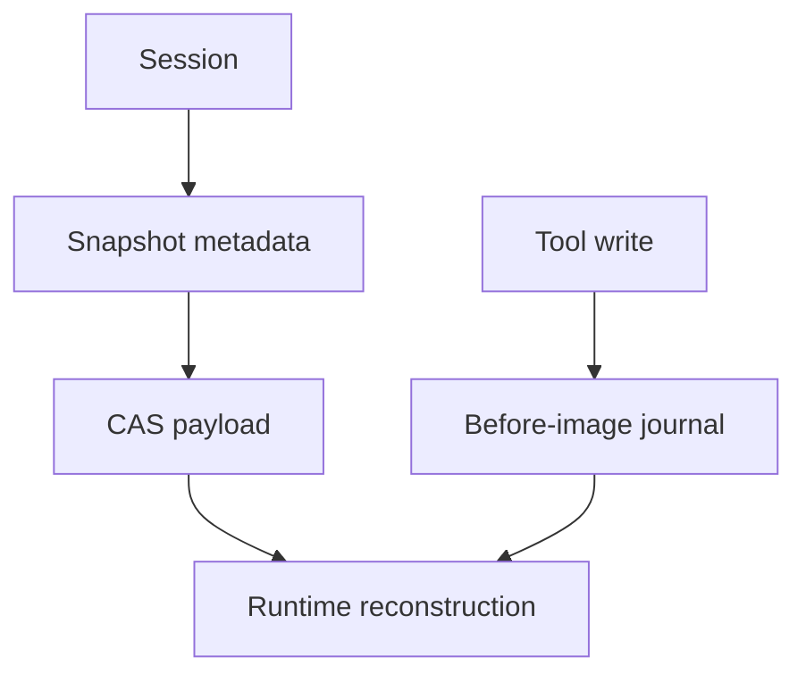

# Sessions, Snapshots, CAS, and Workspace Journal

English | [简体中文](../../zh-CN/08-state-observability/03-session-snapshot-journal.md)

## Learning Objectives

Separate session metadata, snapshot checkpoints, immutable content storage, and
workspace side-effect recovery.

## Four Complementary Stores

| Store | Identity | Purpose |
| --- | --- | --- |
| Session repository | session/workspace ID | lifecycle and listing |
| Snapshot repository | snapshot/thread/sequence | fast state restore |
| CAS | content hash | deduplicated immutable bytes |
| Workspace Journal | Turn/path fingerprint | rollback and crash recovery |



Snapshots carry schema, sequence, content handle, size, and digest. Save retains
CAS content before committing metadata; reads verify content hash and schema.
CAS validates ID-to-content equality, regular-file layout, reference metadata,
atomic writes, and cross-process locks.

The Journal records the first before-image and after fingerprint for each path
in a Turn. Its durable ledger is written before the described workspace write.
Recovery skips a still-live owner, restores abandoned work only when current
state matches, and preserves conflicts for retry.

## Commit and Reference Windows

Snapshot save orders writes so metadata never points at unretained content:

```text
normalize payload -> compute/verify content ID -> CAS Put/Retain
                  -> SQLite snapshot metadata commit
```

Failure after Retain but before metadata may leave reclaimable content;
reversing the order could create an unreadable committed Snapshot. CAS
reference changes use cross-process locking and atomic replacement.

Journal ordering is the side-effect equivalent:

```text
durable owner/before-image -> Workspace write -> after fingerprint -> Turn commit
```

Both protocols prefer recoverable leftovers over dangling authoritative
references.

## Identity Boundaries

Session identifies Workspace lifecycle; Thread/Turn identify causal history;
Snapshot sequence identifies a reconstruction point; CAS ID identifies bytes;
Journal Turn/path identifies an effect. Keeping these identities distinct
prevents cross-Workspace restore and incorrect rollback.

## Tradeoffs

Putting large payloads in SQLite simplifies transactions but increases database
churn. CAS separates immutable bytes while SQLite owns references. Git alone
cannot represent untracked files, partial Turns, or non-Git workspaces, so the
Journal remains necessary.

## Failure Boundaries

- Snapshot corruption/schema mismatch is rejected.
- CAS tampering, symlinks, invalid IDs, and bad reference metadata fail closed.
- Last-reference release deletes content; retained content survives restart.
- Journal before-image failure blocks the edit.
- Recovery never clobbers an external edit.

## Tests and Verification

```bash
go test ./internal/persist/session ./internal/persist/snapshot
go test ./internal/persist/state/cas ./internal/persist/workspacejournal
```

## Hands-On Lab

Trace one Snapshot save through CAS retain and metadata commit, then compare it
with a Journal before-image. State what each can and cannot restore.

## Review Questions

1. Why is Snapshot metadata separate from CAS bytes?
2. Why is Git insufficient as a Turn journal?
3. What condition permits automatic rollback?
4. Why must CAS Retain precede Snapshot metadata commit?
5. Which identities prevent cross-Workspace recovery mistakes?

## Further Reading

- [Reconstructing a Failed Run](./06-reconstructing-failures.md)

## Sources and Verification

| Item | Value |
| --- | --- |
| Catalog ID | `state-session-snapshot-journal` |
| Status | `verified` |
| Last verified | 2026-08-06 |
