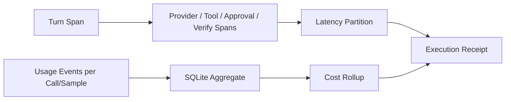

# Traces, Spans, Usage, and Cost

English | [简体中文](../../zh-CN/08-state-observability/04-trace-usage-cost.md)

## Learning Objectives

Understand phase spans, latency rollups, multi-sample usage projection, pricing
provenance, and redacted telemetry.

## Observation Model



Trace Recorder nests phase spans under a Turn, records status/attributes, notes
first output, and closes unfinished spans explicitly. Latency separates total,
provider, first-token, Tool, approval wait, and verification time.

Usage projection requires Turn context and is idempotent by Event. Reports are
cumulative within one call, so the latest report replaces the previous one;
different calls/samples sum. Cached and reasoning tokens remain separate.

Cost is attached using the actual sampled route. Rollups split priced and
unpriced calls: unknown price is not free, and an empty query is not zero-cost
work. Trace rollups scope by Thread, Turn, and time window and compute
percentiles only from completed measurements.

Telemetry metrics use atomic counters. Structured logging recursively redacts
configured credentials and propagates writer failures.

## Observation Types and Cardinality

| Signal | Identity/cardinality | Suitable use |
| --- | --- | --- |
| Metric | bounded labels/counters | health, rate, saturation |
| Log | timestamp + structured fields | discrete sanitized diagnosis |
| Span | Turn/parent/phase IDs | causal timing |
| Usage row | Turn/call/sample/purpose/route | accounting |
| Receipt | one terminal Turn projection | user-facing audit summary |

Putting path, prompt, Tool arguments, or raw error bodies into Metric labels
creates unbounded cardinality and leakage. Those details belong in bounded,
redacted records with explicit access controls.

## Clocks and Aggregation

Span duration uses one Recorder clock and parent identity; wall-clock timestamps
support ordering and query windows. Rollups:

- count open spans but exclude them from completed-duration percentiles;
- reject backward time windows;
- distinguish a foreign Turn from an untraced Turn;
- calculate percentiles only over comparable completed phase samples.

Latency phases may overlap, so their sum is diagnostic partitioning, not always
equal to wall-clock total.

Usage identity includes call/sample because retries and Tool-side model calls
must not overwrite one another. Purpose and actual Route explain where spend
came from.

## Failure Boundaries

- Unfinished Span is visible, not assigned a fictional duration in rollups.
- Missing trace/usage is absent, not zero.
- Duplicate cumulative Usage is not double-counted.
- Non-USD/unknown pricing cannot become known cost.
- Raw secrets must not enter logs or attributes.

## Tests and Verification

```bash
go test ./internal/observability/trace
go test ./internal/observability/usage
go test ./internal/observability/telemetry
```

## Hands-On Lab

Build a Turn with two Provider calls and two cumulative reports per call.
Predict the final token/cost rollup before running the repository tests.

## Review Questions

1. Why replace Usage within a call but sum across calls?
2. Why distinguish untraced from zero latency?
3. What does `CostKnown` communicate?
4. Which data is unsafe as a Metric label?
5. Why may phase latency sums differ from wall-clock total?

## Further Reading

- [Reconstructing a Failed Run](./06-reconstructing-failures.md)

## Sources and Verification

| Item | Value |
| --- | --- |
| Catalog ID | `state-trace-usage-cost` |
| Status | `verified` |
| Last verified | 2026-08-06 |
