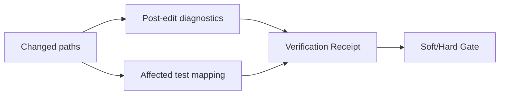

# Diagnostics, Maturity, and Verification

English | [简体中文](../../zh-CN/08-state-observability/05-diagnostics-and-verification.md)

## Learning Objectives

Distinguish diagnostics from verification, understand affected-test mapping,
and interpret passed, failed, unavailable, and not-evaluated maturity claims.

## Evidence Levels

| Level | Meaning |
| --- | --- |
| observed change | bytes changed, no correctness claim |
| diagnostics passed | configured file-local checks found no issue |
| affected verification passed | mapped checks for changed paths passed |
| repository verification passed | detected repository commands passed |



Diagnostics Runner maps file types to sandboxed commands and returns structured
ranges/severity. Verify Runner supports diagnostics, affected, and repository
scope. It detects build manifests, maps changed paths to commands/tests, runs
from the resolved Workspace root, and bounds feedback.

“Unavailable” means the check could not establish a verdict, for example an
environmental module-proxy failure. Ordinary test failure or timeout remains
failed. “Not evaluated” means no gate ran. These states must not collapse into
pass.

## State and Invalidation

```text
not_evaluated -> running -> passed | failed | unavailable
                                      |
                                      +-> invalidated by later write
```

Diagnostics bind to a file/version; Verification binds to changed paths,
commands, scope, and final Workspace state. A later write invalidates passing
evidence for affected paths. Soft Gate may complete with failed/unavailable
evidence; Hard Gate changes the outcome or reverts.

Affected scope maps changed Go directories to packages and source paths to
related tests, reports unmapped paths, expands configured commands with quoted
relative paths, and runs from the canonical root. This bounds work but is not
proof of complete dependency analysis.

Repository test topology covers Go, JavaScript/TypeScript, Python, and Rust.
Each selected command includes its derivation reason. Manifest changes widen
to the repository/module command, while unsupported and unmapped paths remain
explicit instead of silently returning an empty test list.

## Maturity Claims

A chapter, feature, or receipt is mature only to the scope actually verified.
Passing diagnostics cannot claim repository tests; passing one affected package
cannot claim all platforms. Receipts retain commands, paths, outputs, and scope
so claims are inspectable.

Maturity is a tuple, not a badge:

```text
(platform, revision, scope, command, outcome, observed_at)
```

Changing any element can invalidate the claim.

## Failure Boundaries

- Unknown verification scope is rejected.
- Affected mapping reports unmapped paths.
- External JSON Schema references are not trusted for workflow output checks.
- Sandbox/process failures remain explicit.
- Hard mode cannot silently accept an unavailable Runner.

## Tests and Verification

```bash
go test ./internal/observability/diagnostics ./internal/observability/verify
go test ./internal/runtime/agent/engine -run TestVerifyGate
make benchmark-v2
```

## Hands-On Lab

Compare a dependency-network outage with a genuine test timeout in Verify tests.
Explain why their statuses differ.

## Review Questions

1. Why is diagnostics pass weaker than repository verification?
2. What does unavailable mean?
3. How does affected verification bound work?
4. What event invalidates passing verification?
5. Why must unmapped changed paths remain visible?

## Further Reading

- [Verification Gates and Evidence](../06-tools-and-execution/05-verification-and-evidence.md)

## Sources and Verification

| Item | Value |
| --- | --- |
| Catalog ID | `state-diagnostics-verification` |
| Status | `verified` |
| Last verified | 2026-08-06 |
