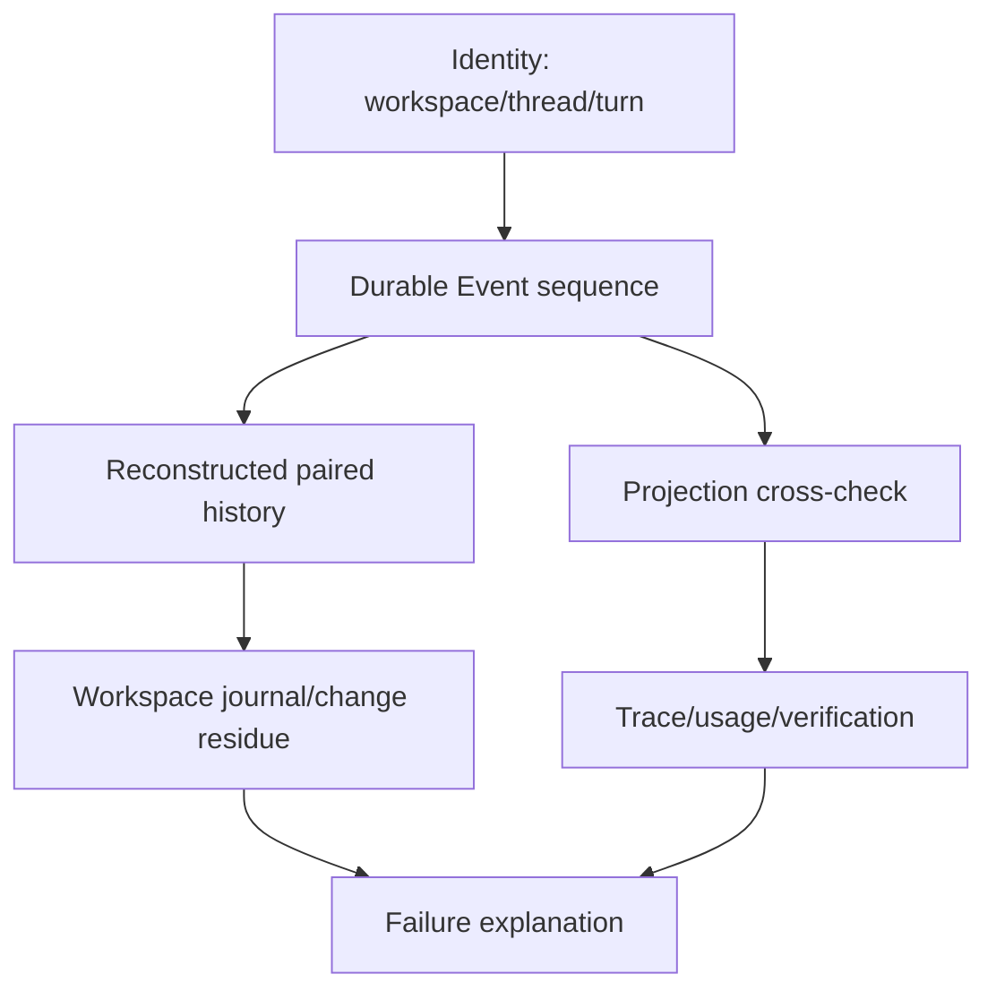

# Reconstructing a Failed Run

English | [简体中文](../../zh-CN/08-state-observability/06-reconstructing-failures.md)

## Learning Objectives

Use Events, projections, snapshots, journal, traces, usage, evidence, and
receipts to determine what happened without guessing.

## Reconstruction Order



Start with stable identity and terminal Events. Reconstruct history only from
completed Assistant Tool Call/Tool Result pairs; orphan results and interrupted
partial Turns do not become model history. Apply compaction/fork/revert Events
in sequence.

Next compare projections and Event evidence, inspect active/committed Journal
records, and determine whether workspace bytes were restored or conflicted.
Then correlate Provider, Tool, approval, and verification spans with usage and
the final Execution Receipt.

## Failure Classes

- **Rejected before effect:** schema, policy, lease, or precondition failure.
- **Effect observed and reverted:** Journal/verification rollback succeeded.
- **Effect unresolved:** rollback conflict or non-file side effect.
- **Interrupted ownership:** expired lease or dead journal owner.
- **Indeterminate persistence:** append and rollback both failed.
- **Unavailable observation:** check or trace never established a verdict.

## Evidence Precedence

When records disagree, prefer evidence closest to the claimed fact:

```text
durable Event/Journal bytes
  > transactional Projection with matching Event
  > observed Trace/Usage/Verification record
  > Execution Receipt projection
  > model/child self-report
```

This is not one universal truth order. Journal is strongest for file effects;
Event sequence is strongest for Runtime lifecycle; Verification is strongest
for the named check scope. State the domain with every conclusion.

## Investigation Worksheet

| Question | Evidence |
| --- | --- |
| Was work accepted once? | Operation ID/idempotency, reservation |
| Which lifecycle facts are durable? | Event Cursor/kind/hash evidence |
| Did query state agree? | Projection sequence and rows |
| Did a Tool effect occur? | Call/Result pair, Journal, observed changes |
| Was it authorized? | Policy/Approval/Edit Plan receipt |
| Was it reverted? | Journal expected/current fingerprints |
| What did it cost? | per-call/sample Usage and actual Route |
| Where did time go? | completed/open phase Spans |
| What correctness was established? | Verification status/scope/command |
| What remains unknown? | gaps, unavailable records, conflicts |

Build a monotonic timeline by Cursor first, then attach timestamps. Wall clocks
can skew; they must not reorder canonical Event sequence.

The explanation should name evidence and uncertainty separately. A missing
terminal Event is not proof the Tool did nothing; Journal and external effects
must still be inspected.

## Failure Boundaries

- Do not replay the Engine merely to discover what happened.
- Do not infer pass from absent diagnostics/tests.
- Do not discard sequence gaps or journal conflicts.
- Do not report self-reported child verification as gate-proven.
- Redact credentials while preserving IDs and categories.

## Tests and Verification

```bash
go test ./internal/runtime/app -run TestReconstructThread
go test ./internal/runtime/app/wire -run TestPersistentRuntime
go test ./internal/persist/workspacejournal
```

## Hands-On Lab

Take an interrupted write fixture and produce a timeline containing Event
Cursors, Tool pairing, Journal fingerprints, recovery action, and unresolved
claims.

## Review Questions

1. Why are orphan Tool Results excluded from history?
2. What evidence distinguishes reverted from unresolved effects?
3. When must a diagnosis remain indeterminate?
4. Why should Event Cursor precede timestamps in a timeline?
5. Which evidence is authoritative for file effects versus lifecycle?

## Further Reading

- [Tasks, Workers, and Executors](../09-task-orchestration/01-task-worker-executor.md)

## Sources and Verification

| Item | Value |
| --- | --- |
| Catalog ID | `state-reconstruct-failure` |
| Status | `verified` |
| Last verified | 2026-08-06 |
