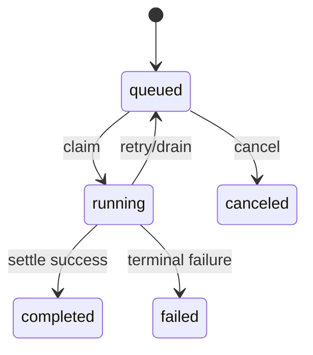

# Tasks, Workers, and Executors

English | [简体中文](../../zh-CN/09-task-orchestration/01-task-worker-executor.md)

## Learning Objectives

Understand durable Task state, Worker scheduling, Executor contracts, and why
background work still enters the production Runtime.

## Lifecycle



Task records executor name, payload, workspace/session identity, attempts,
lease owner/expiry, schedule time, result, failure reason, and version.
Repository transitions validate `CanTransition` and append lifecycle entries.

Worker Scheduler advertises a finite Executor set, claims only matching Tasks,
respects `MaxParallel`, starts heartbeats, runs each Executor under cancellation,
then settles success, failure, retry, or drain. Duplicate Executor names and
unknown Task executors fail at construction/create boundaries.

Production Executors route agent Turns, shell commands, and workflows through
Guard, Policy, Runtime, Journal, and receipts. A Host submits or observes Tasks;
it does not execute provider or Tool logic.

## Three Identity Layers

| Identity | Meaning | May repeat? |
| --- | --- | --- |
| Task ID | durable requested unit of work | no |
| Attempt | one leased execution opportunity | yes, bounded |
| Thread/Turn ID | Runtime conversation/execution produced by an attempt | new per executed attempt |

Task state is the scheduling authority; Attempt records explain ownership and
retry; Runtime Events/Receipts explain Agent execution. Conflating them makes a
retried Turn look like duplicate Task completion.

## Executor Contract

An Executor advertises a stable name and returns an `Outcome` that separates
success, retryable failure, terminal failure, and drain. It must honor Context
cancellation, validate payload before effects, report created Turn identity,
and state whether retry is safe. The Scheduler, not the Executor, owns Task
transition and lease settlement.

Construction validates the finite Executor set. This prevents a Worker from
claiming opaque work and only discovering after ownership transfer that it
cannot execute it.

## Correctness Boundaries

- Claim is workspace-scoped and won by one owner.
- Running attempt is recorded before execution.
- Scheduler close returns running work to queue when safe.
- Unsupported payload fails without blind retry.
- Writing child results merge through guarded file operations.
- In-memory concurrency limits complement durable lease fencing.

## Tests and Verification

```bash
go test ./internal/orchestration/task ./internal/orchestration/worker
go test ./internal/runtime/app/wire -run 'TestScheduler|TestQueuedTask'
```

## Hands-On Lab

Trace one `agent_turn` Task from Create through Worker claim into a child Runtime
Turn and final Task/receipt settlement.

## Review Questions

1. What belongs in Task state versus Worker memory?
2. Why does Executor name participate in claiming?
3. Why must background shell still use Guard?
4. How do Task, Attempt, and Turn identities differ?
5. Why does the Scheduler own settlement rather than the Executor?

## Further Reading

- [Leases, Heartbeats, Retries, and Idempotency](./02-lease-heartbeat-retry.md)

## Sources and Verification

| Item | Value |
| --- | --- |
| Catalog ID | `task-worker-executor` |
| Status | `draft` |
| Last verified | Not yet verified |
