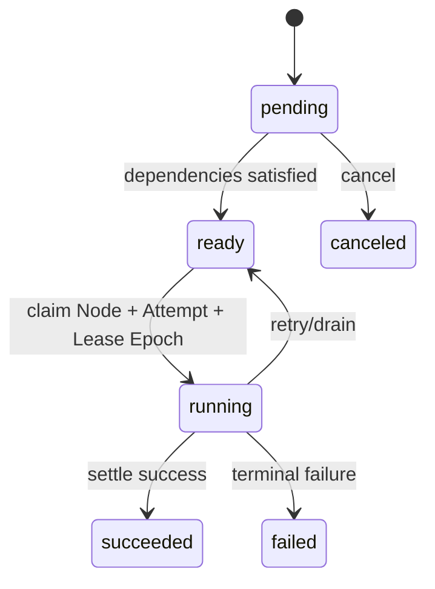

# Tasks, Workers, and Executors

English | [简体中文](../../zh-CN/09-task-orchestration/01-task-worker-executor.md)

## Learning Objectives

Understand the durable WorkGraph lifecycle, Worker claims, Executor contracts,
Task compatibility projections, and why background work still enters the
production Runtime.

## Lifecycle



The authoritative model is one WorkGraph aggregate containing Run, Node,
Attempt, Lease Epoch, and Effect state. A pure Kernel validates a
revision-checked Command and emits ordered Facts plus Effects. The Store commits
aggregate snapshot, Facts, command Receipt, Effect Outbox, and compatibility
projections in one SQLite transaction.

Task records remain a bounded compatibility and query surface for executor
name, payload, workspace/session identity, schedule, result, and failure
reason. They cannot transition independently of the WorkGraph facts that
produced them.

Worker Scheduler advertises a finite Executor set, claims only matching Tasks,
respects `MaxParallel`, starts heartbeats, runs each Executor under cancellation,
then submits WorkGraph settlement Commands for success, failure, retry, or
drain. Duplicate Executor names and unknown Task executors fail at
construction/create boundaries.

Production Executors route agent Turns, shell commands, and workflows through
Guard, Policy, Runtime, Journal, and receipts. A Host submits or observes Tasks;
it does not execute provider or Tool logic.

## Three Identity Layers

| Identity | Meaning | May repeat? |
| --- | --- | --- |
| Run/Node ID | durable graph and executable unit | no within one graph |
| Attempt ID | one leased execution opportunity | yes, bounded per Node |
| Thread/Turn ID | Runtime conversation/execution produced by an attempt | new per executed attempt |

WorkGraph state is the scheduling authority; Task rows are projections, Attempt
Facts explain ownership and retry, and Runtime Events/Receipts explain Agent
execution. Conflating them makes a retried Turn look like duplicate completion.

## Executor Contract

An Executor advertises a stable name and returns an `Outcome` that separates
success, retryable failure, terminal failure, and drain. It must honor Context
cancellation, validate payload before effects, report created Turn identity,
and state whether retry is safe. The Worker, not the Executor or Fleet
projection, owns Claim and settlement Commands.

Construction validates the finite Executor set. This prevents a Worker from
claiming opaque work and only discovering after ownership transfer that it
cannot execute it.

## Correctness Boundaries

- Claim is workspace-scoped and won by one owner.
- Running Attempt, Lease Epoch, and Effect are recorded before execution.
- Snapshot, Facts, Receipt, Outbox, and Task projection commit atomically.
- Scheduler close returns running work to queue when safe.
- Unsupported payload fails without blind retry.
- Writing child results merge through guarded file operations.
- In-memory concurrency limits complement durable lease fencing.
- Stored Task payloads and results are canonicalized and validated on read;
  malformed stored JSON fails closed instead of being silently repaired.

## Tests and Verification

```bash
go test ./internal/orchestration/kernel ./internal/orchestration/store
go test ./internal/orchestration/task ./internal/orchestration/worker
go test ./internal/runtime/app/wire -run 'TestScheduler|TestQueuedTask'
```

Contract tests cover duplicate identity, optimistic conflict, canceled
contexts, missing schemas, and real restart/reopen behavior: Task and
Automation state survives an actual database reopen, and a scheduled tick runs
exactly once.

## Hands-On Lab

Trace one `agent_turn` Task from Create through Worker claim into a child Runtime
Turn and final Task/receipt settlement.

## Review Questions

1. What belongs in Task state versus Worker memory?
2. Why does Executor name participate in claiming?
3. Why must background shell still use Guard?
4. How do Task, Attempt, and Turn identities differ?
5. Why does the Scheduler own settlement rather than the Executor?

## Further Reading

- [Leases, Heartbeats, Retries, and Idempotency](./02-lease-heartbeat-retry.md)

## Sources and Verification

| Item | Value |
| --- | --- |
| Catalog ID | `task-worker-executor` |
| Status | `draft` |
| Last verified | Not yet verified |
