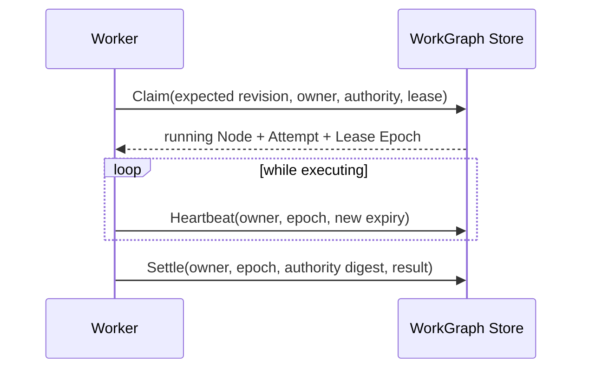

# Leases, Heartbeats, Retries, and Idempotency

English | [简体中文](../../zh-CN/09-task-orchestration/02-lease-heartbeat-retry.md)

## Learning Objectives

Understand ownership fencing, lease loss, attempt accounting, bounded backoff,
and the limits of retry safety.

## Ownership Protocol



Every mutation of running work checks the current owner, Lease Epoch, authority
digest, and expected aggregate revision. An expired lease can be reclaimed and
requeued under a new epoch; the old owner is fenced and its next heartbeat or
settlement fails. Worker cancellation follows lease loss.

Attempt consumption depends on why work returned: ordinary retry and lease
expiry consume attempts; graceful drain gives the attempt back. Backoff grows
and caps. Once attempts are spent, requeue becomes failed.

## Idempotency

Lease fencing prevents two owners from committing Task state, but it cannot
undo an external side effect performed before lease loss. Retried Executors
must either be intrinsically idempotent, use an idempotency key, or refuse
retry. Shell background execution explicitly requires an idempotent declaration
for Task retry.

Recovery requeues executable interrupted work, fails work without a valid
Executor/retry path, and leaves healthy foreign leases untouched.

## Lease Is a Time-Bounded Fence

A lease proves only that the repository currently recognizes one owner until a
stored expiry. It does not prove the process is alive, that work is progressing,
or that external systems honor the fence.

```text
claim transaction: ready -> running, owner, epoch, expiry, Attempt + Effect
heartbeat: require owner + epoch + unexpired lease, extend expiry
settle: require owner + epoch + authority digest, append one transition
reclaim: require expired lease, close Attempt, increment epoch, fence old owner
```

Worker heartbeat cadence must be comfortably below lease duration. Clock
assumptions belong to repository time comparisons; a late heartbeat cannot
resurrect ownership after another owner reclaimed it.

## Retry Safety Matrix

| Effect | Safe retry condition |
| --- | --- |
| pure computation/read | deterministic or harmless repetition |
| Runtime Turn | durable idempotency/admission prevents duplicate execution |
| file write | Journal/transaction proves rollback or idempotent target state |
| remote API | service idempotency key and stable request identity |
| shell command | explicit operator/executor idempotency contract |
| unknown/partial effect | do not retry automatically |

## Failure Boundaries

- Heartbeat/settle by stale owner is rejected.
- Heartbeat/settle under a stale Lease Epoch or authority digest is rejected.
- Claim cannot cross normalized Workspace identity.
- Healthy lease is not stolen.
- Retry count and delay are bounded.
- Side-effecting Executor cannot infer idempotency from Task durability.
- Duplicate settlement cannot create two terminals.

## Tests and Verification

```bash
go test ./internal/orchestration/kernel ./internal/orchestration/store
go test ./internal/orchestration/task -run 'Test(Claim|Settle|Reclaim|Recovery|Backoff)'
go test ./internal/orchestration/worker -run 'Test.*(Lease|Retry|Takeover)'
```

## Hands-On Lab

Expire a lease in the repository tests, let a second owner reclaim it, then
attempt heartbeat and settle from the old owner. Explain each fence.

## Review Questions

1. What does a lease prove?
2. Why does graceful drain refund an attempt?
3. Why is fencing insufficient for external side-effect idempotency?
4. Why can a late heartbeat not restore ownership?
5. What evidence is required before retrying a partial effect?

## Further Reading

- [Checkpoints and Recovery](./04-checkpoint-and-recovery.md)

## Sources and Verification

| Item | Value |
| --- | --- |
| Catalog ID | `task-lease-retry` |
| Status | `verified` |
| Last verified | 2026-08-17 |
