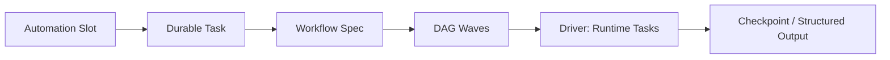

# Automation and Workflows

English | [简体中文](../../zh-CN/09-task-orchestration/03-automation-and-workflow.md)

## Learning Objectives

Understand recurring Automation slots, DAG Workflow execution, capability
defaults, structured outputs, and deterministic JavaScript hosting.

## Automation

Automation stores trigger, canonical RRULE subset, creation anchor, next run,
status, payload, version, and run records. `Tick` transactionally creates each
due slot once, even across concurrent processes and restart. Resume uses the
persisted creation anchor rather than shifting the schedule.

The logical de-duplication key is Automation identity plus scheduled slot, not
the time a Worker happened to tick. Pause/resume changes eligibility but not
the recurrence anchor. Manual `RunNow` creates an explicit run identity rather
than impersonating a scheduled slot.

## Workflow



Workflow `Spec` validates unique nodes, dependencies, acyclicity, conditions,
retry, timeout, permissions, and budgets. Ready independent nodes run as a
bounded parallel wave; joins wait, failed dependencies skip descendants, and
compensation can run conditionally.

Permissions deny host capabilities by default. Task response schema is
validated without external references. The JS VM removes nondeterministic host
access, restricts environment and Workspace reads, enforces timeout, and
cancels outstanding Tasks.

## DAG Semantics

Node array order is not execution order; dependency edges determine readiness.
A bounded wave contains all currently ready independent nodes up to
`MaxParallel`. Join nodes observe terminal dependency results. Failed
dependencies skip ordinary descendants, while explicit failure conditions may
activate compensation.

Each node has its own attempt/timeout/retry policy, but the Workflow budget is
shared. A retry does not erase prior attempt evidence. Structured output is
validated before it becomes input to downstream nodes.

## Determinism Boundary

The Spec fingerprint covers executable graph semantics. The JS host removes
clock/random/global process access, exposes allowlisted environment and
Workspace reads, and routes spawned work through the Driver. External Tasks can
still be nondeterministic; their durable results/checkpoints are the replay
boundary.

## Failure Boundaries

- Concurrent ticks cannot duplicate a schedule slot.
- Invalid graph/fingerprint is rejected before execution/resume.
- Node retry and timeout are bounded.
- Failed dependency is not silently treated as empty output.
- Secret environment access and Workspace escape are denied.
- Unsupported profile/schema fails before starting a production Turn.

## Tests and Verification

```bash
go test ./internal/orchestration/automation
go test ./internal/orchestration/workflow/...
```

## Hands-On Lab

Run the parallel-wave, failed-dependency, and compensation tests; draw the
resulting node status graph.

## Review Questions

1. How does an Automation prevent duplicate slots?
2. Why are Workflow permissions deny-by-default?
3. What makes the JS host deterministic enough to resume?
4. What key prevents duplicate Automation slots?
5. Why is structured output validated before downstream execution?

## Further Reading

- [Checkpoints and Recovery](./04-checkpoint-and-recovery.md)

## Sources and Verification

| Item | Value |
| --- | --- |
| Catalog ID | `task-automation-workflow` |
| Status | `draft` |
| Last verified | Not yet verified |
