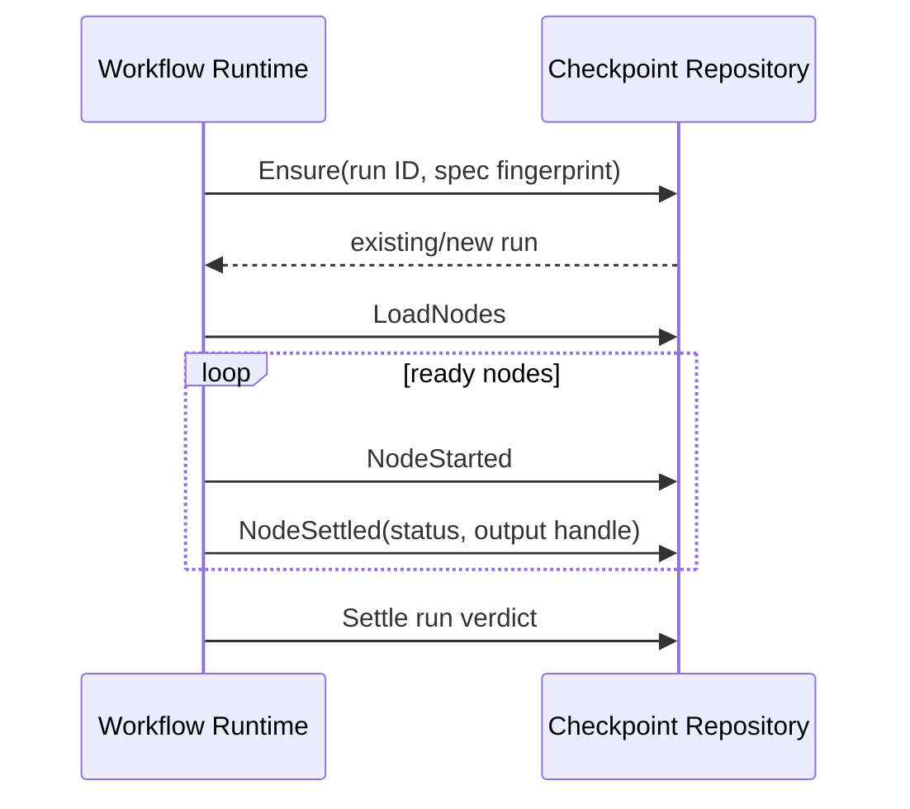

# Checkpoints and Recovery

English | [简体中文](../../zh-CN/09-task-orchestration/04-checkpoint-and-recovery.md)

## Learning Objectives

Understand Workflow fingerprints, node checkpoints, output handles, and
resume-only-unfinished semantics.

## Checkpoint Contract



`Ensure` creates or adopts a run only when Workflow fingerprint matches.
Node records survive restart and update in place. Large outputs live behind
content handles; missing output is reported separately from node status.

On resume, completed terminal nodes are not rerun. Failed/skipped dependency
semantics remain in the graph; only unfinished eligible nodes execute. Node
attempts, retry, timeout, and output validation still apply after recovery.

## Node Commit Windows

```text
NodeStarted durable
 -> Driver external/Runtime execution
 -> validate output
 -> store output handle
 -> NodeSettled durable
```

A crash after `NodeStarted` but before settlement leaves an unfinished node.
Whether it may rerun depends on the node's effect/idempotency contract, not only
checkpoint status. A crash after output storage but before settlement can leave
reclaimable content; settlement must never point at content that failed to
store.

The checkpoint records status and output handle separately so it can state
"completed but output unavailable" without rewriting history as "not run".

## Resume Decision Table

| Node record | Resume behavior |
| --- | --- |
| terminal + valid output | reuse, do not run |
| terminal + missing output | preserve status, report unavailable data |
| started/non-terminal | recover according to retry/effect policy |
| absent + dependencies satisfied | eligible for next wave |
| skipped by failed dependency | preserve graph semantics |
| fingerprint mismatch | refuse entire resume |

## Recovery Layers

Task recovery restores ownership/queue state. Workflow checkpoint recovery
restores graph progress. Runtime Event recovery restores child Turn state.
Workspace Journal restores file effects. These layers coordinate but do not
substitute for one another.

## Failure Boundaries

- Changed Workflow fingerprint refuses resume.
- Non-terminal status cannot settle a node.
- Output storage failure cannot masquerade as node success.
- Missing output does not erase terminal status.
- Resume does not rerun completed nodes.
- Checkpoint does not make an external side effect idempotent.

## Tests and Verification

```bash
go test ./internal/orchestration/workflow/checkpoint
go test ./internal/orchestration/workflow -run 'TestResume|TestFingerprint'
```

## Hands-On Lab

Stop a DAG after one node settles, reopen the checkpoint repository, and verify
that resume executes only the remaining wave.

## Review Questions

1. Why bind checkpoint to Spec fingerprint?
2. Why store output separately from node status?
3. Which recovery layer handles workspace bytes?
4. What crash window can leave stored but unreferenced output?
5. Why is a started node not automatically safe to rerun?

## Further Reading

- [Leases, Heartbeats, Retries, and Idempotency](./02-lease-heartbeat-retry.md)

## Sources and Verification

| Item | Value |
| --- | --- |
| Catalog ID | `task-checkpoint-recovery` |
| Status | `verified` |
| Last verified | 2026-08-06 |
